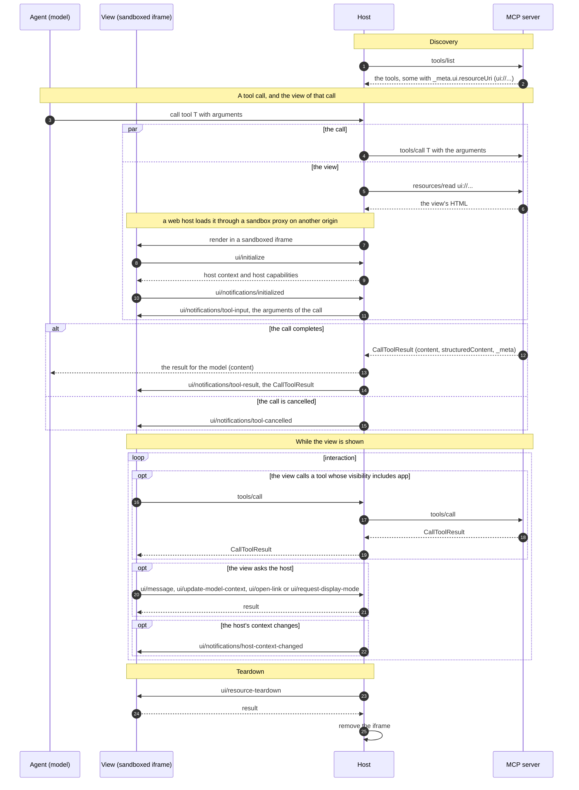

# MCP Apps

```mermaid
sequenceDiagram
    autonumber
    participant M as Agent (model)
    participant V as View (sandboxed iframe)
    participant H as Host
    participant S as MCP server

    Note over H,S: Discovery
    H->>S: tools/list
    S-->>H: the tools, some with _meta.ui.resourceUri (ui://...)

    Note over M,S: A tool call, and the view of that call
    M->>H: call tool T with arguments
    par the call
        H->>S: tools/call T with the arguments
    and the view
        H->>S: resources/read ui://...
        S-->>H: the view's HTML
        Note over V,H: a web host loads it through a sandbox proxy on another origin
        H->>V: render in a sandboxed iframe
        V->>H: ui/initialize
        H-->>V: host context and host capabilities
        V->>H: ui/notifications/initialized
        H->>V: ui/notifications/tool-input, the arguments of the call
    end
    alt the call completes
        S-->>H: CallToolResult (content, structuredContent, _meta)
        H-->>M: the result for the model (content)
        H->>V: ui/notifications/tool-result, the CallToolResult
    else the call is cancelled
        H->>V: ui/notifications/tool-cancelled
    end

    Note over V,S: While the view is shown
    loop interaction
        opt the view calls a tool whose visibility includes app
            V->>H: tools/call
            H->>S: tools/call
            S-->>H: CallToolResult
            H-->>V: CallToolResult
        end
        opt the view asks the host
            V->>H: ui/message, ui/update-model-context, ui/open-link or ui/request-display-mode
            H-->>V: result
        end
        opt the host's context changes
            H->>V: ui/notifications/host-context-changed
        end
    end

    Note over V,H: Teardown
    H->>V: ui/resource-teardown
    V-->>H: result
    H->>H: remove the iframe
```
