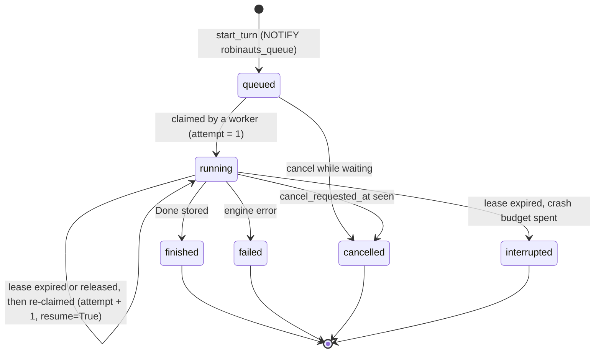

# Long-running turns: a readiness study

- Status: study, nothing decided. Written 2026-10-04 against `main` at `b73b2e7`.
- Question: can Robinauts run agent turns that last **1 to 3 hours**, with
  visibility, and survive a crash, a shutdown and a rebalancing? What does a
  concurrency limit take, what does horizontal scaling take, and is a separate
  worker container worth it?

## TL;DR

**The foundations are right, and the turn mechanics are not there yet.** The
controller already treats a turn as a record that outlives both the HTTP request
and the browser. It has a lifecycle, a lease column, a cancel column, numbered
events written under a fencing condition, and watchers that work from any process
through `LISTEN`/`NOTIFY`. The dispatcher sits behind a port designed for "a
worker in another process". The engine contract already specifies a **resume**
operation. The LangGraph engine already writes a checkpoint to PostgreSQL after
every step.

Most of what remains is wiring and policy. Very little needs redesign. Today,
though, a turn longer than a few minutes is fragile. The five things that stop it
are:

1. **One number means three things.** `models.<id>.timeout_seconds` is at once the
   timeout of each HTTP call to the vendor, the deadline of the whole turn, and the
   turn's lease. The lease is written once and never renewed. A 3-hour turn
   therefore needs a 3-hour lease, and a crash is noticed 3 hours later.
2. **Nothing resumes.** A crash, a deploy or a scale-down ends every running turn as
   `interrupted` after at most about 30 s. LangGraph's checkpoints are on disk but
   are never used to continue. Pydantic AI saves nothing until a turn finishes.
3. **Long runs hit hard limits.** Pydantic AI's default `request_limit=50` is not
   overridden. The vendor clients run with `max_retries=0`, so one 429 or 529 kills
   a two-hour turn. Neither engine configures context management (no summarisation
   middleware, no history processor), so a long tool loop will overflow the context
   window.
4. **Write amplification.** Every token delta is one PostgreSQL transaction plus one
   `NOTIFY`, through a pool of at most 10 connections per process. Re-attaching
   after a reload replays the turn from position 0.
5. **Cancel and delete only work on the process that runs the turn.** Behind a load
   balancer they return 409.

**Recommendations, in one line each:**

- **Resume.** Implement the resume the contract already describes. For LangGraph
  this is cheap: `astream(None, …)` from the turn's last checkpoint, with
  `durability="sync"`, and LangGraph 1.2's built-in cooperative drain covers
  `SIGTERM`. For Pydantic AI, snapshot the message history at every graph node and
  continue with `agent.iter(None, message_history=…)`. Both behaviours are
  confirmed in the locked library versions (§3).
- **Concurrency limit.** Replace "one asyncio task per request" with a **PostgreSQL
  queue that every replica pulls from**, with admission control (max turns, a memory
  watermark). Once a turn can wait, it must outlive the process that accepted it. So
  the concurrency limit *is* the worker: you get the worker without a new service
  and without a new dependency (§4).
- **Long external jobs** (submit, then poll by id). Park them as rows that the
  same workers poll, and call the agent back with a new turn when all have ended
  or the limit passes. No process waits, and the conversation stays usable (§7).
- **Separate worker container.** It then becomes the *same image* started with
  `--role worker`, a small delta worth doing for operational reasons. A worker that
  polls the HTTP API for work is not worth it here: higher cost, no gain while the
  workers can reach the database (§6).

Rough size, after the review: Phases 0–3 of the roadmap, about **5–8
developer-weeks**, take 1–3 hour turns from "fragile" to "survive deploys, crashes
and scale-downs, with a queue". Phases 0–7 are about **9–13 weeks**, and external
jobs add 2–3 (§10). The owner's decisions are recorded just below.

## Decisions taken (2026-10-04)

After a review by three agents (operations, agent engines, product and security),
the owner decided:

| # | Decision | Choice | What it changes |
|---|---|---|---|
| D1 | Where long turns run | **Kubernetes, N identical pods**, each web + worker | §5 applies in full. The role split (§6, option C) stays optional, for later |
| D2 | Capacity | **Two groups.** *Live* work: about **10 running turns per user**, served first. *Background* work: **unlimited**, waits in the queue and runs on the capacity live work leaves | §4.2–4.3 below: a per-user live cap, a background group with no cap and a guaranteed share so it never starves, and no global queue position shown |
| D3 | What makes work "background" | **Chosen per conversation when it starts**, in the UI and by a parameter of the API (`mode: live \| background` on `POST /api/turns`) | `sessions.mode`. A conversation's turns, callbacks included, belong to its group |
| D4 | A message sent while a turn runs | **Queued behind it** | One *running* turn per conversation, any number queued in order. The queued question enters the message tree when its turn is claimed, under the branch tip. This is also what callbacks (§7.4) need |
| D5 | Schema migrations | **At the first release** | Until then every phase that changes the schema (most do) is rolled out by recreating the database. "Survives deploys" therefore holds only for deploys that leave the schema alone, which is fine while nobody depends on the data. Migrations, +3–5 days, come before the release. Resuming a turn across builds also needs a rule: fingerprint each turn's graph configuration, and restart rather than resume when it changed |

| D6 | A tool call in flight when a turn crashed or was released | **Never called again.** On resume the agent always gets "outcome unknown: this call may or may not have happened" as that call's result, and checks for itself if it matters | §3.4 below. No MCP hints, no per-server override: simpler than the hint rule first proposed. The call shows as "outcome unknown" in the transcript. Callback turns are not restricted further: nothing is repeated in them, and they run tools as any turn does |
| D7 | Retry of a turn that failed for good | **Start over only**, as today | A failed turn's partial progress is not kept for Retry. Its intermediate checkpoints are pruned when it ends. ADR 0005 stands as it is on this point. Automatic resume after a crash or a deploy (§3) is a different thing and is unaffected |

Defaults taken where the reviewers agreed, to revisit if they prove wrong:

- **LangGraph leads.** Pydantic AI gets resume in Phase 4, with its native cancel
  capture, P1 and P2 shipped together, and a `supports_resume` flag in the
  contract suite. The second engine keeps the seam honest; it is not held to
  parity in every phase.
- **External jobs** use `call_me_back` and a callback turn (§7). The suspended
  turn is an opt-in for later.
- **Context policy:** clear old tool results at about 60% of the window, then
  summarise at about 85%. The prompt cache TTL is set per agent, 1 h for long
  agents. ADR 0005 needs an amendment, because LangChain's summarisation does not
  always keep the question being answered.
- **Budgets** (time, model calls, cost) are kept by the controller, because
  middleware counters reset on resume. They ship in Phase 0 together with raising
  `request_limit`, which is today's only spend cap. At the cap, the agent makes one
  last call without tools to wrap up, then the UI offers "Continue".
- **Notifications** stay in-app: badge, tab title, and the browser's Notification
  API while a tab is open. No Web Push, whose relays would break "nothing phones
  home". Email or Slack come with the "more channels" roadmap item. Notifications
  never show answer text.
- **Operator visibility:** `/metrics` on a separate port or behind a token, and a
  `robinauts turns list|cancel` CLI. A metadata-only admin view comes with roles.

### Corrections from the review, folded in below

- **Engines.** `StepCommitted` comes from the saver's `aput`, not from the
  `updates` stream, which fires before the writes are stored. The Pydantic AI
  snapshot after a tool step must include the pending request that holds the tool
  returns. The fresh-turn path pins its start checkpoint; today
  `checkpoint_id=None` means "the thread's latest", which after a failed first
  turn is partial state. Pydantic AI's default of one retry ends a turn on the
  second error from a tool (`tool_error_behavior`); that is fixed in Phase 0. The
  built-ins (`call_me_back`, `job_status`) are served by an in-process platform MCP
  server, and the poller needs an MCP client of its own, because `ToolResult` drops
  `structuredContent`.
- **Operations.**
  - `attempt` (fencing, +1 on every claim) is kept apart from `crashes` (+1 only
    when an *expired* lease is re-claimed). A voluntary release on deploy then never
    uses up `max_crashes`.
  - Re-claims get jitter and a rate limit, so a fleet restart does not resume every
    turn at once and draw 429s from the vendor.
  - The heartbeat and the claim use their own connection, never the shared pool.
  - The drain starts on `SIGTERM`, or on a `preStop` call to `/drain`, and closes
    the SSE streams early with a reconnect hint. Uvicorn's wait for open
    connections would otherwise use up the grace period.
  - "More uvicorn workers per pod" does not work: `cli.py` passes an app object, so
    scale with pods.
  - Advisory locks are transaction-level (`pg_try_advisory_xact_lock`), so they
    still work behind PgBouncer.
  - Lambda's 15-minute cap rules the serverless layout out for long turns.
- **Product and security.** Callback results are untrusted tool output, so they
  reach the model as a delimited platform message, never as user text. The
  per-user cap is enforced exactly, by one claimer at a time (§4.2). A soft delete
  cancels a conversation's waits and jobs, and a purge removes their results. The
  platform's own actions (polls, `cancel_tool`, callback turns) are recorded in the
  audit log. A resume leaves a visible "resumed after a restart" marker rather
  than silently removing text the person saw.

---

## 1. What exists today

| Piece | Where | Why it matters for long turns |
|---|---|---|
| A turn is a row with a state machine (`running → finished / failed / cancelled / interrupted`) | `schema.sql` `turns`; `controller.py:334-363` | It outlives the request. The stream is "a view of the turn" (`docs/specs/wire.md:17`) |
| `turns_one_running_per_session` partial unique index | `schema.sql` | Serialises turns per conversation in the database, not in memory |
| `lease_until`, `cancel_requested_at` columns | `schema.sql` | Already built for a lease and a store-routed cancel. `cancel_requested_at` is never written |
| Numbered `turn_events`, appended with `… AND state='running' AND lease_until > now FOR SHARE` | `store.py:58-67, 285-322` | Fencing: a runner that lost its lease cannot write. A second runner loses at position 1 |
| Watchers re-read the store and are woken by `NOTIFY` on one listener connection per process | `store.py:429-495`, `controller.py:409-441` | Streaming already works when the SSE request lands on a replica that does not run the turn |
| Re-attach by `Last-Event-ID` / `?after=` | `web/app.py:690-699`; frontend `agui/client.ts:241-330` | The browser can come and go |
| `TurnDispatcher` port: `dispatch / cancel / close`. `run_turn(owner, session, turn)` loads everything from ids | `ports/dispatcher.py`, `controller.py:365-407` | Written for "a worker in another process" (docstring at `controller.py:366`) |
| Engine contract: `stream(..., resume: bool)` and `ResumeMismatchError` | `contract/ports.py:79-96`; `docs/specs/agent-engines.md:160-164` | **Resume is specified**: "continues from whatever partial work it kept, without repeating tool calls already made". Only the echo engine implements it |
| LangGraph checkpoints to PostgreSQL after every step, through its own asyncpg saver | `langchain_engine/saver.py`, `engine.py:78-86` | Partial progress is *already persisted* and never used |
| Sign-in state (`user_sessions`, `pending_logins`, `api_tokens`) in PostgreSQL | `schema.sql` | No sticky sessions needed for sign-in (see §5) |

`docs/architecture/the-path-of-one-message.md` describes most of the target
already: lease ticks, cancel through the store, a worker Lambda. It labels them
"block 5" and "stage two". This study agrees with that direction and fills in
queueing, admission, resume and visibility.

## 2. Blockers for 1–3 hour turns, in the code

| # | Problem | Evidence | Effect on a 2 h turn |
|---|---|---|---|
| B1 | `timeout_seconds` is the vendor HTTP timeout, the turn deadline **and** the lease | `clients.py` (both engines) pass it to the SDK. `turns.py:143, 162` derive the deadline from the lease. `controller.py:357` sets `lease_until = now + timeout + 1 min` | Set it to 3 h, and a hung HTTP call waits 3 h and a crash is noticed after 3 h. Leave it at 120 s, and the turn dies at 2 min |
| B2 | Lease written once, no heartbeat | `turns.py` module docstring; no tick anywhere | A crashed runner's turn looks alive until its lease ends |
| B3 | Pydantic AI `UsageLimits.request_limit` defaults to **50** and is not overridden | `pydantic_ai/usage.py:457`; `pydantic_ai_engine/engine.py:88-93` | A long agent loop fails with `UsageLimitExceeded` after 50 model calls. LangGraph is fine: `create_agent` sets `recursion_limit` to 9 999 (`langchain/agents/factory.py:1899`) |
| B4 | Vendor SDKs built with `max_retries=0`, and no retry middleware | both `clients.py` | One 429, 529 or connection reset in hour two fails the turn |
| B5 | No context management, although ADR 0005 gives it to the frameworks | `create_agent(...)` gets no `middleware`. `Agent(...)` gets no `history_processors` | The context window overflows partway through a long tool loop |
| B6 | Shutdown ends turns as `interrupted` | `cli.py:52` (20 s graceful), `controller.py:67` (`CLOSE_TIMEOUT=10`), `dispatch.py:40-48`, `turns.py:214` | Every deploy or scale-down kills every running turn after about 30 s (`docs/specs/operations.md`: "A restart ends the runs that are in flight") |
| B7 | A crash loses all progress | LangGraph: `Done` never comes, so the answer gets no `checkpoint_id` and the next turn starts from the previous answer's checkpoint. Pydantic AI: `memory.save` only on `AgentRunResult` (`engine.py:104`) | Two hours of tool calls are gone. Only the transcript, as `turn_events`, remembers them |
| B8 | Every delta is one transaction and one `NOTIFY` | `turns.py:79-90`, `store.py:285-302`. Pool `max_size=10` (`pool.py:27`) | Thousands of transactions per second at a few hundred concurrent turns. The coalescing the path doc asks for ("about 50 ms", step 11) is not implemented |
| B9 | A reload replays the whole turn | `web/app.py:340` sends `resume.after=0`. `open_session` loads every event just to count them (`controller.py:178-180`) | A 2 h turn has tens of thousands of events. Each reload loads and replays all of them |
| B10 | No SSE keep-alive. The client gives up after 4 quick retries | `wire.md:150` lists keep-alive as "not yet served". `agui/client.ts:56-59` (`RETRIES=4`, 250 ms to 2 s), `runtime.tsx:556-577` | A 10-minute silent tool call behind a proxy with a 60 s idle timeout ends as "connection lost" in the UI after about 8–10 min |
| B11 | Cancel and delete go only to the local task | `dispatch.py:32-38`, `controller.py:320-321` → 409 | Behind a load balancer, Stop fails about (N−1)/N of the time. The UI shows "the stop did not reach the server" for every failure (`state.ts:254`) |
| B12 | Nothing deletes anything | `controller.sweep()` raises `NotImplementedError` (`controller.py:443-444`). `turn_events.expires_at` is 24 h but unswept. Checkpoints are never pruned | `turn_events` and both engines' checkpoint tables grow without bound (see B13) |
| B13 | The LangGraph saver writes the **whole** checkpoint every step, and `alist(filter=…)` filters in Python | `saver.py:127-162, 93-125` | For a long turn the state is O(steps × history), so storage is O(n²). Per-turn lookups would deserialise every checkpoint of the thread |
| B14 | The POST waits for the first event before it sends headers | `web/app.py:458-475` | A queued turn would hold the POST open with no run id and no Stop button (frontend `state.ts:131-137`) |

Also worth fixing on the way: the client marks an interrupted answer that has
dangling tool calls as `failed` (`state.ts:1058-1067`), while the backend only
retries answers *stored* as failed (`controller.py:304`). Several frontend files
cite `docs/specs/runs.md`, which does not exist.

---

## 3. Resuming after a crash

### 3.1 What "resume" must mean

The engine contract already gives the semantics (`agent-engines.md:160`):
*continue from the partial work kept, without repeating tool calls already made.
If nothing was kept, run again from the checkpoint.* The controller has to:

1. **Notice** the runner is gone. This needs a short heartbeat lease (B1, B2), not
   a deadline.
2. **Re-claim** the turn in some process, with fencing so the old runner, if it is
   only slow, cannot write: `attempt` or `worker_id` goes into the append condition.
3. **Call** `engine.stream(..., resume=True)` with the same question and checkpoint.
4. **Stitch the transcript.** Rebuild the answer's `parts` from the turn's stored
   events up to the last step boundary. Emit a `TurnResumed{attempt, rewind_to}`
   event so watchers drop partial text written after that boundary. Then continue
   numbering after the last stored position.
5. **Bound** retries: `max_crashes`, say 3, then `interrupted`, as the store's
   `end_expired_turn` already ends an expired turn. This stops a poison turn (one
   that crashes the process every time) from cycling through the fleet.

Step 4 needs one new kind of event: a **step boundary**, `StepCommitted{n}`,
appended when the engine reports that a graph step was persisted. It is invisible
on the wire, or mapped to AG-UI `STEP_FINISHED`. It lets the runner know which
streamed text is backed by a checkpoint and which will be produced again.

### 3.2 LangGraph engine: small, mostly there

Verified in the locked versions (langgraph 1.2.12, langchain 1.4):

- `durability` defaults to `"async"` (`langgraph/pregel/main.py:2603`). The
  checkpoint of a step is written while the next step runs, so a crash can lose the
  last step. Use **`durability="sync"`** for long turns. The cost is one database
  round trip per step, negligible next to a model call.
- `create_agent` sends **each tool call as its own task**:
  `Send("tools", [tool_call])` (`langchain/agents/factory.py:2032`). Each finished
  call is saved as a *pending write* (`aput_writes`, which our saver implements). On
  resume, LangGraph re-runs only the tasks of the interrupted step **that had not
  finished**. So "don't repeat tool calls already made" holds for finished calls.
  The call that was in flight is repeated: at-least-once.
- A model call that was streaming when the crash came is made again in full. Its
  partial text is the reason for the rewind in §3.1.
- `RunnableConfig["metadata"]` is copied into every checkpoint's metadata
  (`langgraph/checkpoint/base/__init__.py:757-775`). Tagging a run with
  `{"robinauts_turn": <turn id>}` therefore labels its checkpoints.
- **Cooperative drain is built in.** Since LangGraph 1.2, pass
  `control=RunControl()` to the run. Calling `request_drain("shutdown")` stops it
  at the next step boundary, with the checkpoint saved, and raises `GraphDrained`
  (`langgraph/runtime.py:79-104`, `langgraph/errors.py:54`). That is the hook for
  §5.3's release on `SIGTERM`. It does not interrupt a node already running, so a
  long tool call still finishes or is lost when the grace period ends.
- **Resume means `None` input.** Calling again with a new input *discards* the
  unfinished tasks of the last checkpoint. Passing a `checkpoint_id` replays from
  that checkpoint, which forks.
- **Under resume, the step budget and the call-limit middleware reset.**
  `create_agent` recomputes the stop step from the current step, and the counters
  of `ModelCallLimitMiddleware` and `ToolCallLimitMiddleware` are `UntrackedValue`s,
  never checkpointed (`model_call_limit.py:34`, `tool_call_limit.py:50`). A cap on
  a turn's total calls has to live in the controller (the turn's `progress`, §8),
  not in middleware.

What to change:

```python
# engine.stream(), resume path (sketch)
config = {"configurable": {"thread_id": sid},
          "metadata": {"robinauts_turn": str(turn_id)},
          "recursion_limit": agent.max_steps}
if resume and (last := await saver.latest_for_turn(sid, turn_id)):
    stream = graph.astream(None, last.config, stream_mode=[...], durability="sync",
                           control=run_control)   # drained on SIGTERM
else:   # fresh, or a resume with nothing kept: run again from the checkpoint
    stream = graph.astream({"messages": [HumanMessage(prompt)]}, start, ..., durability="sync")
```

- `engine.stream` needs the turn id. Today the port does not carry it. Either add a
  `run_id` argument, or derive it from `(session, checkpoint, prompt)`, which is what
  `ResumeMismatchError` hints at.
- Saver: add a `turn_id` column, or a `metadata->>'robinauts_turn'` index, so that
  "latest checkpoint of this turn" is one indexed query and not `alist` +
  deserialise everything (B13). Wrap `aput_writes`' loop in one transaction. Add
  **pruning**: when a turn finishes, delete its intermediate checkpoints and writes
  and keep the final one. That turns the O(n²) footprint back into O(n) per
  conversation. LangGraph 1.2 also ships a **beta** `DeltaChannel`, which stores
  only the writes of each step and replays them, with periodic snapshots
  (`langgraph/channels/delta.py`). It would need the saver to implement
  `get_delta_channel_history`, and its on-disk contract "is not yet stable".
  Pruning is the safer choice now. Revisit it when it leaves beta.
- Emit `StepCommitted` from the saver's `aput`, once the step's checkpoint is
  stored. Not from the `updates` stream: an update fires as each task's writes
  land, and `aput_writes` is not awaited at that point.
- Pin the fresh path's start checkpoint (today `checkpoint_id=None` resumes from the
  thread's latest, partial state after a failed first turn). Fingerprint the
  turn's graph configuration (model, tools, middleware), and restart rather than
  resume when a deploy changed it (D5).
- Before resuming, settle the in-flight tool calls (D6):
  `aupdate_state(as_node="tools")` writes an "outcome unknown" `ToolMessage` for
  **every** call of the interrupted step that has no stored result, so LangGraph
  re-runs none of them.
- Turn on the middleware ADR 0005 promised: `SummarizationMiddleware` or
  `ContextEditingMiddleware` (B5) and `ModelRetryMiddleware` (B4). All of them are
  in the locked `langchain` (`langchain/agents/middleware/`). Under resume the
  summary is part of the checkpointed state, so it is not produced again.

Estimated effort: **7–10 days** (revised by the review) including a kill-the-process test (start a turn on
the echo or stand-in provider, `SIGKILL` mid-tool, resume, assert the tool calls
and the final transcript).

### 3.3 Pydantic AI engine: three levels, pick by need

Verified in pydantic-ai-slim 2.47 (`pydantic_ai/_agent_graph.py:649-700`):

- `agent.iter(None, message_history=h)` where `h` ends in a `ModelResponse` with
  tool calls **executes those pending tool calls** (`CallToolsNode`) and then goes
  on to the model.
- Where `h` ends in a `ModelRequest`, for example tool returns, it is **re-sent to
  the model** ("resuming without prompt").
- A response cut off mid-stream (`state == 'interrupted'`) has its dangling tool
  calls repaired with synthesised returns, but only when a new prompt is given.
  Under `iter(None)` the cut-off calls run.
- On cancel, Pydantic AI 2.47 keeps the returns of finished calls and fills in
  "interrupted" returns for the rest (`_agent_graph.py:2345-2364`). That is the
  native capture P2 builds on.

**P1 — snapshot per node (recommended first step, about 3–4 days).** After each
`ModelRequestNode` and each `CallToolsNode` finishes (the engine already iterates
nodes in `run_of`), upsert `run.all_messages()`, plus the next node's pending
`request` after a tool step, because the tool returns join the history only when
the next model request runs, under one *in-progress* row per
turn, `pydantic_ai_progress(session_id, turn_id, history, step)`, and emit
`StepCommitted`. On resume, load it and call `iter(None, message_history=…)`. On
`Done`, write the normal checkpoint and delete the progress row. A step whose tool
calls were in flight re-runs **all** of that step's calls: at-least-once per step.

**P2 — per-call journal for at-most-once on finished calls (+2–3 days).** Record
each `FunctionToolResultEvent` as it lands. On resume, append a `ModelRequest`
holding the real returns of the finished calls. For the calls that never finished,
add a synthesised return, "interrupted by a restart; result unknown", unless the
tool is known to be safe to repeat (§3.4). Then continue. The model sees exactly
what happened and decides whether to call again. (Pydantic AI's
`deferred_tool_results` resume path exists too, but it insists on a result for
every eligible call (`_tool_execution.py:445-475`), which makes it awkward here.)
A ready-made version of this ledger exists: `pydantic-ai-harness`'s
`StepPersistence` (MIT). It keeps step events, continuable snapshots and a
tool-effect ledger in which a call left "started" reads as `unknown_after_crash`.
It has no PostgreSQL store, but its `StepStore` protocol is open. Its 0.36 line
accepts our `pydantic-ai-slim` 2.47, and later lines pin an exact slim version.
It is worth reading as a design reference even if it is not adopted.
(pydantic-graph's old `BaseStatePersistence` / `iter_from_persistence` API is gone
in 2.47.)

**P3 — a PostgreSQL durability backend on `pydantic_ai.durable_exec` (8–15
days).** This is the "Pydantic AI is extensible" route. Version 2.47 exposes a
public framework for durable engines: subclass `BaseDurabilityCapability` and
provide a `CallableOperationBackend` whose one method, `execute(operation_id, name,
body, cache_key, config)`, runs each **model request and tool call** as a named
durable unit (`durable_exec/_operation_backend.py:81-153`, `durable_exec/AGENTS.md`).
A Robinauts backend would journal each unit's result in a table keyed
`(turn, name, seq)` and return the journalled result on replay. That gives
Temporal-like semantics on PostgreSQL alone, for model calls too, so a crash after
a long model response costs nothing. The costs: the journal codec, determinism
rules, how streaming events flow out of a durable unit, and keeping pace with an
API that is new and moves fast. Worth it only if P1 + P2 prove insufficient.

**Not recommended: the shipped Temporal, DBOS or Prefect integrations.** Each
brings a service, a driver or a licence question that "one app + one PostgreSQL"
rules out (§6.1).

### 3.4 Side effects: what at-least-once means for tools

Whatever the engine, a tool call that was **in flight** when the process died has
an unknown outcome. **Decided (D6): never call it again.** Every in-flight call
gets a synthesised "outcome unknown" result. That is option 2's mechanism applied
to every tool, with no hints consulted. Option 3 stays compatible as future work:
a call running as an MCP task could be re-attached instead of reported unknown.
The options, in increasing order of effort, are kept for the record:

1. **Accept it, and document it.** Most MCP tools that agents call are reads.
2. **Use MCP tool annotations.** The protocol's `ToolAnnotations` carry
   `readOnlyHint`, `idempotentHint` and `destructiveHint` (`mcp/types.py:1262-1280`).
   `langchain-mcp-adapters` copies them into the tool's metadata
   (`langchain_mcp_adapters/tools.py:511`). On resume, repeat an in-flight call only
   if it is read-only or idempotent. Otherwise synthesise an "outcome unknown"
   result (P2 above, and the same idea for LangGraph by writing a `ToolMessage` into
   the state before resuming). Cheap, and it fits the planned "tool execution
   approval" feature. Hints are the server's claims, so the operator should be able
   to override them per server in the configuration.
3. **Make long tool calls themselves durable.** MCP's asynchronous *tasks*
   (SEP-1686) let a tool call return a task id that the client polls. A resumed turn
   could then re-attach to a call still running remotely instead of repeating it.
   Status in the locked versions: **experimental** in the `mcp` 1.30 SDK
   (`mcp/shared/experimental/tasks/`). Pydantic AI's MCP client can call with
   `use_task=True`, and fastmcp's client takes `call_tool(..., task=True,
   task_id=…)`. `langchain-mcp-adapters` has nothing equivalent in what we lock.
   Few tool servers support it yet. Future work, and best for the slow tools (CI
   runs, report builds) that dominate a long turn.

### 3.5 Cost of a resume

A resume sends the context to the model again. Anthropic's prompt cache lives 5
minutes by default (writes at 1.25× the input price) or 1 hour (writes at 2×).
Reads cost about 0.1×, and each read refreshes the timer. A resume within the TTL
mostly reads the cache. One after it pays the whole prefix again as a write. For
long agent turns, where a step often takes longer than 5 minutes anyway (slow
tools), the **1 h TTL** is probably the better default, and it also makes resumes
cheap. That is a setting in each engine's caching configuration. The cost is
negligible against a 3 h turn either way, but worth a line in the usage reporting.

---

## 4. Concurrency limit and admission control

### 4.1 Where a limit can live, and why it ends up in PostgreSQL

The ask: *with 1000 turns running, or 80% of planned RAM used, stop picking new
turns, and show the conversation as "…waiting…"*.

An in-memory semaphore in `InProcessDispatcher` is about 20 lines, but it breaks
three ways:

- The waiting turn lives only in the memory of the process that took the POST. A
  restart loses it silently, and the row says `running` with nobody running it.
- A replica that is full keeps queueing while its neighbours sit idle. The load
  balancer spreads *requests*, not *work*.
- A full replica has no way to hand work to another.

So a turn that can wait must wait **in the database**. Every replica pulls work
when it has capacity. That is a queue, and the pulling loop is a worker.
**The concurrency limit and the worker are the same feature.** Built this way, the
web app is a worker, and no external container is needed to get there (§6).

### 4.2 Design

**States.** Add `queued`. `running` now means "claimed by a worker, with a live
lease". Widen the unique index to one *active* turn per session:

```sql
ALTER TABLE turns DROP CONSTRAINT turns_state_is_a_state,
  ADD CONSTRAINT turns_state_is_a_state CHECK (state IN
    ('queued','running','finished','failed','cancelled','interrupted'));
-- one queued-or-running turn per conversation
CREATE UNIQUE INDEX turns_one_active_per_session ON turns (session_id)
  WHERE state IN ('queued','running');
ALTER TABLE turns
  ADD COLUMN queued_at   timestamptz,
  ADD COLUMN claimed_at  timestamptz,
  ADD COLUMN worker_id   text,          -- which process holds it: visibility and fencing
  ADD COLUMN attempt     integer NOT NULL DEFAULT 0,  -- +1 on every claim: fencing
  ADD COLUMN crashes     integer NOT NULL DEFAULT 0,  -- +1 only when an expired lease is re-claimed
  ADD COLUMN deadline_at timestamptz,   -- the turn's own limit (B1), apart from the lease
  ADD COLUMN heartbeat_at timestamptz,
  ALTER COLUMN lease_until DROP NOT NULL;  -- a queued turn holds no lease yet
CREATE INDEX turns_queue_idx ON turns (queued_at) WHERE state = 'queued';
```

(The schema is still edited in place before the first release, so this goes into
`schema.sql` directly.)



**Claim.** Each process runs one claim loop. `capacity = admission.free_slots()`
(§4.3). Fairness: oldest first, but at most *k* running turns per user, so one
person's 50 batch turns cannot starve everyone.

```sql
WITH next AS (
  SELECT t.id FROM turns t JOIN sessions s ON s.id = t.session_id
  WHERE (t.state = 'queued'
         OR (t.state = 'running' AND t.lease_until < $now AND t.crashes < $max_crashes))
    AND s.deleted_at IS NULL
    AND (SELECT count(*) FROM turns r JOIN sessions rs ON rs.id = r.session_id
         WHERE r.state = 'running' AND rs.owner_id = s.owner_id) < $per_user
  ORDER BY t.queued_at
  LIMIT $capacity
  FOR UPDATE OF t SKIP LOCKED)
UPDATE turns t SET state = 'running', worker_id = $me, claimed_at = $now,
       attempt = t.attempt + 1, lease_until = $now + $lease, heartbeat_at = $now
FROM next WHERE t.id = next.id
RETURNING t.id, t.session_id, t.attempt;   -- attempt > 1  ⇒  resume=True
```

The same query covers the queue and crash recovery: an expired `running` turn is
re-claimed, which is the resume path of §3.

**Revised after the review, with D2–D4.** The query above does not enforce the
per-user cap. Its count runs before the update, a single batch can take several
turns of one user, and two replicas race because `SKIP LOCKED` locks turns, not
users. It also predates the two groups and queue-behind. The claim becomes:

```sql
-- One claimer at a time, fleet-wide: caps are exact, and a claim takes milliseconds.
-- false means another replica is claiming: try again at the next tick.
SELECT pg_try_advisory_xact_lock(<claim key>);
WITH live AS (           -- live turns each user runs now
  SELECT s.owner_id, count(*) AS n FROM turns r JOIN sessions s ON s.id = r.session_id
  WHERE r.state = 'running' AND r.lease_until >= $now AND s.mode = 'live'
  GROUP BY s.owner_id),
ready AS (               -- per conversation: its expired turn, or else its oldest queued one,
  SELECT DISTINCT ON (t.session_id)   -- and only if nothing in it runs (D4)
         t.id, t.queued_at, s.owner_id, s.mode
  FROM turns t JOIN sessions s ON s.id = t.session_id
  WHERE s.deleted_at IS NULL
    AND (t.state = 'queued' OR (t.state = 'running' AND t.lease_until < $now))
    AND NOT EXISTS (SELECT 1 FROM turns x WHERE x.session_id = t.session_id
                    AND x.state = 'running' AND x.lease_until >= $now)
  ORDER BY t.session_id, t.queued_at),
ranked AS (
  SELECT r.*, row_number() OVER (PARTITION BY r.owner_id, r.mode ORDER BY r.queued_at) AS k
  FROM ready r)
SELECT ranked.id FROM ranked LEFT JOIN live USING (owner_id)
WHERE ranked.mode = 'background' OR ranked.k <= $live_cap - coalesce(live.n, 0)
ORDER BY (ranked.mode = 'background'), ranked.queued_at   -- live first (D2)
LIMIT $capacity;
-- then, in the same transaction:
-- UPDATE turns SET state = 'running', worker_id = $me, attempt = attempt + 1,
--        crashes = crashes + (state = 'running')::int, lease_until = $now + $lease ...
-- WHERE id = ANY($claimed);
```

- **Background never starves.** A replica keeps a share of its slots, about 20%,
  for background turns whenever they wait, however much live work there is.
- **Queue-behind (D4).** A message sent while a turn runs creates a `queued` turn
  holding the question's text. The message enters the tree when the turn is
  claimed, under the branch tip, which is usually the answer that just finished.
  So `turns_one_active_per_session` (above) is not added after all.
  `turns_one_running_per_session` stays, and the claim's `NOT EXISTS` keeps the
  order within a conversation.
- `sessions.mode` (D3): `text NOT NULL DEFAULT 'live' CHECK (mode IN ('live',
  'background'))`, set when the conversation is created.

**Wake-ups.** `start_turn` does `NOTIFY robinauts_queue` in its transaction. A
finishing turn does the same, because capacity just freed. Claimers also poll
every 2–5 s, so a lost notification costs seconds, which is the same rule
`wait_for_events` already follows. `NOTIFY` stays a hint and the table stays the
truth. Notifications are not persistent, carry at most 8000 bytes, and are
delivered only on commit. Under heavy concurrent writes, every committing
transaction that notified serialises on a global lock
(<https://recall.ai/blog/postgres-listen-notify-does-not-scale>). That is one more
reason to coalesce turn events (B8) and notify once per batch, not per token.

**Hand-rolled, or a library?** `pgqueuer` (MIT, asyncpg, `LISTEN/NOTIFY` +
`SKIP LOCKED`) is the one queue library that fits the licence rule and the
driver. The others need psycopg (LGPL) or a new service (§6.1). It is still not
recommended here. The `turns` table already *is* the queue, and what matters is
domain-specific: fencing the event appends by attempt, resume on re-claim, one
active turn per conversation, fairness per user. A library would add a second
job table to keep in step with `turns`, for about 150 lines of SQL saved.

**Heartbeat (the "lease tick" of the path doc).** Each running turn's lease is
extended every `lease/3` by one statement per tick:

```sql
UPDATE turns SET lease_until = $now + $lease, heartbeat_at = $now
WHERE id = $turn AND state = 'running' AND worker_id = $me AND attempt = $attempt
RETURNING cancel_requested_at;
```

Batch it per process: one `UPDATE … WHERE id = ANY($turns)` per tick for all local
turns. No row back means the turn was lost: stop the engine. A non-null
`cancel_requested_at` means cancel. The append and finish conditions gain
`AND attempt = $attempt` to fence a slow runner. A lease of about 60–120 s, ticked
every 20–30 s, detects a crash within 2 minutes whatever the turn's length.

**Cancel and delete from any replica (B11).** `cancel_turn` writes
`cancel_requested_at` and `NOTIFY robinauts_cancel '<turn>'`. The owning process
reacts at once through its listener, or at worst at the next heartbeat. A queued
turn is cancelled in place. `delete_session` does the same and waits on the
turn's end with `wait_for_events`, instead of answering 409.

### 4.3 Admission signals

| Signal | How, without new dependencies | Notes |
|---|---|---|
| Running turns in this process | the dispatcher's own count | `max_running_turns`, per process. The 1000 of the question is high for one Python event loop (see below) |
| Memory | cgroup v2 `/sys/fs/cgroup/memory.current` ÷ `memory.max`. Fall back to RSS from `/proc/self/statm` ÷ a configured budget | Stop claiming above a high watermark (80%). Resume below a low one (70%). The hysteresis matters: CPython rarely returns freed memory to the OS, so RSS after a spike stays high |
| Event-loop lag | a 1 s ticker that measures its own delay | Stop claiming above about 200 ms. Serialising big checkpoints is CPU-bound on the loop, and the lag is the honest signal that more turns would slow every stream |
| Database pool wait | `asyncpg` pool `get_idle_size()` / acquire latency | Stop claiming when writes queue |
| Per user, per provider | a counter in the claim query; a token bucket per provider key | Keeps one user, or one vendor's rate limit, from filling the fleet |

**Realistic numbers to measure before choosing limits.** A long LangGraph turn
holds its whole message list in memory, plus a serialised copy during each
checkpoint write. A 2 h turn with 50 tool results of about 20 KB each is roughly
5–10 MB live. A thousand of those is 5–10 GB, and every step also serialises the
state on the single event-loop thread. Expect a comfortable 100–300 long turns per
process. Scale out with pods. More uvicorn workers per pod is not an option as
the server is started today, because `cli.py` passes an app object, which uvicorn
refuses to run with `workers`. The load test listed in the README's
"Planned" section is the place to pin this down.

### 4.4 "…waiting…" in the UI

- **Backend (B14).** Answer the POST at once. Send headers, `RUN_STARTED` and an
  AG-UI `CUSTOM` event such as `{name: "robinauts.turn_state", value: {state:
  "queued", reason: "live_cap" | "busy" | "background"}}`, and `: keep-alive`
  comments every 15 s. The watcher loop already wakes every 15 s (`WAIT_SECONDS`).
  `MessageStarted` then marks the end of the wait. The review advised the reason
  rather than a global position: a position reveals how busy the deployment is,
  jumps under caps and priorities, and costs a recount for every waiter at every
  claim.
- **Frontend.** Decode the event (`events.ts:176` drops unknown types today), add
  `queued` to `ChatState`, and render "…waiting… (you have 10 tasks running)" or "…waiting… (the system is busy)"
  in the status slot of
  `Chat.tsx:83-100`. Stop works because `runId` is known. Treat a POST that fails
  with a network error or 5xx as *unknown*, not *refused*, and re-read the
  conversation before taking the question off the screen.
- **History list.** Add `active: "queued" | "running" | null` to
  `ConversationSummary` and show a badge. Long tasks are exactly the ones people
  leave and come back to.

---

## 5. Horizontal scaling: N copies of the same image

### 5.1 What already works across replicas

- **Streams.** Any replica serves any turn's events: rows plus `NOTIFY`, re-read on
  every wake.
- **Sign-in.** The OIDC `pending_logins` (state, nonce, PKCE verifier), the
  `user_sessions` and the API tokens are rows. The cookie is an opaque secret
  checked by its hash. No signing key needs sharing.
- **Turn exclusivity.** The partial unique index makes a second turn in a
  conversation fail in the database, not in memory.
- **The schema.** The server never migrates it; it checks it. `robinauts db init`
  is a separate command, so N replicas starting together do not race.

Officially the deployment is still one process: `docs/deployment.md:619` lists
"Several backend processes" as not there yet, while `docs/specs/operations.md:23`
says several "may run". The table below is what stands between the two.

### 5.2 What does not, and what to do

| Item | State | What is needed |
|---|---|---|
| **No `ROBINAUTS_DATABASE_URL` means in-memory storage** | **Blocker** | `storage_from` falls back to memory (`composition/__init__.py:49-54`) and `serving()` never refuses (`cli.py:74-125`), although `docs/deployment.md:541` says start-up does. One pod missing the variable silently gets its own private data. Refuse to start in sign-in mode without it |
| Cancel and delete of a turn on another replica | Needs work | 409 today (`controller.py:193-201, 320-321`). Use `cancel_requested_at` + `NOTIFY`, as in §4.2 |
| Lease renewal | Needs work | The heartbeat of §4.2. After a `SIGKILL`, a turn stays `running` for timeout + 1 min, blocking the conversation |
| Turn placement | Needs work | Turns run where the POST landed. There is no balancing of work and no limit (§4) |
| Sweep (`turn_events`, expired `user_sessions` and `api_tokens`, hidden sessions whose purge died, expired leases) | **Blocker for long-running use** | `sweep()` is not implemented. Expired leases end only when someone reads that session. Implement it, in every replica, under `pg_try_advisory_xact_lock` so the work is not duplicated. Correctness does not need the lock, since the deletes are idempotent |
| Connection budget | Needs work | Per replica: pool 2–10, fixed and not configurable (`pool.py:26-27`), plus 1 `LISTEN` connection. So 11 × N at peak: about N ≤ 8 replicas on the default `max_connections=100`. `pool.acquire` has no timeout. Make sizes configurable, and add an acquire timeout |
| PgBouncer in transaction mode | Needs work | `LISTEN` through it gets no notifications. Watchers then fall back to the 15 s re-check, so streams stutter. asyncpg's named prepared statements need PgBouncer ≥ 1.21 with `max_prepared_statements`, or `statement_cache_size=0`. Give the listener its own direct URL |
| Readiness | Needs work | `/health` is a constant (`app.py:709-712`). Add `/ready`: database ping, listener up, not draining. Add a `preStop` sleep so the pod leaves the endpoints before uvicorn closes |
| Shutdown budget | Needs work | 20 s graceful + 10 s close + writes > Kubernetes' default 30 s. The final wait has no timeout, so an unreachable database hangs shutdown until `SIGKILL`. With §5.3, set the grace period to 60–90 s |
| `robinauts db init` run concurrently | Needs work | The schema creation holds an advisory lock, but the engines' `setup()` (`CREATE TABLE IF NOT EXISTS`) does not. Run it once as a Job, not in every pod's initContainer. `check_schema` does not check the engines' tables |
| Schema upgrades | Needs work | There are no migrations, and a hash must match. Until migrations exist, every schema change is a stop-all (`Recreate`) rollout |
| Config drift during a rolling change | Needs work | `default_model` raises `StopIteration` (500) for an agent one replica does not know (`app.py:455-456`). Answer 404/422 instead, and roll config with the image |
| Rate limiting | Not there | At the ingress for now. A future per-user limit must live in the database, not in process memory (`docs/layout.md:196`) |
| Logs and metrics | Not there | Plain-text logs (`cli.py:126`), no request, turn or replica ids, no metrics (§8). The default uvicorn access log also records `/auth/callback?code=…`, against `docs/deployment.md:528` ("every query string cut off") |
| Docs drift | Needs work | One process versus several, shutdown timings (`deployment.md:348-350` against the code), CLI flags that do not exist (`--forwarded-allow-ips`, `--log-level`), a "start-up sweep" log line that does not exist. `docs/working-notes/` was referenced but absent until this note |

Already fine: sign-in callbacks on any replica (`pending_logins` taken with
`DELETE … RETURNING`), opaque session cookies with no signing key, CSRF by
`Origin` against `public_url` (the load balancer must pass `Origin` through),
`ensure_user` with `ON CONFLICT`, a read-only start (`check_schema`, engines not
set up by the server), and a per-process OIDC discovery cache that is harmless.

**No sticky sessions are needed.** Cookie affinity would hide the cancel and
delete 409s from browsers, but not from bearer-token clients, so fix the cause
instead.

### 5.3 Rebalancing

With a pull queue, *new* work goes to whoever has capacity. Running turns are
moved only at **step boundaries**, by the same mechanism as crash recovery:

- **Scale-down or deploy (`SIGTERM`).** Start the drain at once, on `SIGTERM` or a
  `preStop` call to `/drain`, not in the lifespan shutdown, which runs only after
  uvicorn has waited for the open streams. Readiness answers 503, the claim loop
  stops, and the SSE streams close early with a reconnect hint. Give running turns the grace window to
  reach their next step boundary (LangGraph: `RunControl.request_drain()`, §3.2;
  Pydantic AI: stop iterating after the next node's snapshot). Then **release**
  them instead of interrupting them:
  `UPDATE turns SET lease_until = now(), worker_id = NULL WHERE worker_id = $me`.
  A live replica re-claims them within seconds and resumes. The cost of a
  deploy falls from "every running turn is lost" to "every running turn repeats at
  most one model call". Set Kubernetes `terminationGracePeriodSeconds` to about
  60–90 s and uvicorn's `timeout_graceful_shutdown` a little below it. The
  operations spec already plans the drain ("Letting them drain for a bounded time
  first is planned").
- **Hot replica.** Optionally, a replica above its high watermark can *yield* its
  newest turn at the next step boundary, using the same release. This is
  cooperative preemption. Leave it out at first.
- **A turn inside a long tool call** cannot move until the call returns, because
  there is no boundary inside it. On a forced stop the call is lost and repeated
  (§3.4).

---

## 6. A separate worker container?

| Option | What it is | New moving parts | Delta from today | Verdict |
|---|---|---|---|---|
| **A. In-process tasks** (today) | `asyncio.create_task` in the process that took the POST | none | — | Not enough: no queue, no limit, no cross-replica cancel, no resume |
| **B. Every replica is web + worker, pulling from PostgreSQL** | §4: claim loop, heartbeat, admission, in the same process | none (one table's columns, one channel) | 5–8 days for queue and admission, plus §3 for resume | **Recommended next step.** It satisfies the concurrency limit, horizontal scaling and rebalancing |
| **C. Same image, role flag**: `robinauts start --role web\|worker\|all` | B, with the claim loop off in `web` and the HTTP routes off (except `/health` and `/metrics`) in `worker` | a second Deployment manifest | **+1–3 days of code on top of B** | **Worth doing once B exists.** Workers get their own memory limits, a long grace period, autoscaling on queue depth (for example a KEDA PostgreSQL scaler on `count(*) WHERE state='queued'`) and their own blast radius. A web deploy no longer restarts workers |
| **D. A worker container that polls the HTTP API for work** | new internal API (claim, heartbeat, append events, finish), worker credentials | a worker auth scheme, an internal API surface, a second client of the turn protocol | **3–5 weeks** | **Not recommended.** The engines' memory writes straight to PostgreSQL (LangGraph's saver, Pydantic AI's tables), so the worker needs the database anyway, unless checkpoints are proxied over HTTP too. Every token goes worker → API → DB → API → browser. It pays only if workers must run where the database is unreachable, such as customer-side runners or sandboxes |
| **E. An external queue or durable-execution service** (Redis/arq/Celery, Temporal, DBOS, Hatchet) | someone else's queue | a service to run, or a driver | varies | Contradicts "one application and one PostgreSQL". See §6.1 for licences |

**Answer to the question asked.** Yes: once the concurrency limit is built the
mature way (B), it *is* the worker, and the external container is optional. C is
then mostly a deployment choice, worth it for operational isolation.
D is not worth its cost while workers can reach the database.

### 6.1 Licence and dependency notes for the alternatives

| Candidate | Licence | Driver or service | Fits? |
|---|---|---|---|
| Hand-rolled queue on `turns` (§4.2) | ours | asyncpg, existing pool | **Yes** (recommended) |
| pgqueuer 1.4 | MIT | asyncpg extra; `LISTEN/NOTIFY` + `SKIP LOCKED` | Yes, but adds a second job table (§4.2) |
| procrastinate 3.10 | MIT | **psycopg** in its core dependencies | No: LGPL driver |
| absurd-sdk 0.5, oban-py 0.6, chancy 0.25 | Apache-2.0 / Apache-2.0 / MIT | **psycopg** | No: LGPL driver |
| pgmq client 1.1 | Apache-2.0 | psycopg in core, plus the `pgmq` **extension** in the database | No |
| saq 0.26 | MIT | Redis, or PostgreSQL through psycopg | No |
| arq 0.28, Celery 5.6 | MIT, BSD-3 | Redis or RabbitMQ | No: new service |
| dramatiq 2.2 | **LGPL-3.0+** | Redis or RabbitMQ | No |
| Hatchet SDK 1.41 | MIT (SDK) | gRPC to the Hatchet engine | No: new service |
| Temporal (`temporalio` 1.34; `pydantic_ai.durable_exec.temporal`) | MIT | a Temporal Server cluster | No: new service |
| DBOS Transact 3.2 (`pydantic_ai.durable_exec.dbos`) | MIT | PostgreSQL only, but depends on **`psycopg[binary]`** and SQLAlchemy | No: LGPL driver |
| Prefect 3.8 (`pydantic_ai.durable_exec.prefect`) | Apache-2.0 | a Prefect server or Cloud, and a very large dependency tree (transitive licences not audited) | No: new service |

DBOS is the near miss. It wants nothing but PostgreSQL, which is our model, and
it is excluded only by its driver. The licence gate (`scripts/licence_gate.py`)
would reject every "psycopg" row automatically, as it was built to.
Licences were read from PyPI metadata of the versions current on 2026-10-04;
those of the Hatchet engine and the Restate server were not verified.

---

## 7. Long-running external jobs: submit, poll, call back

The case: an MCP server offers `submit_job` (returns an id) and a way to ask for
that job's status. The agent starts job 1 and job 2, about 40 minutes each, and
asks to be called back within 60 minutes. The platform polls both in parallel and
calls the agent **once**: when both have ended, successfully or not, or when the
60 minutes are up, whichever comes first.

### 7.1 The principle: a wait holds no process

Nothing should sit in memory for 40 minutes. Not an engine, not a turn, not an
asyncio task. The jobs and the wait become **rows**. Polling is a small,
periodic piece of work that the worker claim loop of §4 picks up like a turn. The
callback is a turn that enters the same queue. A thousand conversations waiting
on jobs cost a thousand rows and a poll every few minutes each, and **no** turn
slots and no memory. This also *shortens* turns: a "3-hour turn" that is mostly
waiting becomes a few short turns with parked waits between them, which takes
pressure off everything in §3.

### 7.2 What the agent sees

Submit tools stay ordinary MCP tools: they return a job id at once. The platform
adds one **built-in tool** to agents that use job-capable servers:

```text
call_me_back(jobs: [job_id, ...], by_minutes: int) -> "callback scheduled"
```

- The platform checks that every id was **returned by a configured submit tool in
  this conversation**. It records them from the submit tool's result, so a
  hallucinated or foreign id is refused. Each id's server is therefore known, and
  the agent never names it.
- `by_minutes` is clamped to the configured bounds, for example 1 minute to 24
  hours.
- The agent ends its turn as it would anyway ("I've started both jobs; I'll
  report back"). **The conversation stays free.** The person can keep talking,
  ask for a status (a `job_status` built-in reads the rows, so no vendor call is
  needed), or cancel.

### 7.3 How the platform polls

Two ways to poll, chosen per tool server:

1. **Configured submit/status pair**, which works with any server today:

   ```toml
   [tool_servers.ci.jobs]
   submit_tool       = "submit_job"
   id_from           = "job_id"            # field of the submit result
   status_tool       = "get_job"
   id_argument       = "job_id"
   status_field      = "status"            # in the status tool's structuredContent
   succeeded         = ["succeeded"]
   failed            = ["failed", "cancelled"]
   poll_every_seconds = 300                 # with jitter, and backoff on errors
   cancel_tool       = "cancel_job"         # optional, best effort
   idempotency_argument = "request_id"      # optional: tool_call_id is passed here
   ```

2. **MCP tasks (SEP-1686)**, where the server declares `execution.taskSupport`.
   The platform calls the tool in task mode and gets a task id. It polls
   `tasks/get`, respecting the server's `pollInterval`, then fetches
   `tasks/result`, and cancels with `tasks/cancel` (`mcp/types.py:526-640`,
   `1296-1310`). That is the standard form of this pattern, so the configuration
   above is not needed. It is **experimental** in the locked `mcp` 1.30, and few
   servers support it yet, so add it second.

Either way the poller is a third kind of work item in the claim loop (§4.2),
alongside queued turns and expired leases:

```sql
CREATE TABLE tool_jobs (
  id            uuid PRIMARY KEY,
  session_id    uuid NOT NULL REFERENCES sessions (id) ON DELETE CASCADE,
  origin_turn   uuid NOT NULL,          -- the turn whose submit created it
  submit_call   text NOT NULL,          -- the tool_call_id of the submit
  server_id     text NOT NULL,
  external_id   text NOT NULL,          -- the vendor's job or task id
  state         text NOT NULL,          -- running | succeeded | failed | unknown | cancelled
  last_status   jsonb,  result jsonb,
  next_poll_at  timestamptz, poll_failures integer NOT NULL DEFAULT 0,
  lease_until   timestamptz, worker_id text,
  created_at    timestamptz NOT NULL, ended_at timestamptz
);
CREATE INDEX tool_jobs_due_idx ON tool_jobs (next_poll_at) WHERE state = 'running';

CREATE TABLE job_waits (
  id            uuid PRIMARY KEY,
  session_id    uuid NOT NULL REFERENCES sessions (id) ON DELETE CASCADE,
  origin_turn   uuid NOT NULL,
  deadline_at   timestamptz NOT NULL,   -- now + by_minutes
  state         text NOT NULL,          -- waiting | fired | cancelled
  fired_because text,                   -- all_ended | deadline
  callback_turn uuid
);
CREATE INDEX job_waits_deadline_idx ON job_waits (deadline_at) WHERE state = 'waiting';
CREATE TABLE job_wait_members (wait_id uuid REFERENCES job_waits, job_id uuid REFERENCES tool_jobs,
                               PRIMARY KEY (wait_id, job_id));
```

- **Poll:** claim due jobs with `FOR UPDATE SKIP LOCKED`, take a short lease,
  call the status tool, and write the new state and the next `next_poll_at`. A
  status read is idempotent, so a poll lost to a crash is simply done again.
  After N failed polls in a row the job ends as `unknown`. That counts as ended,
  as an error, so a broken status endpoint cannot hold the agent past its
  deadline anyway.
- **Fire:** whenever a job ends, and whenever a wait's `deadline_at` passes
  (claimed through its own index), check the wait. If every member has ended, or
  the deadline has passed, then **in one transaction** set the wait to `fired`
  and insert the callback turn as `queued`. The transaction makes the callback
  exactly-once whatever the number of replicas.

### 7.4 The callback turn

- **Its message** is a platform-authored *notification*, a new message kind in
  the transcript. The UI shows it as a card. The model receives it as a clearly
  delimited **platform message**, never as user text, because job results are
  untrusted tool output (`docs/specs/wire.md:70`). It is built by `core`, like
  `prompt_after_failures` today, for example:
  "Callback (all ended): job 1 succeeded: <result>; job 2 failed: <error>". Or:
  "Callback (60 min limit reached): job 1 succeeded: <result>; job 2 still
  running, 60 min elapsed, id …". At the limit the agent decides: report, or call
  `call_me_back` again for job 2.
- **Its place in the tree:** under the newest message of the branch that holds
  the turn that called `call_me_back`. If the person branched away meanwhile,
  the callback continues the job's branch, not theirs.
- **Its place in the queue.** If a turn is running in that conversation when the
  wait fires, the callback waits behind it. So the turn index changes again: one
  *running* turn per conversation, with the queued ones kept in order. The claim
  takes a conversation's oldest queued turn only when none of its turns runs.
  A callback belongs to its conversation's group (D2, D3). In a live conversation
  it counts toward the owner's live cap. It never outranks people who are present.
- **Engines need little that is new.** For them a callback is an ordinary turn
  with a prompt, on the same checkpoint chain. The built-in tools need an
  in-process platform MCP server, because `AgentDefinition` names MCP servers
  only. The poller needs an MCP client of its own, because `ToolResult` drops
  `structuredContent`. That is about +2–3 days.
- **Deletes and audit.** A soft delete cancels the conversation's waits and jobs,
  so nothing keeps polling through the trash period. The purge removes their
  results. Polls, cancels and callback turns are the platform's own actions, and
  are recorded in the audit log.

### 7.5 The alternative: suspend the same turn

Both frameworks can park a run until external results arrive. In LangGraph,
`interrupt()` inside the tool parks the run, and `Command(resume=results)`
continues it (`langgraph/types.py:827, 880`). In Pydantic AI, the tool raises
`CallDeferred`, the run ends with `DeferredToolRequests`, and a later run takes
`DeferredToolResults` (`pydantic_ai/exceptions.py:150`, `_deferred.py:27, 158`).
The results then arrive as the **tool result** of the waiting call, which is
neater for the model. The cost: the conversation is **locked** for the whole
wait, because a new message on a LangGraph thread with a pending interrupt
discards the interrupted tasks. It also means engine-specific suspend and resume
paths in both adapters. Keep it as an option for agents that must not end their
turn without the results. The rows, poller and fire logic above are the same;
only the last step differs (resume the parked turn instead of queueing a new
one).

### 7.6 How it fits the rest

| Area | Effect |
|---|---|
| Concurrency limit (§4) | Waiting costs no slot and no memory. Polls are tiny work items, rate-limited per server. Callback turns are admitted like any turn, ahead of new ones |
| Horizontal scaling (§5) | Any replica polls and fires (`SKIP LOCKED`, transactional fire). No affinity |
| Crash, deploy, rebalancing | Nothing in memory to lose. A poll in flight is repeated, and a fire happens exactly once. The **submit** is still at-least-once if the process dies between the call and recording the id: pass `tool_call_id` as the idempotency key where the server accepts one |
| Resume (§3) | Not needed for the wait itself, because the callback is a fresh turn. Turns get shorter |
| Cancel and delete | Cancelling a conversation's waits calls `cancel_tool` or `tasks/cancel`, best effort. A delete does that before the purge |
| Visibility (§8) | A jobs panel per conversation: state, elapsed, last and next poll, deadline. A history badge, "waiting on 2 jobs · by 14:32". A card when the callback fires. Today events are per turn and nothing streams between turns, so the panel reads a `GET …/jobs` endpoint the UI refreshes, and the history list shows the badge |
| Limits | Jobs per wait, open jobs per user, `by_minutes` bounds, and callbacks in a row per conversation, so a model that keeps saying "call me back again" is stopped |
| Cost | A 40–60 minute wait outlives Anthropic's prompt cache (5 min, or 1 h). The callback turn pays one full prefix write, which is small |
| Credentials | The poller uses the tool server's configured credential, the same identity the agent's own calls use today (operations spec) |

**Effort.** About 8–12 days on top of Phase 2 of the roadmap: the poller, waits,
callback turns, the per-conversation queue order, the built-in tools, the UI card,
panel and badge. MCP tasks support adds about 3–5 days. The suspended-turn
variant, for both engines, adds about 5–8 days.

## 8. Visibility

What a person needs during a 2-hour turn:

- **State and progress on the turn.** queued (position), running, resuming
  (attempt *n*), waiting on tool *x* for *mm:ss*, finished. Add `progress jsonb`
  to `turns`, updated with each heartbeat or step: steps, tool calls, tokens in
  and out, elapsed, the current tool. Return it from `GET /api/conversations/{id}`
  and stream it as a `CUSTOM` or `STATE_DELTA` event.
- **A partial-answer snapshot.** Every *k* events or *s* seconds, store the
  answer's `parts` so far and the position they cover, on the turn row. Reload
  then returns the snapshot and attaches at that position instead of 0 (B9).
- **Running badges in the history list**, and a browser notification when a
  long turn ends while the tab is in the background.
- **Reconnect that does not give up while the run is alive.** Capped exponential
  backoff with jitter (to about 30–60 s), an idle watchdog at 2–3× the keep-alive
  interval, retries on `online` and `visibilitychange`, and a manual "Reconnect"
  instead of the dead end "connection lost" (B10).

What an operator needs:

- **Structured logs with `turn_id`, `session_id`, `worker_id` and `attempt`** on
  every runner and engine line.
- **Metrics.** A `/metrics` endpoint that is *pulled*, so nothing phones home,
  served on a separate port or behind a token, never openly on the public origin:
  queue depth and age of the oldest queued turn, running turns per worker,
  admission state (memory %, loop lag, refusals), claims, resumes, lease losses,
  turn duration by outcome, event-write latency, `NOTIFY` rate, provider
  errors and retries. `prometheus-client` is Apache-2.0 if a library is wanted. The
  text format is also simple enough to write by hand.
- **A readiness probe that means something**: the database is reachable, the
  listener is connected, and the process is not draining. Keep `/health` as
  liveness.
- **A running-turns view.** An admin endpoint or page listing queued and running
  turns with owner, worker, attempt, heartbeat age and progress, with a cancel.
  It needs the "administrators" role already on the roadmap.

---

## 9. Resilience matrix (after the recommended work)

| Event | Today | After phases 0–3 |
|---|---|---|
| Browser closes or reloads | Turn continues. Reload replays from position 0 | Turn continues. Reload loads the snapshot and attaches at its position |
| Proxy idle timeout during a long tool call | The stream drops. The client retries 4× in about 4 s, re-reads once, then shows "lost" | Keep-alives prevent it. The watchdog and patient reconnect cover the rest |
| Process crash or OOM kill | Turn `interrupted` once its lease (timeout + 1 min) expires. All progress lost | Lease expires within about 2 min. Another replica re-claims and resumes from the last step. At most one model call and the in-flight tool call are repeated |
| Deploy or scale-down (`SIGTERM`) | All running turns `interrupted` after about 30 s | Drain, then release at the next boundary. Turns resume elsewhere within seconds |
| Replica overloaded | Keeps accepting. Every stream slows | Stops claiming at its watermark. New turns show "…waiting…" and are picked up by any replica with room |
| Vendor 429, 529 or network blip | Turn fails | Retried with backoff (SDK retries or `ModelRetryMiddleware`). A long outage ends in `failed` with progress kept, so Retry resumes |
| PostgreSQL failover | Writes fail and turns fail | Writes fail, and runners stop on `TurnLostError`. After failover the leases expire and turns resume. A queued turn just waits |
| Context window full | The model call fails | Summarisation or context editing keeps the turn going |
| Cancel or delete on another replica | 409 | Works from any replica, through `cancel_requested_at` and `NOTIFY` |
| A 40-minute external job | The turn must stay running, holding a slot, and dies with the process | The turn ends. Jobs are polled from rows by any replica. The agent is called back once, when all have ended or at its limit |

---

## 10. Roadmap

Effort is in developer-days for someone who knows the codebase, tests and docs
included. It is rough, for ordering, not for commitments.

| Phase | Content | Effort |
|---|---|---|
| **0. Quick wins** | Split `timeout_seconds` (per vendor call) from an agent-level `max_turn_seconds` (B1). Vendor retries or `ModelRetryMiddleware` (B4). Pydantic `UsageLimits` and LangGraph `recursion_limit` from config (B3). Summarisation or context editing in both engines (B5). SSE keep-alive (B10). Coalesce deltas over about 100–250 ms in `_Writer` (B8). `open_session` counts with `max(position)` (B9). Configurable pool size and acquire timeout. Refuse to start without a database URL in sign-in mode (§5.2). Controller budgets (time, calls, cost) with the wrap-up call. Pydantic AI `tool_error_behavior` | 5–7 |
| **1. Leases and cancel through the store** | Heartbeat tick per process, short lease, `deadline_at`, `worker_id` and `attempt` fencing (B2). Cancel and delete via `cancel_requested_at` + `NOTIFY` (B11). Frontend: 409 on cancel no longer shown as "did not arrive". Heartbeat and claim on their own connection | 4–6 |
| **2. Queue and admission** | `queued` state, claim loop with `SKIP LOCKED`, wake-ups, admission signals and limits, per-user fairness. Web answers the POST at once with a `queued` event (B14). Frontend "…waiting…", patient reconnect and watchdog. Drain on `SIGTERM`, with a readiness probe. `sessions.mode` live and background with a per-user live cap of about 10 and a background share (D2, D3). Queue-behind with questions entering the tree at claim (D4). Exact caps through one claimer at a time | 10–14 |
| **3. Resume (LangGraph) and release on shutdown** | `durability="sync"`, turn-tagged checkpoints, the resume path, `StepCommitted` and `TurnResumed` events, transcript rewind, `max_crashes`, release leases on drain. Saver index, transactional writes, pruning (B13). `StepCommitted` from `aput`, pinned start, config fingerprint, "outcome unknown" for every in-flight call (D6), `crashes` apart from `attempt`, re-claim jitter, the "resumed" marker. Kill tests | 8–12 |
| **4. Resume (Pydantic AI)** | P1 snapshots (with the pending request), native cancel capture and P2, shipped together. A `supports_resume` flag in the contract suite (§3.3) | 6–8 |
| **5. Visibility** | `progress` and partial snapshot (B9), history badges, notifications, structured logs, `/metrics` on a separate port or behind a token, `robinauts turns list\|cancel` CLI. A metadata-only admin view later, with roles | 6–10 |
| **6. Role split** | `--role web\|worker\|all`, worker-only `/health` and `/metrics`, deployment docs with two Deployments and queue-depth autoscaling. Reconcile the deployment docs for several processes (§5.2) | 2–4 |
| **7. Housekeeping** | `sweep()`: retention of `turn_events`, expired sign-in rows, purge of hidden sessions, checkpoint pruning, under `pg_try_advisory_xact_lock` so one replica runs it (B12). Load test behind a load balancer (README "Planned") | 4–6 |
| **8. External jobs** | Submit, poll and call back (§7): `tool_jobs`, `job_waits`, the poller in the claim loop, transactional fire, callback turns and notification messages, the `call_me_back` and `job_status` built-ins on an in-process platform MCP server, the poller's own MCP client, a delimited platform message, cancel on soft delete, the audit log, the UI card, panel and badge. Then MCP tasks | 10–15 (+3–5) |
| **M. Migrations** | Numbered expand/contract SQL migrations under the existing advisory lock, before the first release (D5) | 3–5 |

Phases 0–3 ≈ **27–39 days** (about 5–8 weeks): long turns survive crashes,
deploys and scale-downs, with a queue and limits. Phases 0–7 ≈ **45–67 days**.
External jobs (Phase 8) need Phase 2 and add 10–15 days. Migrations (M) come
before the first release.
Phases 0 and 1 are worth doing whatever is decided about the rest.

## 11. Open questions

1. **Delivery of a finished long turn to someone who left.** Is a badge and a
   browser notification enough, or is email, Slack or a webhook wanted? That ties
   into the "more channels" roadmap item.
2. **At-least-once tools.** Should an in-flight non-idempotent tool call be
   repeated, reported as "outcome unknown", or need approval on resume? This
   interacts with the planned tool approval.
3. **Fairness policy.** Per-user caps, per-agent caps, priorities (interactive
   before batch)?
4. **Should a turn ever wait for capacity on another vendor?** Admission per
   provider key would let a turn on an idle vendor jump a queue blocked on a
   rate-limited one.
5. **Memory accounting.** Pick the per-process limits from a load test, not from
   the 1000/80% example. The event loop, not RAM, may be the first limit.
6. **Callback turn or suspended turn** for external jobs (§7.4–7.5)? Defaulted to
   the callback turn. Is a suspended turn needed for any agent?
7. **The AWS layout** (`the-path-of-one-message.md`). Everything here is behind the
   existing ports (store, dispatcher, engine storage), but Lambda's 15-minute cap
   rules it out for long turns unless a turn is cut into Lambda-sized steps that
   each resume from a checkpoint. Out of scope with D1.

---

## Appendix A — file references

- Runner: `backend/src/robinauts/controller/application/turns.py`
- Controller (start, run, watch, cancel): `backend/src/robinauts/controller/application/controller.py`
- Dispatcher port and adapter: `controller/ports/dispatcher.py`, `controller/adapters/dispatch.py`
- Store (append fencing, `NOTIFY`, watchers): `controller/adapters/postgres/store.py`
- Schema: `controller/adapters/postgres/schema.sql`
- Engines: `agent_engines/langchain_engine/{engine,saver,memory,clients,tools}.py`,
  `agent_engines/pydantic_ai_engine/{engine,memory,clients,tools}.py`
- Web: `web/app.py` (`watched`, routes), `web/agui.py`, `web/cli.py` (graceful shutdown)
- Frontend: `frontend/src/chat/assistant-ui/agui/client.ts` (re-attach),
  `runtime.tsx`, `state.ts`, `Chat.tsx`, `history/HistoryList.tsx`
- Specs: `docs/specs/agent-engines.md` (resume), `docs/specs/wire.md`
  (keep-alive, re-attach), `docs/specs/operations.md` (restart and drain),
  `docs/architecture/the-path-of-one-message.md` (leases, stage two)

## Appendix B — library behaviour checked in the locked versions

| Claim | Where |
|---|---|
| LangGraph `durability` defaults to `"async"`; `"sync"` persists before the next step | `langgraph/pregel/main.py:2603, 2705-2712` |
| `create_agent` sets `recursion_limit` 9 999 | `langchain/agents/factory.py:1899` |
| Cooperative drain at a step boundary: `RunControl.request_drain()` → `GraphDrained` | `langgraph/runtime.py:79-104`, `langgraph/errors.py:54` |
| Call-limit middleware counters are not checkpointed | `langchain/agents/middleware/model_call_limit.py:34`, `tool_call_limit.py:50` |
| Beta `DeltaChannel` (delta-encoded channel values) | `langgraph/channels/delta.py` |
| `create_agent` sends one task per tool call | `langchain/agents/factory.py:2032` |
| Config metadata is copied into checkpoint metadata | `langgraph/checkpoint/base/__init__.py:757-775` |
| LangChain middleware available: summarisation, context editing, model and tool retry, model fallback, call limits | `langchain/agents/middleware/` |
| Pydantic AI `request_limit` defaults to 50 | `pydantic_ai/usage.py:457` |
| `iter(None, message_history=…)` runs pending tool calls, or re-sends a trailing request | `pydantic_ai/_agent_graph.py:649-700` |
| Public durable-execution framework (`BaseDurabilityCapability`, `CallableOperationBackend.execute`) | `pydantic_ai/durable_exec/__init__.py`, `_operation_backend.py:81-153` |
| MCP `ToolAnnotations` (`readOnlyHint`, `idempotentHint`, `destructiveHint`) | `mcp/types.py:1262-1280`; passed on by `langchain_mcp_adapters/tools.py:511` |
| MCP tasks (SEP-1686) are experimental | `mcp/shared/experimental/tasks/`; `fastmcp/client/mixins/tools.py` (`task=True`) |

## Appendix C — external facts gathered for this study

- **LangGraph durability**: `"exit"` skips the saver until the run exits, so a
  crash loses everything. `"async"` writes in the background. `"sync"` waits for
  the write before the next step. Resume = `astream(None, {thread_id})`. Saved
  writes are given back to finished tasks (`_reapply_writes_to_succeeded_nodes`);
  everything else re-runs its node from the start.
  <https://docs.langchain.com/oss/python/langgraph/checkpointers>,
  <https://reference.langchain.com/python/langgraph/runtime/RunControl>
- **Custom saver contract**: `aget_tuple` (with `pending_writes`, by explicit
  `checkpoint_id` too), `alist`, `aput`, `aput_writes` (insert-if-absent for normal
  writes, upsert for the negative special indexes), `adelete_thread`. Optional:
  `adelete_for_runs`, `acopy_thread`, `aprune`. Ours implements the required set,
  with the special-index rule (`saver.py:164-199`).
- **Pydantic AI durable execution**: in-tree Temporal, DBOS and Prefect. The docs
  also list Restate and AWS Lambda as co-maintained, and Kitaru, Airflow and Absurd
  as third-party, all built on the public `BaseDurabilityCapability` API.
  <https://pydantic.dev/docs/ai/integrations/durable_execution/overview/>
- **AG-UI** has no stream-reconnect protocol. `RunAgentInput.resume` is for
  human-in-the-loop interrupts, and `BaseEvent` has no sequence field. Robinauts'
  `id: <position>` framing and `GET …/events?after=` are the right
  application-level answer already. assistant-ui has an *unstable*
  `history.resume()` hook for in-flight runs, which matters only if the custom
  runtime is ever replaced by its stock AG-UI runtime.
- **uvicorn** (`server.py`): on `SIGTERM` it stops accepting, waits for open
  connections and its own request tasks, cancels them after
  `timeout_graceful_shutdown` (default: wait for ever), and only then runs the
  lifespan shutdown. Tasks the app made with `asyncio.create_task`, our turns
  among them, are not tracked. The dispatcher's `close` is what handles them.
- **Kubernetes**: `preStop`, then `SIGTERM`, then `SIGKILL` at
  `terminationGracePeriodSeconds` (default 30 s, with `preStop` counted in it).
- **Vendor SDKs**: Anthropic 1.7 and OpenAI 3.14 default to a 600 s timeout and 2
  retries with backoff. Robinauts overrides both, with `max_retries=0` and its own
  timeout. OpenAI's Responses API `background=True` (Pydantic AI's
  `openai_background` and its `'suspended'` response state) and Anthropic's
  `pause_turn` let a provider hold a turn server-side. They could be used to
  survive a restart *during* a very long model call.
- **asyncpg**: a listener needs a dedicated connection (releasing a pooled one runs
  `UNLISTEN *`). Notifications sent while it is disconnected are lost, so a re-read
  after reconnecting is mandatory. The store already re-reads on every wake.
- **PgBouncer**: `LISTEN` is never supported in transaction pooling.
  <https://www.pgbouncer.org/features.html>
