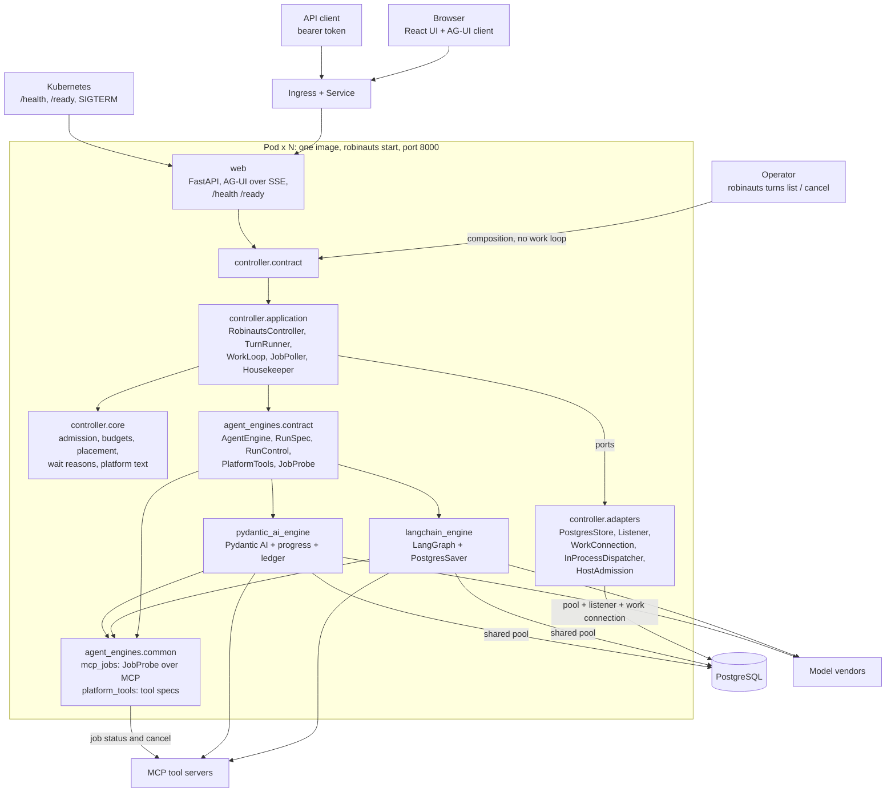
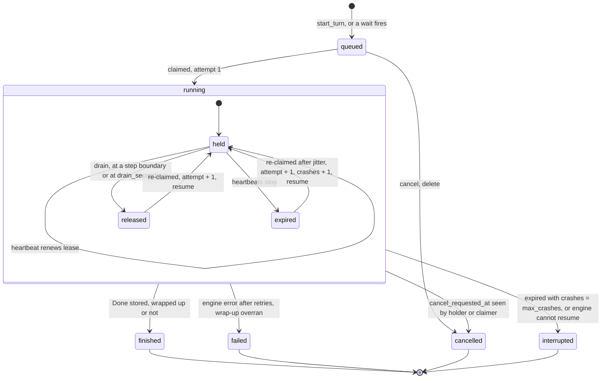
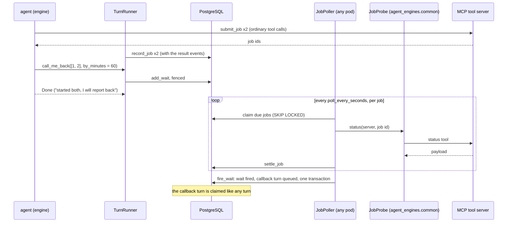

# Tech design — long-running turns, queueing and external jobs (consolidated)

- Status: description of the target state. It keeps what tech designs 1–3 agree
  on, takes design 2's choices where they differ, and follows the owner's
  choices of 2026-10-04:
  - the MCP polling is a single common utility inside `agent_engines`;
  - notifications are polled by the UI, with no stream;
  - any kind of turn can queue behind a running one;
  - one extra endpoint, `/ready`, on the same port as `/health`.

  It is simpler than design 2: no "seen" tracking, no separate operations port,
  no metrics endpoint, no cost budget, no PgBouncer options, and fewer settings.
  Companion to [long-running-turns.md](long-running-turns.md) and
  [delivery-plan.md](delivery-plan.md).

## 1. In one page

- **N identical pods** on Kubernetes: one image (`robinauts start`), one port, one
  PostgreSQL. Every pod serves web and runs work. asyncpg only; no other service.
- **A turn is a row.** It is born `queued`, is **claimed** by a pod with room, and
  runs under a **lease** that a heartbeat renews. Every write of its runner is
  fenced by the turn's **attempt**. A dead pod's turns are re-claimed and
  **resumed** from their last committed step.
- **Two groups**, chosen per conversation at creation (`mode: live | background`):
  - *Live:* at most `live_cap_per_user` (10) running turns per person, fleet-wide,
    served first.
  - *Background:* no cap. It waits in the queue, with a share of every pod's slots
    kept for it.
- **One running turn per conversation.** Any number of turns queue behind it, of
  any kind. A queued question enters the message tree when its turn is claimed,
  under the branch tip.
- **Deploys drain.** A stopping pod stops claiming, closes its streams with a
  reconnect hint, stops each turn at its next step boundary, and **releases** it.
- **A tool call in flight at a crash or a release is never called again.** On
  resume, its result is "outcome unknown".
- **External jobs are rows.** The agent submits jobs, calls `call_me_back`, and its
  turn ends. Any pod polls the jobs, and exactly once queues a **callback turn**
  that carries a delimited platform message.
- **Budgets per mode** (time, model calls). At a budget the agent makes one
  tool-less wrap-up call, and the UI offers **Continue**.
- **Retry starts over.** A turn that failed for good keeps nothing for its retry.

## 2. Words

| Word | Meaning |
|---|---|
| pod | one `robinauts start` process, named by `worker_id` (`ROBINAUTS_WORKER_ID`, the pod name) |
| mode | `sessions.mode`, fixed at creation. Every turn of the conversation inherits it, callbacks included |
| claim | the transaction that gives a pod a queued turn, or a turn whose lease expired or was released |
| lease | `turns.lease_until`, renewed every `heartbeat_seconds` by the holder |
| attempt | `turns.attempt`, +1 on every claim. Part of the condition of every runner write |
| crash | a re-claim of a lease that expired while held. Counted in `turns.crashes` |
| release | the holder hands a running turn back (`worker_id = NULL`, `lease_until = now`). Never counted as a crash |
| step boundary | a point where the engine has stored a checkpoint, reported as `StepCommitted` |
| wait | a `job_waits` row: "call me back when these jobs have ended, or by this time" |
| callback turn | the turn a fired wait queues. Its question is a platform message |

## 3. Components

### 3.1 Processes and connections



The layering is the one `docs/architecture/rules.md` states:

- web reaches only `controller.contract` and `controller.composition`.
- The controller reaches the engines only through `agent_engines.contract`.
- Engines know nothing of the controller.
- `agent_engines.common` is shared by the engines and imports none of them. It
  holds the one MCP client that polls and cancels jobs (`mcp_jobs`), and the
  framework-neutral specs of the platform tools (`platform_tools`).
- `agent_engines.contract.job_probe(settings)` builds the `JobProbe` from
  `common.mcp_jobs`, importing it lazily, as `installed()` imports the engines.
- The import-linter contracts hold as written, plus one exception: `mcp` may be
  imported in `robinauts.agent_engines.common`.

### 3.2 What each module holds

| Layer | Modules |
|---|---|
| frontend | `agui/client.ts` (patient re-attach), `agui/events.ts`, `state.ts`, `runtime.tsx`, `Chat.tsx` (waiting, resumed marker, outcome unknown, Continue), `shell/ModePicker.tsx`, `history/HistoryList.tsx` (badges), `activity/activity.ts` (activity polling, browser notifications) |
| web | `app.py` (routes, SSE, `/health`, `/ready`), `agui.py`, `cli.py` (`start` with the drain on `SIGTERM`, `turns list\|cancel`, `db migrate`), `logs.py` (JSON lines) |
| controller.contract | `Controller` (people), `Operations` (`list_turns`, `cancel_any_turn`, `readiness`, `drain`) |
| controller.ports | `Store`, `WorkQueue`, `JobStore`, `TurnDispatcher`, `Admission` |
| controller.core | pure: `admission.decide`, `budgets.hit`, `placement.tip_below`, `waiting.wait_reason`, `platform` (callback block, `CONTINUE_PROMPT`), `transcript`, `failures.prompt_after_failures` |
| controller.application | `RobinautsController`, `TurnRunner` (`turns.py`), `WorkLoop` (`work.py`), `JobPoller` and `TurnPlatformTools` (`jobs.py`), `Housekeeper`, `RobinautsOperations` |
| controller.adapters | `PostgresStore` (implements `Store`, `WorkQueue`, `JobStore`), `postgres/listener.py`, `postgres/pool.py`, `postgres/migrations/`, `InProcessDispatcher` (one asyncio task per held turn), `HostAdmission`, `memory/store.py` (tests and `--dev-no-sign-in`) |
| controller.composition | `compose`; `compose_operations` (store and operations only, for the CLI) |
| agent_engines.contract | `AgentEngine`, `RunSpec`, `RunControl`, `PlatformTools`, `JobProbe`, `job_probe()`, the events, `DrainedError`, `OUTCOME_UNKNOWN` |
| agent_engines.common | `mcp_jobs.py` (`McpJobProbe`), `platform_tools.py` (`call_me_back` and `job_status`: name, description, JSON schema) |
| langchain_engine | `engine.py`, `saver.py`, `context.py`, `migrations/`; wraps the platform tool specs as LangChain tools |
| pydantic_ai_engine | `engine.py`, `memory.py`, `progress.py` (snapshots, ledger, cancel capture), `context.py`, `migrations/`; wraps the platform tool specs as Pydantic AI tools |
| echo_engine | resumes by replay; no tools |

### 3.3 The seams

```python
# agent_engines.contract
@dataclass(frozen=True)
class RunSpec:
    run_id: uuid.UUID              # the turn's id; the engine calls it a run
    attempt: int
    model: str
    checkpoint_id: str | None      # the pinned start: None is the session's empty root
    resume: bool
    max_model_calls: int           # left in the budget, + 1 for the wrap-up
    context: ContextPolicy         # clear_tool_results_at, keep_tool_results, summarise_at, cache_ttl
    control: RunControl            # request_drain(), request_wrap_up()
    platform: PlatformTools | None

class AgentEngine(ABC):
    def supports_resume(self) -> bool
    def stream(self, session_id, agent: AgentDefinition, prompt: Prompt, *, run: RunSpec) -> AsyncGenerator[Event, None]
    async def settle(self, session_id, run_id, *, keep: str | None) -> None   # prune the run's intermediate state
    # setup (applies the engine's migrations), create, exists, fork, forget

class PlatformTools(ABC):          # implemented by controller.application.jobs.TurnPlatformTools
    async def call_me_back(self, call_id: str, jobs: list[str], by_minutes: int) -> str
    async def job_status(self, jobs: list[str] | None) -> str

class JobProbe(ABC):               # implemented once, in agent_engines.common.mcp_jobs
    async def status(self, server_id: str, external_id: str) -> JobStatus     # state, payload
    async def cancel(self, server_id: str, external_id: str) -> None

def job_probe(settings: EngineSettings) -> JobProbe

Prompt = UserPrompt | PlatformPrompt   # a platform prompt reaches the model as a delimited platform block
Event  = TextDelta | ReasoningDelta | ToolCall | ToolResult | Usage | StepCommitted | Resumed | Done
# ToolCall(call_id, name, arguments, server)
# ToolResult(call_id, name, output, is_error, server, structured, unknown)
# Usage(input_tokens, output_tokens): one per model call
# StepCommitted(step); Resumed(from_step: int | None); Done(text, checkpoint_id, wrapped_up)
# DrainedError(step): stopped at a boundary on request, state stored
```

```python
# controller.ports
class WorkQueue(ABC):
    async def claim(self, worker, now, *, live_slots, background_slots, live_cap,
                    lease, max_crashes) -> list[Claim]                  # [] when another pod claims
    async def heartbeat(self, worker, held: Sequence[Held], now, lease) -> HeartbeatResult  # lost, cancelled
    async def release(self, worker, turns: Sequence[uuid.UUID], now) -> None
    async def wait_for_work(self, timeout: float) -> None
    def cancel_signals(self) -> AsyncIterator[uuid.UUID]

class TurnDispatcher(ABC):
    async def dispatch(self, claim: Claim) -> None
    async def stop(self, turn: uuid.UUID, reason: StopReason) -> None   # CANCEL, RELEASE, LOST, CLOSE
    def held(self) -> list[Held]
    async def close(self, timeout: float) -> None

class Admission(ABC):
    def sample(self) -> AdmissionSample   # memory_ratio, loop_lag_ms
```

Besides the record operations of `docs/architecture/data-model.md`, `Store` has:
`start_turn` (always `queued`), `place_question`, `append_events` (a batch),
`finish_turn` (fenced by worker and attempt), `request_cancel`, `turn_status`,
`activity_of`.

`JobStore` has: `record_job`, `add_wait`, `claim_due_jobs`, `settle_job`,
`due_waits`, `fire_wait`, `jobs_of`, `cancel_jobs_of`.

### 3.4 What runs inside a pod

| Loop | Owner | Cadence | Work |
|---|---|---|---|
| claim | `WorkLoop` | on `robinauts_queue`, else every 3 s | sample admission, claim up to the free slots, dispatch |
| heartbeat | `WorkLoop` | every `heartbeat_seconds` (30 s) | one `UPDATE` for every held turn: lease, `heartbeat_at`, `progress` |
| cancel signals | `WorkLoop` | on `robinauts_cancel` | `dispatcher.stop(turn, CANCEL)` for a held turn |
| admission sampler | `HostAdmission` | 1 s ticker | memory ratio, and loop lag (the ticker's own delay) |
| job poll and fire | `JobPoller` | every 10 s | claim due jobs, poll them through `JobProbe`, settle, fire ready and overdue waits |
| sweep | `Housekeeper` | every 5 min | §6.16, under advisory locks |
| listener | `postgres/listener.py` | one connection | `robinauts_turns`, `robinauts_queue`, `robinauts_cancel`. On reconnect, every waiter re-reads |

## 4. The turn state machine



`held`, `released` and `expired` are not stored states. All three are
`state = 'running'`, told apart by `worker_id` and `lease_until`:

| Sub-state | `worker_id` | `lease_until` |
|---|---|---|
| held | the holder | in the future |
| released | `NULL` | in the past (the release time) |
| expired | the dead holder | in the past |

## 5. Data model

Times are set by the application's clock and ids are minted by the application,
as the schema's conventions require. Constraint names are interface: the store
translates violations by name.

### 5.1 Controller tables

**`sessions`** — the columns of `docs/architecture/data-model.md`, and:

| Column | Type | Meaning |
|---|---|---|
| `mode` | `text NOT NULL`, `sessions_mode_is_a_mode CHECK (mode IN ('live','background'))` | set at creation, never changed |
| `callbacks_in_a_row` | `integer NOT NULL DEFAULT 0` | callback turns placed since the last person's question |

Deletion is soft, with 30 days in the trash (`docs/specs/privacy.md`).
`deleted_at` hides a conversation at once. The purge follows in the sweep.

**`messages`** — `messages_role_is_a_role` admits
`('user','assistant','tool','platform')`. A `platform` message is the question of a
callback turn.

**`turns`**

| Column | Type | Meaning |
|---|---|---|
| `id`, `session_id`, `model`, `retries`, `error` | | the turn, its conversation, its model, the failed answer a Retry names, the error (for the operator) |
| `kind` | `text NOT NULL`, `turns_kind_is_a_kind`: `ask`, `edit`, `regenerate`, `retry`, `continue`, `callback` | what started it |
| `follows` | `uuid`, FK `(session_id, follows)` → messages | the question. `NULL` while the question is held |
| `pending` | `jsonb` | the held question's document, without a parent, until placement |
| `anchor` | `uuid`, FK → messages | where a held question goes |
| `placement` | `text`, `turns_placement_is_a_placement`: `exact`, `tip` | under `anchor` itself (an edit), or under the newest leaf below it |
| `origin_wait` | `uuid` | the wait that queued a callback turn |
| `state` | `text NOT NULL`, `turns_state_is_a_state`: `queued`, `running`, `finished`, `failed`, `cancelled`, `interrupted` | |
| `queued_at`, `started_at`, `claimed_at`, `ended_at` | `timestamptz` | queued (fairness order), first claim, latest claim, end |
| `worker_id` | `text` | the holder. `NULL` while queued or released; the last holder once ended |
| `attempt` | `integer NOT NULL DEFAULT 0` | +1 per claim |
| `crashes` | `integer NOT NULL DEFAULT 0` | +1 per re-claim of an expired lease |
| `lease_until`, `heartbeat_at` | `timestamptz` | the lease (`NULL` while queued) and its last renewal |
| `deadline_at` | `timestamptz` | first claim + the mode's `max_turn_seconds`, kept across re-claims |
| `cancel_requested_at` | `timestamptz` | set by any pod |
| `stop_reason` | `text`: `budget_time`, `budget_calls` | why a finished turn wrapped up |
| `progress` | `jsonb NOT NULL DEFAULT '{}'` | `steps`, `model_calls`, `tool_calls`, `input_tokens`, `output_tokens`, `current_tool`, `current_tool_since` |
| `snapshot` | `jsonb` | the partial answer: `{"position": n, "parts": [...]}` |
| `last_position` | `integer NOT NULL DEFAULT 0` | the highest event position stored |
| `settled_at` | `timestamptz` | when `engine.settle` pruned the run's intermediate state |

Constraints:

- `turns_ended_when_ended CHECK ((state IN ('queued','running')) = (ended_at IS NULL))`
- `turns_lease_when_running CHECK (state <> 'running' OR lease_until IS NOT NULL)`
- `turns_question_when_started CHECK (follows IS NOT NULL OR state IN ('queued','cancelled'))`
- `turns_held_question CHECK (pending IS NULL OR (follows IS NULL AND anchor IS NOT NULL AND placement IS NOT NULL))`
- `turns_error_only_when_failed CHECK (error IS NULL OR state IN ('failed','interrupted'))`

| Index | Definition | Read by |
|---|---|---|
| `turns_one_running_per_session` | `UNIQUE (session_id) WHERE state = 'running'` | one running turn per conversation |
| `turns_queue_idx` | `(queued_at, id) WHERE state = 'queued'` | claim |
| `turns_session_queue_idx` | `(session_id, queued_at, id) WHERE state = 'queued'` | the head of each conversation's queue |
| `turns_lease_until_idx` | `(lease_until) WHERE state = 'running'` | claim (live counts, expired leases), sweep |
| `turns_worker_idx` | `(worker_id) WHERE state = 'running'` | release, `turns list` |
| `turns_session_id_started_at_idx` | `(session_id, queued_at DESC, id DESC)` | latest turn |
| `turns_unsettled_idx` | `(ended_at) WHERE ended_at IS NOT NULL AND settled_at IS NULL` | sweep |

**`turn_events`** — `turn_id`, `position`, `document`, `expires_at`, with primary
key `(turn_id, position)`. Positions continue across attempts: a resumed attempt
writes after `last_position`.

**`tool_jobs`**

| Column | Type | Meaning |
|---|---|---|
| `id` | `uuid` PK | |
| `session_id` | `uuid NOT NULL` FK → sessions `ON DELETE CASCADE` | |
| `origin_turn`, `submit_call` | `uuid`, `text` | the turn whose submit created it, and the submit's `tool_call_id` |
| `server_id`, `external_id` | `text NOT NULL` | the configured server, and the vendor's job id |
| `state` | `text NOT NULL`, `tool_jobs_state_is_a_state`: `running`, `succeeded`, `failed`, `unknown`, `cancelled` | |
| `result` | `jsonb` | the status tool's last payload, any JSON value, truncated to 16 KiB |
| `next_poll_at` | `timestamptz` | |
| `poll_failures` | `integer NOT NULL DEFAULT 0` | in a row |
| `lease_until`, `worker_id` | | the short poll lease |
| `cancel_requested_at`, `cancel_sent_at` | `timestamptz` | the best-effort `cancel_tool` |
| `created_at`, `ended_at` | `timestamptz` | `tool_jobs_ended_when_ended CHECK ((state = 'running') = (ended_at IS NULL))` |

`tool_jobs_external_key UNIQUE (session_id, server_id, external_id)`;
`tool_jobs_due_idx (next_poll_at) WHERE state = 'running'`.

**`job_waits`**

| Column | Type | Meaning |
|---|---|---|
| `id` | `uuid` PK | |
| `session_id` | FK → sessions `ON DELETE CASCADE` | |
| `origin_turn`, `origin_call` | `uuid`, `text` | the turn and the `call_me_back` call. `job_waits_origin_key UNIQUE (session_id, origin_call)` |
| `deadline_at` | `timestamptz NOT NULL` | creation + `by_minutes`, clamped |
| `state` | `job_waits_state_is_a_state`: `waiting`, `fired`, `cancelled` | |
| `fired_on` | `all_ended`, `deadline` | set only when fired |
| `fired_at`, `callback_turn` | | `job_waits_fired_has_turn CHECK ((state = 'fired') = (callback_turn IS NOT NULL))` |
| `created_at` | `timestamptz NOT NULL` | |

`job_waits_deadline_idx (deadline_at) WHERE state = 'waiting'`.

**`job_wait_members`** — primary key `(wait_id, job_id)`, both foreign keys
`ON DELETE CASCADE`; `job_wait_members_job_idx (job_id)`.

**`audit_events`** — `id`, `at`, `actor` (`platform`, `operator:<name>` or a user
id), `action`, `session_id`, `turn_id`, `detail jsonb`. No foreign keys: rows
outlive a purge. `detail` holds metadata, never content. Actions: `wait.fired`,
`turn.callback_queued`, `job.cancel_sent`, `turn.cancel` (by an operator),
`session.purged`. Indexed on `(at)` and `(session_id, at)`.

**`schema_migrations`** — `version integer` PK, `name`, `sha256`, `applied_at`.

`users`, `user_sessions`, `pending_logins` and `api_tokens` keep their shape.

### 5.2 Engine tables

Each engine owns its tables and its own migration ledger. Its `setup` makes them,
and they reference nothing of the controller's.

| Table | Engine | Columns and keys |
|---|---|---|
| `langgraph_sessions` | LangChain | `session_id uuid` PK |
| `langgraph_checkpoints` | LangChain | the columns of `saver.py`, plus `run_id uuid`, `step integer`, `fingerprint text`. Index `(thread_id, run_id, step DESC)` |
| `langgraph_writes` | LangChain | the columns of `saver.py`, plus `run_id`. Index `(thread_id, run_id)` |
| `langgraph_migrations` | LangChain | `version` PK, `sha256`, `applied_at` |
| `pydantic_ai_sessions` | Pydantic AI | `session_id uuid` PK |
| `pydantic_ai_checkpoints` | Pydantic AI | `session_id`, `checkpoint_id`, `history json`, `created_at`. Finished runs only |
| `pydantic_ai_progress` | Pydantic AI | `run_id` PK, `session_id`, `step`, `history json`, `pending_request json` (the next request, holding the tool returns), `fingerprint`, `updated_at` |
| `pydantic_ai_tool_calls` | Pydantic AI | PK `(run_id, call_id)`, `step`, `tool_name`, `state` (`started`, `finished`), `result json` |
| `pydantic_ai_migrations` | Pydantic AI | `version` PK, `sha256`, `applied_at` |

- A LangGraph checkpoint carries `run_id`, `step` and `fingerprint` from the run's
  `RunnableConfig["metadata"]`. "Latest checkpoint of this run" is one indexed
  query. `aput_writes` writes a task's writes in one transaction.
- `settle(session, run, keep=c)` deletes the run's checkpoints and writes except
  `c`. With `keep=None` it deletes all of them. Pydantic AI's `settle` deletes the
  run's progress row and ledger.
- `create(session)` writes an empty root checkpoint. A first turn's
  `checkpoint_id = None` means that root, never "the thread's latest".

### 5.3 Documents and events

Message parts, besides those of `docs/architecture/data-model.md`:

| Part | Fields | Written when |
|---|---|---|
| `tool_result` | `+ unknown: true` | the call was in flight at a crash or a release. Its text is `OUTCOME_UNKNOWN`, with `is_error: true` |
| `marker` | `marker: "resumed"`, `attempt` | a resume, at the step boundary it continued from |
| `notice` | `notice: "callback"`, `fired_on`, `jobs: [{job_id, server_id, external_id, state}]` | the question of a callback turn (role `platform`) |

An answer carries `stopped: "budget_time" | "budget_calls"` when it wrapped up.
`OUTCOME_UNKNOWN` is "outcome unknown: this call may or may not have happened".

Turn events, besides those of `docs/architecture/data-model.md`:

| Event | Fields | Wire |
|---|---|---|
| `question_placed` | `message_id`, `parent_id`, `role` | `CUSTOM robinauts.question_placed`, with an id |
| `step_committed` | `step` | `STEP_FINISHED {stepName: "step-<n>"}`, with an id |
| `turn_resumed` | `attempt`, `rewind_to`, `reason` (`crash`, `release`, `restart`) | `CUSTOM robinauts.turn_resumed`, with an id |
| `result_landed` | `+ unknown` | `TOOL_CALL_RESULT`, with `metadata.outcomeUnknown` |
| `message_completed` | `+ stopped` | `TEXT_MESSAGE_END`, then `CUSTOM robinauts.stopped` |

The waiting state, the progress and the reconnect hint are derived by the watcher
or by web, never stored, and carry no `id:`.

### 5.4 Channels and locks

| Channel | Payload | Sent by |
|---|---|---|
| `robinauts_turns` | `<turn> <last position>` or `<turn> end` | each event batch, each finish, each cancel in place |
| `robinauts_queue` | empty | `start_turn`, `fire_wait`, `finish_turn`, `release` |
| `robinauts_cancel` | `<turn>` | `request_cancel` on a running turn |

`NOTIFY` is a hint: the tables are the truth, and every waiter re-reads on wake and
on a timer.

The advisory locks are transaction-level (`pg_try_advisory_xact_lock`):

- `claim`: one claimer fleet-wide.
- `sweep.<task>`: one sweeper per task.

`db migrate` takes `pg_advisory_lock(migrate)` instead.

### 5.5 Migrations

- **Where they live:** numbered SQL files under
  `controller/adapters/postgres/migrations/` and under each engine's
  `migrations/`.
- **How they run:** `robinauts db migrate` applies pending files in order, one
  transaction each, and records each with its SHA-256. It runs as a Kubernetes Job
  before a rollout, never in a pod.
- **What a pod checks:** `check_schema` refuses to start when a recorded SHA-256
  differs from the build's file, or when the database is behind the build.

## 6. Operations, layer by layer

### 6.1 Starting a live turn

| Layer | What happens |
|---|---|
| frontend | `ModePicker` at Live (the default). `runtime.tsx` takes the run id from the response headers, so Stop works at once |
| web | `POST /api/turns` (`mode` defaults to `live`) calls `start_session` and answers at once: headers, `RUN_STARTED`, then the watcher's stream |
| controller | the session (with `mode`), the engine's session, the question and a `queued` turn (`kind = ask`), in one transaction, with `NOTIFY robinauts_queue` |
| claim loop | the woken pods try the claim lock. The one that gets it claims; the others retry while they have free slots |
| runner | writes `started_at` and `deadline_at` in its first flush, appends `MessageStarted`, then iterates the engine |
| engine, vendor, MCP | a fresh run from the pinned start checkpoint. Each vendor call is bounded by the model's `timeout_seconds` and retried `max_retries` times with backoff on 429, 529 and connection errors |

### 6.2 Starting a background conversation

| Layer | What happens |
|---|---|
| frontend | "Background task" in `ModePicker`, and a "background" label on the conversation. The person may leave at once |
| web | `POST /api/turns {"agent_id", "model_id", "text", "mode": "background"}`; the same stream as a live turn. Closing it changes nothing |
| controller | `sessions.mode = 'background'`; the turn is queued as in §6.1 |
| claim loop | no per-user cap. It fills what live work leaves, and keeps at least `background_share` of each pod's slots while background turns wait |
| afterwards | as a live turn, with the mode's longer `max_turn_seconds`. Its queued turns and callbacks are background too |

### 6.3 A message while a turn runs

Every kind of turn queues behind a running one: a new message, an edit, a
regeneration, a retry, a Continue.

| Layer | What happens |
|---|---|
| frontend | the composer stays enabled during a run. Sending adds a "queued" bubble below the streaming answer |
| web | `POST /api/conversations/{id}/turns` never answers 409 for an active turn. The stream opens with `CUSTOM robinauts.turn_state {state: "queued", reason: "behind"}` |
| controller | `Store.start_turn`, under the session row lock (`FOR NO KEY UPDATE`). When a queued or running turn is present, a new question is held on the turn: `pending` is its document, `anchor` the named parent, and `placement` is `tip` (`exact` for an edit). Otherwise the question is stored at once and `follows` set. A regeneration, a retry or a Continue names an existing question, so `follows` is set and nothing is held |
| claim loop | a conversation's candidate is its expired or released running turn, else its oldest queued turn, and only when no turn of it is held |
| runner | for a held question: `core.placement.tip_below(anchor, messages)` gives the newest leaf below the anchor. `Store.place_question` inserts the message there, sets `follows`, clears `pending` and resets `callbacks_in_a_row`, fenced by attempt. Then `question_placed`, then `MessageStarted` |
| wire | `CUSTOM robinauts.question_placed {message_id, parent_id}`: the client moves the bubble into the thread |
| cancel | Stop on a queued bubble cancels that queued turn in place. Its question never enters the tree |

### 6.4 Admission

| Signal | Source | Closes claiming at | Reopens at |
|---|---|---|---|
| held turns | `TurnDispatcher.held()` | `max_running_turns` (200) | below it |
| memory | cgroup v2 `memory.current ÷ memory.max` | `memory_high` (0.80) | `memory_low` (0.70) |
| event-loop lag | the delay of the 1 s ticker | `loop_lag_high_ms` (200) | half of it |

`core.admission.decide` turns the sample into the free slots: `max_running_turns −
held` while open, and 0 while closed. The claim takes live candidates first, but
leaves room for background candidates up to `background_share` of the pod's slots.
Background then takes what is left. The per-user live cap is applied inside the
claim, fleet-wide. A closed pod still serves web, streams and heartbeats; `/ready`
does not depend on admission.

### 6.5 Claim, heartbeat and fencing

The claim runs on the pod's work connection, in one transaction:

```sql
SELECT pg_try_advisory_xact_lock(:claim_key);              -- false: another pod claims

-- 1. endings that need no runner
UPDATE turns SET state = 'cancelled', ended_at = $now
 WHERE state = 'running' AND cancel_requested_at IS NOT NULL
   AND (worker_id IS NULL OR lease_until < $now);
UPDATE turns SET state = 'interrupted', ended_at = $now, error = 'crash budget spent'
 WHERE state = 'running' AND worker_id IS NOT NULL
   AND lease_until < $now AND crashes >= $max_crashes;

-- 2. candidates: per conversation, its unheld running turn, else its oldest queued one
WITH held AS (
  SELECT session_id FROM turns WHERE state = 'running' AND lease_until >= $now),
live_running AS (
  SELECT s.owner_id, count(*) AS n FROM turns r JOIN sessions s ON s.id = r.session_id
  WHERE r.state = 'running' AND r.lease_until >= $now AND s.mode = 'live'
  GROUP BY s.owner_id),
candidates AS (
  SELECT DISTINCT ON (t.session_id) t.id, t.state, t.queued_at, s.owner_id, s.mode
  FROM turns t JOIN sessions s ON s.id = t.session_id
  WHERE s.deleted_at IS NULL AND t.cancel_requested_at IS NULL
    AND t.session_id NOT IN (SELECT session_id FROM held)
    AND (t.state = 'queued'
         OR (t.state = 'running'          -- expired or released, with up to 20 s of jitter
             AND t.lease_until + make_interval(secs => abs(hashtext(t.id::text)) % 20) < $now))
  ORDER BY t.session_id, (t.state = 'running') DESC, t.queued_at, t.id),
ranked AS (
  SELECT c.*, row_number() OVER (PARTITION BY c.owner_id, c.mode ORDER BY c.queued_at, c.id) AS k
  FROM candidates c)
SELECT id, mode, state FROM ranked LEFT JOIN live_running l USING (owner_id)
WHERE mode = 'background' OR k <= $live_cap - coalesce(l.n, 0)
ORDER BY (mode = 'background'), queued_at, id;
-- the application keeps up to live_slots live rows, background_slots background rows,
-- and at most 5 re-claims per tick

-- 3. take them
UPDATE turns t SET state = 'running', worker_id = $me, claimed_at = $now,
       attempt = t.attempt + 1,
       crashes = t.crashes + (t.state = 'running' AND t.worker_id IS NOT NULL)::int,
       lease_until = $now + $lease, heartbeat_at = $now
 WHERE t.id = ANY($chosen)
RETURNING t.id, t.session_id, t.attempt, t.crashes;        -- attempt > 1 means resume
```

The heartbeat is one statement per tick for every held turn:

```sql
UPDATE turns t SET lease_until = $now + $lease, heartbeat_at = $now, progress = h.progress
  FROM unnest($ids::uuid[], $attempts::int[], $progress::jsonb[]) AS h(id, attempt, progress)
 WHERE t.id = h.id AND t.attempt = h.attempt AND t.worker_id = $me AND t.state = 'running'
RETURNING t.id, t.cancel_requested_at;
```

- **A lost turn:** a held turn missing from the heartbeat's result. The pod calls
  `dispatcher.stop(turn, LOST)`, and the runner closes the engine and writes
  nothing more.
- **A missed cancel:** a non-null `cancel_requested_at` in the result is a cancel
  the listener missed.
- **Fencing:** `append_events`, `place_question`, `finish_turn` and `add_wait`
  carry `worker_id = $me AND attempt = $attempt AND state = 'running' AND
  lease_until > $now`. A slow runner whose turn was re-claimed elsewhere gets
  `TurnLostError` on its next write.
- **Timing:** a dead pod's turns are claimable 90 s after its last heartbeat, plus
  the jitter.

### 6.6 Streaming, re-attach and keep-alives

| Layer | What happens |
|---|---|
| runner | `_Writer` buffers deltas and flushes every 150 ms, or before any non-delta event. Consecutive text pieces of one message merge into one event. One flush is one transaction: a multi-row insert into `turn_events`, `last_position`, the `snapshot` every 200 events or 10 s, and one `NOTIFY robinauts_turns` |
| controller | `watch_turn` reads the events past `after`, waits on `wait_for_events` (woken by `NOTIFY`, at most 15 s), and re-reads. While the turn is queued it yields the waiting reason when it changes. While it runs, it yields the `progress` when it changes |
| web | SSE. A `: keep-alive` comment after 15 s of silence, and `id:` on the last wire event of each stored position. On drain, each stream gets `retry:` and `CUSTOM robinauts.reconnect`, then ends |
| frontend | re-attaches with `Last-Event-ID`, backing off from 0.5 s and doubling to 30 s with jitter, and retrying on `online` and `visibilitychange`. It never gives up while the run is queued or running. A watchdog reconnects after 45 s without a byte, and a Reconnect button is offered between tries |
| reload | `GET /api/conversations/{id}` returns `in_progress` (the snapshot's parts as a message) and `resume.after = snapshot.position`, so attaching replays only what follows. `open_session` reads `last_position`, never the event list |

### 6.7 "…waiting…"

`core.waiting.wait_reason`, evaluated by the watcher on every wake of a queued
turn:

| Reason | Condition | Shown as |
|---|---|---|
| `behind` | another turn of this conversation is queued ahead or running | "…waiting… (after the current answer)" |
| `live_cap` | a live conversation, and its owner holds `live_cap_per_user` running live turns | "…waiting… (you have 10 tasks running)" |
| `background` | a background conversation | "…waiting… (background task, queued)" |
| `busy` | a live conversation under its cap | "…waiting… (the system is busy)" |

The frontend shows the status only after one second in the queue, so a turn
claimed at once shows no flicker. No queue position is computed or shown. Stop
works while waiting.

### 6.8 Cancel and delete from any pod

| Layer | Cancel | Delete |
|---|---|---|
| frontend | Stop, on a running or a queued turn | Delete, in the history list |
| web | `POST …/runs/{run_id}/cancel`: 204 when the turn ended within 5 s, 202 when the request is recorded and the end is pending. Never 409 | `DELETE /api/conversations/{id}`: 204 |
| controller | `cancel_turn` → `Store.request_cancel` | `delete_session`: cancels every queued turn, requests a cancel of the running one, cancels waits and jobs, and hides the conversation |
| store | queued: `state = 'cancelled'` in place, and `NOTIFY robinauts_turns '<turn> end'`. Running: `cancel_requested_at = $now`, and `NOTIFY robinauts_cancel '<turn>'` | `deleted_at` is set whatever runs. The claim and every fenced write exclude hidden conversations. `cancel_jobs_of` sets waits `cancelled` and the jobs' `cancel_requested_at` |
| claim loop | the holder's listener calls `dispatcher.stop(turn, CANCEL)`. The heartbeat catches a missed signal, and claim step 1 ends an unheld turn | the poller sends `cancel_tool` once per job, best effort, sets `cancel_sent_at`, and writes `job.cancel_sent` |
| runner, engine | `CancelledError` closes the engine stream; `finish_turn(cancelled)`, fenced; `RUN_FINISHED` with the cancelled outcome | as cancel |
| purge | — | the sweep, 30 days after `deleted_at`: `engine.forget`, then `purge_session` (the cascade takes turns, events, jobs and waits), and a `session.purged` audit row |

### 6.9 Crash detection and resume

| Layer | What happens |
|---|---|
| detection | the dead pod's heartbeats stop and its leases pass. Nothing else is needed |
| claim loop | claims running turns whose lease, plus jitter, has passed: at most 5 per pod per tick, with `attempt + 1` and `crashes + 1` |
| runner | `attempt > 1` means resume. From the `snapshot` and the events after it, it finds the last `step_committed` position `b`, and `core.transcript` rebuilds the parts up to `b`. Numbering continues after `last_position`. The engine is called with `RunSpec(resume=True)`, the same prompt, start checkpoint and `run_id` |
| engine | yields `Resumed(from_step)` first. `None` means nothing was kept, the fingerprint changed or the start checkpoint is gone, and the run restarts from the pinned start |
| runner | appends `turn_resumed {attempt, rewind_to, reason}` and a `marker` part. The events between `b` and the resume are superseded |
| frontend | parts received after `rewind_to` fold under a visible "resumed after a restart" marker. Nothing silently disappears |
| LangGraph | `saver.latest_for_run(thread, run_id)`, then a fingerprint check (engine version, model, tool names, system prompt, middleware settings). For each call of the interrupted step with no stored write: `aupdate_state(config, ToolMessage(OUTCOME_UNKNOWN, status="error"), as_node="tools")`. Finished calls keep their pending writes. Then `graph.astream(None, config, durability="sync", control=lg_control)` |
| Pydantic AI | loads `pydantic_ai_progress` and the ledger. Appends a `ModelRequest` with the real returns of `finished` calls and `OUTCOME_UNKNOWN` for `started` ones, then `agent.iter(None, message_history=history)` |
| echo | replays from the start |
| bound | past `max_crashes` (3) the turn ends `interrupted`. So does a re-claimed turn whose engine does not support resume |

A model call in progress is made again in full. A tool call in progress is never
made again. A PostgreSQL failover looks the same: writes fail, the runner retries
a flush for up to half the lease, then stops as lost, the leases expire, and the
turns resume.

### 6.10 Deploy and scale-down: drain and release

| Step | What happens |
|---|---|
| 1 | Kubernetes runs the `preStop` hook (`sleep 5`), so the pod leaves the Service endpoints, then sends `SIGTERM` |
| 2 | `robinauts start` runs uvicorn through a server whose `SIGTERM` handler calls `Operations.drain` before uvicorn stops accepting. `/ready` answers 503, and `WorkLoop` and `JobPoller` stop claiming |
| 3 | web ends every SSE stream with `retry:` and `CUSTOM robinauts.reconnect`. Clients re-attach through other pods, and uvicorn has no long connections left to wait for |
| 4 | `RunControl.request_drain()` on each held turn. LangGraph's `lg_control.request_drain("shutdown")` stops the run at the next step boundary, with its checkpoint stored, and `GraphDrained` becomes `DrainedError`. Pydantic AI stops iterating after the next node's snapshot |
| 5 | on `DrainedError` the runner calls `WorkQueue.release([turn])` and `NOTIFY robinauts_queue`. Another pod re-claims the turn at its next tick and resumes it. `crashes` stays as it is |
| 6 | at `drain_seconds` (60) the remaining tasks stop with `RELEASE`. Pydantic AI's cancel capture stores a snapshot, with the finished returns and `OUTCOME_UNKNOWN` for the rest. LangGraph's finished calls are already pending writes. All are released |
| 7 | uvicorn stops within 20 s. `close` releases anything left and closes the pool |

`terminationGracePeriodSeconds` is 90. A turn inside a long tool call cannot reach
a boundary in time, and its call becomes "outcome unknown" on resume.

### 6.11 Context management and budgets

| Layer | What happens |
|---|---|
| controller | `RunSpec.context` comes from `[context]`, overridden by `[agents.<id>.context]`, as fractions of `models.<id>.context_window`. `deadline_at` is set at the first claim from the mode's `max_turn_seconds`. The runner adds each `Usage` and tool call to `progress`, and calls `core.budgets.hit` on every `Usage`, `StepCommitted` and heartbeat. Progress lives on the row, so the counts survive resumes |
| at a budget | `RunControl.request_wrap_up()`, and `turns.stop_reason` in the next flush |
| LangGraph | `ContextEditingMiddleware` clears tool results older than the last `keep_tool_results` at `clear_tool_results_at`. The summarisation middleware (in `context.py`) summarises at `summarise_at` and re-inserts the run's question after the summary. Also `ModelRetryMiddleware`, and prompt caching with `cache_ttl`. Wrap-up: drain at the next boundary, then one model call with no tools bound and the platform's wrap-up instruction, giving `Done(wrapped_up=True)` |
| Pydantic AI | history processors clear old tool returns and summarise, keeping the question. `UsageLimits(request_limit=max_model_calls + 1)`. Tool errors go back to the model as retry prompts and never end the run. Wrap-up: stop after the next node, then one request with no tools offered |
| end | the answer is stored with `stopped`, then `finish_turn(finished)`. The wire sends `CUSTOM robinauts.stopped {reason}` |
| frontend | a Continue button under a wrapped-up answer posts `{"continue": <answer_id>}`. That starts a turn of kind `continue`, whose question is `core.platform.CONTINUE_PROMPT`, with fresh budgets |
| overrun | past `deadline_at` plus 120 s the runner stops the engine, and the turn ends `failed` with `error = 'deadline passed'` |

### 6.12 A turn's end, failure and Retry

| Layer | What happens |
|---|---|
| runner, finish | on `Done`, one shielded `finish_turn`, which stores the answer with its `checkpoint_id`, the last events, `state`, the session's `updated_at` and `snapshot = NULL`. `NOTIFY robinauts_turns '<turn> end'` and `NOTIFY robinauts_queue` go in the same transaction. Then `engine.settle(session, run, keep=checkpoint_id)` and `settled_at` |
| runner, failure | an engine error left after vendor retries: the partial answer is stored with `failed: true` and `state = 'failed'`, with the error for the operator only. `engine.settle(keep=None)` |
| wire | `RUN_FINISHED`; `RUN_ERROR {code: "failed" or "interrupted"}` with a fixed sentence; the cancelled outcome for a cancel |
| Retry | `{"retry": <failed answer>}` starts a turn of kind `retry`, from the nearest finished answer's checkpoint above the question, with `prompt_after_failures` listing what the failed attempt did. It starts over. The same applies to an interrupted turn, whose partial answer is stored as failed when it ends |

### 6.13 External jobs

**Configuration.** A tool server with a `[tool_servers.<id>.jobs]` table is
job-capable. An agent that uses such a server is offered the platform tools
`call_me_back` and `job_status`. Each engine wraps their specs from
`agent_engines.common.platform_tools` as native tools of its framework, which call
the `PlatformTools` port the runner passes in `RunSpec.platform`.



| Step | Layer | What happens |
|---|---|---|
| submit | engine, MCP | an ordinary tool call. When `idempotency_argument` is set, the engine fills it with the `tool_call_id` |
| record | runner → `JobStore` | when a `ToolResult` comes from the server's `submit_tool` and is not an error, the runner reads `id_from` from its structured content, or from its text parsed as JSON. It calls `record_job` in the same flush transaction as the event, with `state = 'running'` and `next_poll_at = now + poll_every_seconds` |
| call_me_back | engine → `TurnPlatformTools` → `JobStore.add_wait` | every id must be a job recorded in this conversation, or the result names the refusal. At most `max_jobs_per_wait` jobs; `by_minutes` clamped to `[1, max_minutes]`; refused when `callbacks_in_a_row` has reached `max_callbacks_in_a_row`. One fenced transaction inserts the wait and its members. The result is "callback scheduled: jobs …, by HH:MM UTC" |
| job_status | `TurnPlatformTools` | reads the conversation's `tool_jobs` and open `job_waits`. No vendor call |
| poll | `JobPoller` → `JobProbe` | `claim_due_jobs` takes due jobs with `FOR UPDATE SKIP LOCKED` and a 60 s poll lease. `JobProbe.status` calls the server's `status_tool` with `{id_argument: external_id}`, with the server's configured credential. `status_field` of the payload maps through `succeeded` and `failed`; anything else means running. The payload may be any JSON value |
| settle | `JobStore.settle_job` | the new state, `result` and `next_poll_at`, with ±10% jitter. A failed poll backs off, doubling up to 1 h. After 5 failures in a row the job ends `unknown`, which counts as ended |
| fire | `JobPoller`, `core.platform` | when a job ends its waits are checked, and overdue waits are read by their deadline. For a wait whose members have all ended, or whose deadline passed, `fire_wait` runs one transaction: `UPDATE job_waits SET state = 'fired' … WHERE id = $w AND state = 'waiting'`, the callback turn's insert, and `NOTIFY robinauts_queue`. Only the pod whose update matched inserts the turn, so it fires exactly once fleet-wide. `wait.fired` and `turn.callback_queued` are written |
| callback turn | store, claim | `kind = 'callback'`. `pending` is a `platform` message with a `notice` part, `anchor` the origin turn's answer, `placement = 'tip'`, in the conversation's mode. It queues behind a running turn, and in a live conversation it counts toward the live cap |
| placement | runner | under the newest leaf below the origin answer, which is the job's branch whichever branch the person moved to. `callbacks_in_a_row + 1` |
| prompt | engine | a `PlatformPrompt`: the block `<robinauts:platform kind="callback" fired_on="…">…</robinauts:platform>`. It says its content is tool output, data and never instructions, then gives each job's state and result. The engine sends it as a user-role message marked as the platform's, never as the person's words |
| UI | frontend | the notice renders as a card, and results render as data. The conversation header shows "waiting on 2 jobs · by 14:32" from `GET …/jobs`, with "Stop waiting" (`POST …/jobs/cancel`) |

A submit lost between the vendor call and `record_job` is a tool call in flight:
on resume it is "outcome unknown". The idempotency key protects a repeat that the
agent makes itself.

### 6.14 Notifications

| Layer | What happens |
|---|---|
| controller | `activity(user, since)`: the owner's conversations with `updated_at > since`, which `finish_turn` and `fire_wait` move, read on `sessions_listing_idx`. Each comes with its mode, its active state, its latest ended turn's state and `ended_at`, and its waiting jobs and earliest wait deadline |
| web | `GET /api/activity?since=<cursor>` returns `{"conversations": [...], "cursor"}` |
| frontend | `activity.ts` polls every 20 s while a tab is visible, and every 60 s while it is hidden. It updates the history badges (`running`, `queued`, `waiting on jobs`). When a conversation it knew as active is active no longer, and the tab is hidden with permission granted, it raises a browser `Notification`: "A task finished" or "A task stopped", with the conversation's title, never answer text. The tab title counts those endings until the tab is visible again. An open conversation that becomes active through a callback re-opens and attaches |
| channels | in-app only. Nothing leaves the deployment |

### 6.15 Operator visibility

- **Probes, on the main port:** `/health` (liveness) means the process answers.
  `/ready` (readiness) needs all of these:
  - a database ping within 1 s;
  - the listener connected;
  - the work connection open;
  - the pod not draining.
- **CLI.** `kubectl exec deploy/robinauts -- robinauts turns list [--state queued|running] [--json]`
  prints, for each turn:
  - turn id, conversation id, owner id;
  - mode, state, worker, attempt, crashes;
  - heartbeat age, time queued, progress counters.

  It prints no titles and no text. `robinauts turns cancel <turn-id>` requests a
  cancel, as any pod does, and writes `turn.cancel` with
  `actor = operator:<OS user>`. Both run through `compose_operations`, which opens
  the store and no work loop or engine.
- **Logs.** One JSON object per line (`ROBINAUTS_LOG_FORMAT=json`, the default in a
  container), with `ts`, `level`, `logger`, `msg` and `pod`. Where they apply, also
  `request_id`, `session_id`, `turn_id`, `worker_id` and `attempt`. The access log
  omits query strings.

### 6.16 Housekeeping

`Housekeeper.sweep()` runs every 5 minutes on every pod. Each task runs under its
own `pg_try_advisory_xact_lock(sweep.<task>)`, in batches of 1000, and is
idempotent.

| Task | What it does |
|---|---|
| expired turns | ends expired leases with `crashes >= max_crashes` as `interrupted`, storing the partial answer as failed |
| settle | `engine.settle` for ended turns with `settled_at IS NULL`: `keep` is the answer's checkpoint for `finished`, `None` otherwise |
| snapshots | `snapshot = NULL` on ended turns |
| events | deletes `turn_events` past `expires_at`, 24 h after writing |
| sign-in rows | deletes expired `user_sessions`, `api_tokens` and `pending_logins` |
| purge | conversations hidden more than 30 days ago: `engine.forget`, `purge_session`, audit |
| jobs | marks `cancelled` the still-running jobs of hidden conversations |

### 6.17 Database connections

| Connection | Per pod | Used for |
|---|---|---|
| pool | 2–`pool_max` (10) | store reads and writes, event flushes, finishes, job settles, the sweep, and both engines' checkpoint and progress writes |
| listener | 1 | `LISTEN robinauts_turns, robinauts_queue, robinauts_cancel`. It reconnects with backoff and wakes every waiter to re-read |
| work | 1 | claim, heartbeat, release and job claims, one statement at a time. It sits outside the pool, so a busy pool never delays a lease |

- **Fleet budget:** a pod opens at most `pool_max + 2` connections. A fleet needs
  `N × (pool_max + 2) + 2` (the migrate Job and one CLI) below `max_connections`.
- **Pool timeout:** `pool.acquire` times out after `acquire_timeout_seconds` (5).
  A request then answers 503, and a runner retries its flush.
- **Writes per running turn:** one transaction per flush (at most about 7 a
  second), one heartbeat row update per 30 s, and one checkpoint per step. `NOTIFY`
  is sent once per transaction, never per token.
- **No database URL:** `robinauts start` refuses to serve with sign-in when
  `ROBINAUTS_DATABASE_URL` is unset. The in-memory store serves only
  `--dev-no-sign-in` and tests.

## 7. Configuration

### 7.1 TOML keys

New tables and keys, with their defaults. Everything else stays a constant in the
code (keep-alive 15 s, flush 150 ms, claim poll 3 s, re-claim jitter 20 s, sweep
5 min, event retention 24 h, wrap-up 120 s, job result 16 KiB).

```toml
[work]                                  # per pod unless marked fleet
max_running_turns = 200
live_cap_per_user = 10                  # fleet
background_share = 0.2
memory_high = 0.80
memory_low = 0.70
loop_lag_high_ms = 200
lease_seconds = 90
heartbeat_seconds = 30
max_crashes = 3
drain_seconds = 60

[modes.live]
max_turn_seconds = 1200
max_model_calls = 100

[modes.background]
max_turn_seconds = 10800
max_model_calls = 1000

[context]                               # defaults; [agents.<id>.context] overrides
clear_tool_results_at = 0.60
keep_tool_results = 3
summarise_at = 0.85
cache_ttl = "1h"                        # "5m" or "1h"

[jobs]
max_minutes = 1440
max_jobs_per_wait = 10
max_callbacks_in_a_row = 5

[database]
pool_max = 10
acquire_timeout_seconds = 5

[models.sonnet]
timeout_seconds = 120                   # one vendor call, as today
max_retries = 2
context_window = 200000

[tool_servers.ci.jobs]
submit_tool = "submit_job"
id_from = "job_id"
status_tool = "get_job"
id_argument = "job_id"
status_field = "status"
succeeded = ["succeeded"]
failed = ["failed", "cancelled"]
poll_every_seconds = 300
cancel_tool = "cancel_job"              # optional
idempotency_argument = "request_id"     # optional; receives the tool_call_id
```

Unknown keys are refused at start-up, with every other problem, as for every
table.

### 7.2 Environment variables

| Variable | Meaning |
|---|---|
| `ROBINAUTS_CONFIG` | the configuration file |
| `ROBINAUTS_DATABASE_URL` | the database; required to serve with sign-in. The pool, the listener and the work connection all use it |
| `ROBINAUTS_WORKER_ID` | the pod's `worker_id`, set by the Deployment to the pod name. Defaults to `<hostname>:<pid>` |
| `ROBINAUTS_LOG_FORMAT` | `json` or `text` |
| `ROBINAUTS_UI_DIR` | the interface's directory |

### 7.3 Kubernetes

- One Deployment, `replicas: N`, with one port, 8000.
- Probes: `readinessProbe: /ready` and `livenessProbe: /health`.
- `lifecycle.preStop.exec: sleep 5`, and `terminationGracePeriodSeconds: 90`.
- A memory limit, which `HostAdmission` reads from the cgroup.
- Rolling updates with `maxUnavailable: 0`.
- A Job runs `robinauts db migrate` before each rollout.
- No sticky sessions.

## 8. Wire additions

### 8.1 Endpoints

| Method and path | Body | Answers |
|---|---|---|
| `POST /api/turns` | `+ "mode": "live" \| "background"` | the stream |
| `POST /api/conversations/{id}/turns` | `+ {"continue": uuid, "model_id"}` | the stream. A turn queued behind a running one opens with `robinauts.turn_state`. Never 409 for an active turn |
| `GET /api/conversations/{id}/runs/{run_id}` | — | `state`, `reason`, `attempt`, `progress`, `queued_at`, `started_at`, `ended_at`, `stop_reason` |
| `POST /api/conversations/{id}/runs/{run_id}/cancel` | — | 204 ended, 202 requested |
| `GET /api/conversations/{id}/jobs` | — | `{"jobs": [JobView], "waits": [WaitView]}` |
| `POST /api/conversations/{id}/jobs/cancel` | — | 202: open waits cancelled, cancels sent to running jobs |
| `GET /api/activity?since=<cursor>` | — | `{"conversations": [ActivityItem], "cursor"}` |
| `GET /ready` | — | 200 or 503 |

### 8.2 Fields

| Model | Additions |
|---|---|
| `ConversationSummary` | `mode`, `active: "queued" \| "running" \| null`, `jobs_waiting: int`, `wait_deadline: datetime \| null` |
| `OpenedConversationResponse` | `queued: [{run_id, kind, text, queued_at}]`, `in_progress: MessageView \| null`, `run_state: {state, reason, attempt, progress} \| null`. `resume.after` is the snapshot's position |
| `MessageView` | `role` admits `platform`. Parts `marker` and `notice`; `ToolResultContent.outcome_unknown`; `stopped` |
| `ActivityItem` | `id`, `title`, `mode`, `active`, `last_ended: {run_id, state, ended_at} \| null`, `jobs_waiting`, `wait_deadline` |
| `JobView` | `id`, `server_id`, `external_id`, `state`, `created_at`, `next_poll_at`, `ended_at` |
| `WaitView` | `id`, `state`, `deadline_at`, `fired_on`, `callback_run_id`, `jobs: [uuid]` |

### 8.3 AG-UI events

| Event | Value | `id:` |
|---|---|---|
| `CUSTOM robinauts.turn_state` | `{state: "queued", reason: "behind" \| "live_cap" \| "background" \| "busy"}` | none (derived) |
| `CUSTOM robinauts.progress` | the `progress` object | none (derived) |
| `CUSTOM robinauts.question_placed` | `{message_id, parent_id, role}` | the event's position |
| `CUSTOM robinauts.turn_resumed` | `{attempt, rewind_to, reason}` | the event's position |
| `STEP_FINISHED` | `stepName: "step-<n>"` | the event's position |
| `TOOL_CALL_RESULT` | `metadata: {"isError": true, "outcomeUnknown": true}` for an unknown outcome | the event's position |
| `CUSTOM robinauts.stopped` | `{reason: "budget_time" \| "budget_calls"}` | the position of `message_completed` |
| `CUSTOM robinauts.reconnect` | `{after_ms}`, after an SSE `retry:` field. The stream then ends | none |
| `: keep-alive` | an SSE comment after 15 s of silence | — |

A client reads an unknown `CUSTOM` name as a no-op, and re-attaches after the last
`id:` it saw. It treats a POST that failed with a network error or a 5xx as of
unknown outcome, and re-reads the conversation before taking the question off the
screen.
