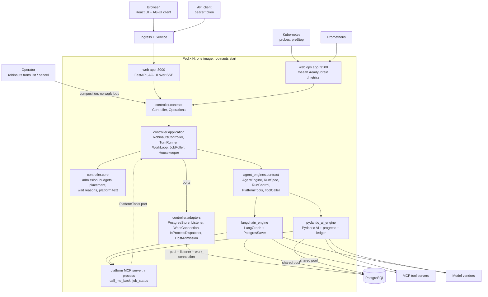
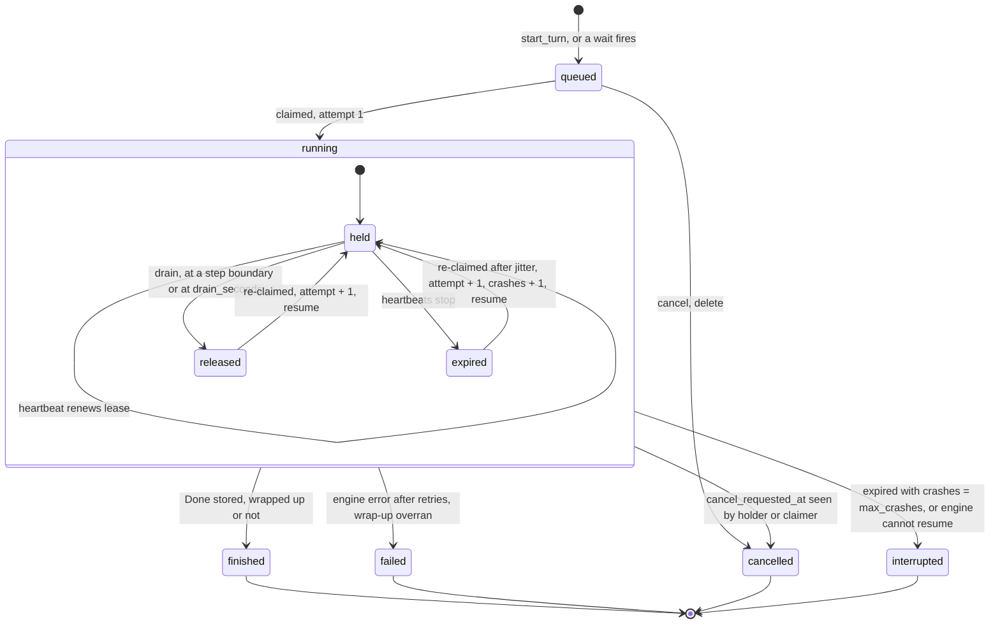
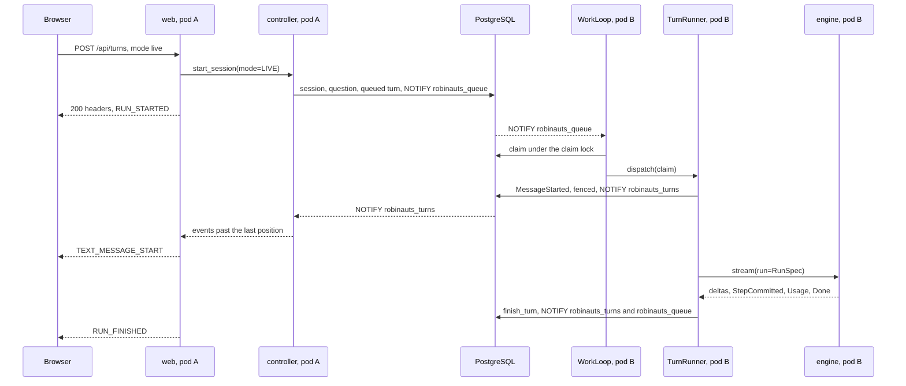

# Tech design 2 — long-running turns, queueing and external jobs (final state)

- Status: description of the target state; companion to long-running-turns.md.

## 1. In one page

- **N identical pods** on Kubernetes, one image (`robinauts start`), one
  PostgreSQL. Every pod serves web and runs work. No other service, queue or
  driver: asyncpg only.
- **A turn is a row**: born `queued`, **claimed** by a pod with room, run under a
  **lease** a heartbeat renews, every runner write fenced by its **attempt**. A
  dead pod's turns are re-claimed and **resumed** from their last committed step.
- **Two groups**, chosen per conversation at creation (`mode: live | background`).
  Live: at most `live_cap_per_user` (10) running turns per person, fleet-wide and
  exact, served first. Background: no cap, queued, with `background_share` of
  every pod's slots kept for it while it waits.
- **One running turn per conversation**, any number queued behind it; a queued
  question enters the message tree at claim, under the branch tip.
- **Deploys and scale-downs drain**: stop claiming, close streams with a
  reconnect hint, stop each turn at its next step boundary, **release** it.
- **A tool call in flight at a crash or release is never called again**; its
  result on resume is "outcome unknown".
- **External jobs are rows**: submit, `call_me_back`, end the turn; any pod polls,
  and exactly once queues a **callback turn** carrying a delimited platform
  message.
- **Controller-held budgets** (time, model calls, cost) end in one tool-less
  wrap-up call and a **Continue** offer.

## 2. Words

| Word | Meaning |
|---|---|
| pod | one `robinauts start` process, named by `worker_id` (`ROBINAUTS_WORKER_ID`, the pod name) |
| group, mode | `sessions.mode`, fixed at creation, inherited by every turn of the conversation, callbacks included |
| claim | the transaction that gives a pod a queued turn, or a turn whose lease expired or was released |
| lease | `turns.lease_until`, renewed every `heartbeat_seconds` by the holder |
| attempt | `turns.attempt`, +1 on every claim; part of every runner write's condition |
| crash | a re-claim of a lease that expired while held (`worker_id` still set); counted in `turns.crashes` |
| release | the holder hands a running turn back (`worker_id = NULL`, `lease_until = now`); never counted as a crash |
| step boundary | a point at which the engine has stored a checkpoint; the engine reports it as `StepCommitted` |
| resume | running a re-claimed turn with `resume = True`, from its last step boundary |
| wait | a `job_waits` row: "call me back when these jobs have ended, or by this time" |
| callback turn | the turn a fired wait queues; its question is a platform message |

## 3. Components

### 3.1 Processes and connections



The layering is the one `docs/architecture/rules.md` states. web reaches only
`controller.contract` and `controller.composition`. The controller reaches the
engines only through `agent_engines.contract`. Engines know nothing of the
controller: the platform tools and the job poller's MCP client cross the seam as
ports of the engine contract (`PlatformTools`, `ToolCaller`), implemented in
`platform.py` and `tool_caller.py` of each framework engine. asyncpg is imported
only in `controller.adapters` and the two framework engines; `mcp` only in the
two framework engines. No engine imports another. The import-linter contracts of
`backend/pyproject.toml` hold as written.

### 3.2 What each module holds

| Layer | Modules |
|---|---|
| frontend | `chat/assistant-ui/agui/client.ts` (patient re-attach), `agui/events.ts`, `state.ts`, `runtime.tsx`, `Chat.tsx`, `ToolCall.tsx` (waiting, resumed marker, outcome unknown, Continue), `shell/ModePicker.tsx`, `history/HistoryList.tsx` (badges), `activity/activity.ts` (activity polling, notifications), `conversation/JobsPanel.tsx` |
| web | `app.py` (routes, SSE), `ops.py` (ops port), `agui.py`, `metrics.py` (Prometheus text, by hand), `cli.py`, `logs.py` (JSON lines) |
| controller.contract | `Controller` (people), `Operations` (`list_turns`, `cancel_any_turn`, `metrics`, `readiness`, `drain`) |
| controller.ports | `Store`, `WorkQueue`, `JobStore`, `TurnDispatcher`, `Admission` |
| controller.core | pure: `admission.decide`, `budgets.hit`, `placement.tip_below`, `waiting.wait_reason`, `platform` (callback text, platform block, `CONTINUE_PROMPT`), `transcript`, `failures.prompt_after_failures` |
| controller.application | `RobinautsController`, `TurnRunner` (`turns.py`), `WorkLoop` (`work.py`), `JobPoller` and `TurnPlatformTools` (`jobs.py`), `Housekeeper`, `RobinautsOperations` |
| controller.adapters | `PostgresStore` (implements `Store`, `WorkQueue`, `JobStore`), `postgres/listener.py`, `postgres/pool.py`, `postgres/schema.py` with `postgres/migrations/`, `InProcessDispatcher` (one asyncio task per held turn), `HostAdmission`, `memory/store.py` (one process: tests and `--dev-no-sign-in`) |
| controller.composition | `compose`; `compose_operations` (store and operations only, for the CLI) |
| agent_engines.contract | `AgentEngine`, `RunSpec`, `RunControl`, `PlatformTools`, `ToolCaller`, the events, `DrainedError`, `OUTCOME_UNKNOWN` |
| langchain_engine | `engine.py`, `saver.py`, `context.py`, `platform.py` (platform MCP server), `tool_caller.py` (poller client), `migrations/` |
| pydantic_ai_engine | `engine.py`, `memory.py`, `progress.py` (snapshots, ledger, cancel capture), `context.py`, `platform.py`, `tool_caller.py`, `migrations/` |
| echo_engine | resume by replay; no tools, no `ToolCaller` |

### 3.3 The seams

```python
# agent_engines.contract.ports
@dataclass(frozen=True)
class RunSpec:
    run_id: uuid.UUID              # the turn's id; the engine calls it a run
    attempt: int
    model: str
    checkpoint_id: str | None      # the pinned start: None is the thread's empty root
    resume: bool
    call_timeout_seconds: float    # one vendor HTTP call, nothing more
    max_retries: int
    max_model_calls: int           # the calls left in the budget, + 1 for the wrap-up
    context: ContextPolicy         # clear_tool_results_at, keep_tool_results, summarise_at, summary_model, cache_ttl
    control: RunControl            # request_drain(), request_wrap_up()
    platform: PlatformTools | None

class AgentEngine(ABC):
    def supports_resume(self) -> bool
    def stream(self, session_id, agent: AgentDefinition, prompt: Prompt, *, run: RunSpec) -> AsyncGenerator[Event, None]
    async def settle(self, session_id, run_id, *, keep: str | None) -> None   # prune the run's intermediate state
    def tool_caller(self) -> ToolCaller | None
    # also setup (applies the engine's migrations), create, exists, fork, forget

class PlatformTools(ABC):          # implemented by controller.application.jobs.TurnPlatformTools
    async def call_me_back(self, call_id: str, jobs: list[str], by_minutes: int) -> ToolOutcome
    async def job_status(self, jobs: list[str] | None) -> ToolOutcome

class ToolCaller(ABC):             # implemented inside each framework engine with the mcp SDK
    async def call(self, server_id: str, tool: str, arguments: Mapping) -> ToolOutcome   # keeps structuredContent
    async def task_get(self, server_id: str, task_id: str) -> TaskState
    async def task_result(self, server_id: str, task_id: str) -> ToolOutcome
    async def task_cancel(self, server_id: str, task_id: str) -> None

Prompt = UserPrompt | PlatformPrompt   # a platform prompt reaches the model as a delimited platform block
Event  = TextDelta | ReasoningDelta | ToolCall | ToolResult | Usage | StepCommitted | Resumed | Done
# ToolCall(call_id, name, arguments, server)
# ToolResult(call_id, name, output, is_error, server, structured, unknown)
# Usage(input_tokens, output_tokens, cache_read_tokens, cache_write_tokens)
# StepCommitted(step); Resumed(from_step: int | None); Done(text, checkpoint_id, wrapped_up)
# DrainedError(step): stopped at a boundary on request, state stored
```

```python
# controller.ports
class WorkQueue(ABC):
    async def claim(self, worker, now, *, live_slots, background_slots, reserve, live_cap,
                    lease, max_crashes, jitter, reclaims) -> list[Claim]    # [] when another pod claims
    async def heartbeat(self, worker, held: Sequence[Held], now, lease) -> HeartbeatResult  # lost, cancelled
    async def release(self, worker, turns: Sequence[uuid.UUID], now) -> None
    async def wait_for_work(self, timeout: float) -> None
    def cancel_signals(self) -> AsyncIterator[uuid.UUID]

class TurnDispatcher(ABC):
    async def dispatch(self, claim: Claim) -> None
    async def stop(self, turn: uuid.UUID, reason: StopReason) -> None   # CANCEL, RELEASE, LOST, CLOSE
    def held(self) -> list[Held]
    async def close(self, timeout: float) -> None

class Admission(ABC):
    def sample(self) -> AdmissionSample   # memory_ratio, loop_lag_ms, pool_wait_ms
```

`Store` holds the record operations of `docs/architecture/data-model.md`, and
`start_turn` (always `queued`), `place_question`, `append_events` (a batch),
`finish_turn` (fenced by worker and attempt), `request_cancel`, `turn_status`,
`activity_of`, `mark_seen`.
`JobStore` holds `record_job`, `add_wait`, `claim_due_jobs`, `settle_job`,
`due_waits`, `fire_wait`, `jobs_of`, `cancel_jobs_of`.

### 3.4 What runs inside a pod

| Loop | Owner | Cadence | Work |
|---|---|---|---|
| claim | `WorkLoop` | on `robinauts_queue`, else every `claim_poll_seconds` (3 s) | sample admission, claim up to the free slots, dispatch |
| heartbeat | `WorkLoop` | every `heartbeat_seconds` (30 s) | one `UPDATE` for every held turn: lease, `heartbeat_at`, `progress` |
| cancel signals | `WorkLoop` | on `robinauts_cancel` | `dispatcher.stop(turn, CANCEL)` for a held turn |
| admission sampler | `HostAdmission` | 1 s ticker | memory ratio, loop lag (the ticker's own delay) |
| job poll and fire | `JobPoller` | every `jobs.poll_tick_seconds` (10 s) | claim due jobs, poll, settle, fire ready and overdue waits |
| sweep | `Housekeeper` | every `work.sweep_seconds` (300 s) | §6.16, under advisory locks |
| listener | `postgres/listener.py` | one connection | `robinauts_turns`, `robinauts_queue`, `robinauts_cancel`; on reconnect every waiter re-reads |

## 4. The turn state machine



`held`, `released` and `expired` are not stored states. All three are
`state = 'running'`; they are told apart by `worker_id` and `lease_until`:

| Sub-state | `worker_id` | `lease_until` |
|---|---|---|
| held | the holder | in the future |
| released | `NULL` | in the past (set to the release time) |
| expired | the dead holder | in the past |

Every transition is one conditional statement: §6.5 gives the claim, the heartbeat
and the fencing condition of the runner's writes.

## 5. Data model

All times are set by the application's clock and every id is minted by the
application, as the schema's conventions require. Constraint names are interface:
the store translates violations by name.

### 5.1 Controller tables

**`sessions`** — the columns of `docs/architecture/data-model.md`, and:

| Column | Type | Meaning |
|---|---|---|
| `mode` | `text NOT NULL`, `sessions_mode_is_a_mode CHECK (mode IN ('live','background'))` | the group, set at creation, never changed |
| `seen_at` | `timestamptz` | when the owner last opened it; "unseen" is `updated_at > seen_at` |
| `callbacks_in_a_row` | `integer NOT NULL DEFAULT 0` | callback turns placed since the last person's question |

**`messages`** — `messages_role_is_a_role` admits
`('user','assistant','tool','platform')`. A `platform` message is the question of
a callback turn.

**`turns`**

| Column | Type | Meaning |
|---|---|---|
| `id`, `session_id`, `model`, `retries`, `error` | | the turn, its conversation, its model, the failed answer a Retry names, the operator's error |
| `kind` | `text NOT NULL`, `turns_kind_is_a_kind`: `ask`, `regenerate`, `retry`, `continue`, `callback` | what started it |
| `ordinal` | `integer NOT NULL` | order inside the session; `turns_session_ordinal_key UNIQUE (session_id, ordinal)` |
| `follows` | `uuid`, FK `(session_id, follows)` → messages | the question; `NULL` while the question is held |
| `pending` | `jsonb` | the held question's document, without a parent, until placement |
| `anchor` | `uuid`, FK → messages | where a held question goes |
| `placement` | `text`, `turns_placement_is_a_placement`: `exact`, `tip` | under `anchor` itself, or under the newest leaf below it |
| `origin_wait` | `uuid` | the wait that queued a callback turn |
| `state` | `text NOT NULL`, `turns_state_is_a_state`: `queued`, `running`, `finished`, `failed`, `cancelled`, `interrupted` | |
| `queued_at` | `timestamptz NOT NULL` | fairness order across conversations |
| `started_at` | `timestamptz` | first claim |
| `claimed_at` | `timestamptz` | latest claim |
| `ended_at` | `timestamptz` | |
| `worker_id` | `text` | holder; `NULL` while queued or released; the last holder once ended |
| `attempt` | `integer NOT NULL DEFAULT 0` | +1 per claim |
| `crashes` | `integer NOT NULL DEFAULT 0` | +1 per re-claim of an expired lease |
| `lease_until` | `timestamptz` | `NULL` while queued |
| `heartbeat_at` | `timestamptz` | last renewal |
| `deadline_at` | `timestamptz` | first claim + the agent's `budget.max_seconds`; kept across re-claims |
| `cancel_requested_at` | `timestamptz` | set by any pod |
| `stop_reason` | `text`, `turns_stop_reason_is_a_reason`: `budget_time`, `budget_calls`, `budget_cost` | why a finished turn wrapped up |
| `progress` | `jsonb NOT NULL DEFAULT '{}'` | `steps`, `model_calls`, `tool_calls`, token counts by kind, `cost`, `current_tool`, `current_tool_since` |
| `snapshot` | `jsonb` | the partial answer: `{"position": n, "parts": [...]}` |
| `last_position` | `integer NOT NULL DEFAULT 0` | highest event position stored |
| `engine_settled_at` | `timestamptz` | when `engine.settle` pruned the run's intermediate state |

Constraints: `turns_ended_when_ended CHECK ((state IN ('queued','running')) = (ended_at IS NULL))`;
`turns_lease_when_running CHECK (state <> 'running' OR lease_until IS NOT NULL)`;
`turns_question_when_started CHECK (follows IS NOT NULL OR state IN ('queued','cancelled'))`;
`turns_held_question CHECK ((pending IS NULL) OR (follows IS NULL AND anchor IS NOT NULL AND placement IS NOT NULL))`;
`turns_error_only_when_failed CHECK (error IS NULL OR state IN ('failed','interrupted'))`;
`turns_stop_reason_only_when_finished CHECK (stop_reason IS NULL OR state = 'finished')`.

Indexes:

| Index | Definition | Read by |
|---|---|---|
| `turns_one_running_per_session` | `UNIQUE (session_id) WHERE state = 'running'` | the guarantee of one running turn per conversation |
| `turns_queue_idx` | `(queued_at, id) WHERE state = 'queued'` | claim, queue metrics |
| `turns_session_queue_idx` | `(session_id, ordinal) WHERE state = 'queued'` | the head of each conversation's queue |
| `turns_lease_until_idx` | `(lease_until) WHERE state = 'running'` | claim (live counts, expired leases), sweep |
| `turns_worker_idx` | `(worker_id) WHERE state = 'running'` | release, `turns list` |
| `turns_session_id_ordinal_idx` | `(session_id, ordinal DESC)` | latest turn, cascade |
| `turns_unsettled_idx` | `(ended_at) WHERE ended_at IS NOT NULL AND engine_settled_at IS NULL` | sweep |

**`turn_events`** — `turn_id`, `position`, `document`, `expires_at`; primary key
`(turn_id, position)`. Positions continue across attempts: a resumed attempt
writes after `last_position`.

**`tool_jobs`**

| Column | Type | Meaning |
|---|---|---|
| `id` | `uuid` PK | |
| `session_id` | `uuid NOT NULL` FK → sessions `ON DELETE CASCADE` | |
| `origin_turn` | `uuid NOT NULL` FK → turns | the turn whose submit created it |
| `submit_call` | `text NOT NULL` | the submit's `tool_call_id` |
| `server_id`, `tool` | `text NOT NULL` | configured server, submit tool |
| `mode` | `text NOT NULL`: `pair`, `task` | status tool, or MCP task |
| `external_id` | `text NOT NULL` | the vendor's job id or MCP task id |
| `state` | `text NOT NULL`, `tool_jobs_state_is_a_state`: `running`, `succeeded`, `failed`, `unknown`, `cancelled` | |
| `last_status`, `result` | `jsonb` | the status tool's `structuredContent`; result truncated to `jobs.max_result_bytes` |
| `next_poll_at`, `last_polled_at` | `timestamptz` | |
| `poll_failures` | `integer NOT NULL DEFAULT 0` | in a row |
| `lease_until`, `worker_id` | | short poll lease |
| `cancel_requested_at`, `cancel_sent_at` | `timestamptz` | best-effort `cancel_tool` or `tasks/cancel` |
| `created_at`, `ended_at` | `timestamptz` | `tool_jobs_ended_when_ended CHECK ((state = 'running') = (ended_at IS NULL))` |

`tool_jobs_external_key UNIQUE (session_id, server_id, external_id)`; indexes
`tool_jobs_due_idx (next_poll_at) WHERE state = 'running'`,
`tool_jobs_session_idx (session_id, created_at)`,
`tool_jobs_cancel_idx (cancel_requested_at) WHERE cancel_requested_at IS NOT NULL AND cancel_sent_at IS NULL`.

**`job_waits`**

| Column | Type | Meaning |
|---|---|---|
| `id` | `uuid` PK | |
| `session_id` | FK → sessions `ON DELETE CASCADE` | |
| `origin_turn`, `origin_call` | `uuid`, `text` | the turn and the `call_me_back` call; `job_waits_origin_key UNIQUE (session_id, origin_call)` |
| `deadline_at` | `timestamptz NOT NULL` | creation + clamped `by_minutes` |
| `state` | `job_waits_state_is_a_state`: `waiting`, `fired`, `cancelled` | |
| `fired_because` | `all_ended`, `deadline` | set only when fired |
| `fired_at`, `callback_turn` | | `job_waits_fired_has_turn CHECK ((state = 'fired') = (callback_turn IS NOT NULL))` |
| `created_at` | `timestamptz NOT NULL` | |

Indexes `job_waits_deadline_idx (deadline_at) WHERE state = 'waiting'`,
`job_waits_session_idx (session_id) WHERE state = 'waiting'`.

**`job_wait_members`** — `(wait_id, job_id)` primary key, both foreign keys
`ON DELETE CASCADE`; `job_wait_members_job_idx (job_id)`.

**`audit_events`** — the audit log of `docs/specs/privacy.md`: `id`, `at`,
`actor` (`platform`, `operator:<name>` or a user id), `action`, `session_id`,
`turn_id` (no foreign keys: rows outlive a purge), `detail jsonb` (metadata, never
content). Actions written by these features: `job.poll`, `job.cancel_sent`,
`wait.fired`, `turn.callback_queued`, `turn.cancel` (by an operator),
`session.purged`. Indexed on `(at)` and `(session_id, at)`.

**`schema_migrations`** — `version integer` PK, `name`, `sha256`, `kind`
(`expand` or `contract`), `applied_at`.

`users`, `user_sessions`, `pending_logins` and `api_tokens` keep the shape
`schema.sql` gives them.

### 5.2 Engine tables

Each engine owns its tables and its own migration ledger, made by its `setup`,
referencing nothing of the controller's. Engines say "run" for a turn.

| Table | Engine | Columns and keys |
|---|---|---|
| `langgraph_sessions` | LangChain | `session_id uuid` PK |
| `langgraph_checkpoints` | LangChain | `thread_id`, `checkpoint_ns`, `checkpoint_id`, `parent_checkpoint_id`, `checkpoint_type`, `checkpoint bytea`, `metadata_type`, `metadata bytea`, `run_id uuid`, `step integer`, `fingerprint text`, `created_at`; PK `(thread_id, checkpoint_ns, checkpoint_id)`; `langgraph_checkpoints_run_idx (thread_id, run_id, step DESC)` |
| `langgraph_writes` | LangChain | `thread_id`, `checkpoint_ns`, `checkpoint_id`, `task_id`, `idx`, `channel`, `value_type`, `value bytea`, `task_path`, `run_id`; PK `(thread_id, checkpoint_ns, checkpoint_id, task_id, idx)`; `langgraph_writes_run_idx (thread_id, run_id)` |
| `langgraph_migrations` | LangChain | `version` PK, `sha256`, `applied_at` |
| `pydantic_ai_sessions` | Pydantic AI | `session_id uuid` PK |
| `pydantic_ai_checkpoints` | Pydantic AI | `session_id`, `checkpoint_id`, `history json`, `created_at`; PK `(session_id, checkpoint_id)`: finished runs only |
| `pydantic_ai_progress` | Pydantic AI | `session_id`, `run_id` PK, `step`, `history json` (all messages so far), `pending_request json` (the next request, holding tool returns), `fingerprint`, `updated_at` |
| `pydantic_ai_tool_calls` | Pydantic AI | `run_id`, `call_id` PK pair, `session_id`, `step`, `tool_name`, `state` (`started`, `finished`), `result json`, `started_at`, `finished_at` |
| `pydantic_ai_migrations` | Pydantic AI | `version` PK, `sha256`, `applied_at` |

- A LangGraph checkpoint carries `run_id`, `step` and `fingerprint` from the run's
  `RunnableConfig["metadata"]`; "latest checkpoint of this run" is one indexed
  query. `aput_writes` writes a task's writes in one transaction.
- `settle(session, run, keep=c)` deletes the run's checkpoints and writes except
  `c`; with `keep=None` it deletes all of them. Pydantic AI's `settle` deletes the
  run's progress row and ledger. A thread's state therefore grows O(n) per
  conversation.
- `create(session)` writes an empty root checkpoint; a first turn's
  `checkpoint_id = None` means that root, never "the thread's latest".

### 5.3 Documents

Message parts, beside those of `docs/architecture/data-model.md`:

| Part kind | Fields | Written when |
|---|---|---|
| `tool_result` | `+ unknown: true` | the call was in flight at a crash or release; text is `OUTCOME_UNKNOWN`, `is_error: true` |
| `marker` | `marker: "resumed"`, `attempt` | a resume, at the step boundary it continued from |
| `notice` | `notice: "callback"`, `fired_because`, `jobs: [{job_id, server_id, external_id, state, elapsed_seconds}]` | the question of a callback turn (role `platform`) |

An answer carries `stopped: "budget_time" | "budget_calls" | "budget_cost"` when it
wrapped up. `OUTCOME_UNKNOWN` is "outcome unknown: this call may or may not have
happened".

Turn event kinds, beside those of `docs/architecture/data-model.md`:

| Kind | Fields | Wire |
|---|---|---|
| `question_placed` | `message_id`, `parent_id`, `role` (`user` or `platform`) | `CUSTOM robinauts.question_placed`, with an id |
| `step_committed` | `step` | `STEP_FINISHED {stepName: "step-<n>"}`, with an id |
| `turn_resumed` | `attempt`, `rewind_to`, `reason` (`crash`, `release`, `restart`) | `CUSTOM robinauts.turn_resumed`, with an id |
| `result_landed` | `+ unknown` | `TOOL_CALL_RESULT` with `metadata.outcomeUnknown` |
| `message_completed` | `+ stopped` | `TEXT_MESSAGE_END`, then `CUSTOM robinauts.stopped` |

`TurnWaiting`, `TurnProgress` and the reconnect hint are derived by the watcher or
by web, never stored, and carry no `id:`.

### 5.4 Channels and locks

| Name | Payload | Sent by |
|---|---|---|
| `robinauts_turns` | `<turn> <last position>` or `<turn> end` | each event batch, each finish, each cancel in place |
| `robinauts_queue` | empty | `start_turn`, `fire_wait`, `finish_turn`, `release`, claim step 1 endings |
| `robinauts_cancel` | `<turn>` | `request_cancel` on a running turn |

`NOTIFY` is a hint; the tables are the truth, and every waiter re-reads on wake and
on a timer. Transaction-level advisory locks (`pg_try_advisory_xact_lock`), so they
hold behind PgBouncer: `claim` (one claimer fleet-wide), `sweep.<task>` (one
sweeper per task). `db migrate` takes the session-level `pg_advisory_lock(migrate)`
on a direct connection.

### 5.5 Migrations

Numbered files under `controller/adapters/postgres/migrations/` (`0001_initial.sql`,
`0002_…`) and under each engine's `migrations/`. `robinauts db migrate` applies
pending ones in order, each in its own transaction, records them with their SHA-256,
and runs as a Kubernetes Job before a rollout, never in pods. A release's
migrations are `expand` (the previous build runs on the result); `contract`
migrations ship one release later. Each build declares `SCHEMA_MIN` and
`SCHEMA_MAX`. `check_schema` refuses to start below `SCHEMA_MIN`, above
`SCHEMA_MAX` unless every newer row is `expand`, or when a recorded SHA-256
differs from the build's file. `robinauts db status` prints all three ledgers.

## 6. Operations, layer by layer

### 6.1 Starting a live turn



| Layer | What happens |
|---|---|
| frontend | `ModePicker` at Live; `runtime.tsx` dispatches `started` when the headers arrive (`X-Robinauts-Run-Id`), so Stop works at once |
| web | `POST /api/turns` (`mode` defaults to `live`) calls `start_session` and answers at once: headers, `RUN_STARTED`, the watcher's stream |
| controller | session (with `mode`), engine session, question and `queued` turn (`kind = ask`, `ordinal = 1`) in one transaction with `NOTIFY robinauts_queue` |
| claim loop | each woken pod waits `load × 100 ms` (`load` = held ÷ `max_running_turns`), so the least loaded usually takes the claim lock; a pod that found it taken retries after 50–250 ms while it has free slots |
| runner | writes `started_at` and `deadline_at` in its first flush, appends `MessageStarted`, iterates the engine |
| engine, vendor, MCP | fresh run from the pinned start checkpoint; each vendor or tool call bounded by `call_timeout_seconds`; vendor calls retried `max_retries` times with backoff on 429, 529 and connection errors |

### 6.2 Starting a background conversation

| Layer | What happens |
|---|---|
| frontend | "Run in background" in `ModePicker`; a "background" label; the person may leave at once |
| web | `POST /api/turns {"agent_id", "model_id", "text", "mode": "background"}`; with `"stream": false`, `202 {"conversation_id", "run_id", "state"}` |
| controller | `sessions.mode = 'background'`; the turn is queued as in §6.1 |
| claim loop | no per-user cap; fills what live work leaves, and at least `reserve` slots per pod while background turns wait (§6.4) |
| afterwards | as a live turn; its queued messages and callbacks are background too; its end raises a notification (§6.14) |

### 6.3 A message while a turn runs

| Layer | What happens |
|---|---|
| frontend | the composer stays enabled during a run. Sending adds a "queued" bubble below the streaming answer (`ChatState.queued`) and POSTs `{"text", "parent_id": <last stored message of the thread>}` |
| web | `POST /api/conversations/{id}/turns` never answers 409 for an active turn; the stream opens with `CUSTOM robinauts.turn_state {state: "queued", reason: "behind"}` |
| controller | `_ask` calls `Store.start_turn`. Under the session row lock (`FOR NO KEY UPDATE`): with a queued or running turn present, the turn is stored with `pending` = the question's document, `anchor` = the named parent, `placement = 'tip'` (`'exact'` for an edit); otherwise the question is stored at once and `follows` set. `ordinal` = max + 1 |
| claim loop | a conversation's candidate is its expired or released running turn, else its lowest `ordinal` queued turn, and only when no turn of it is held |
| runner | for a held question: `core.placement.tip_below(anchor, messages)` gives the newest leaf below the anchor (the answer that just finished, or the question of a cancelled turn); `Store.place_question` inserts the message under it, sets `follows`, clears `pending`, resets `callbacks_in_a_row`, fenced by attempt; then `question_placed`, then `MessageStarted` |
| wire | `CUSTOM robinauts.question_placed {message_id, parent_id}`: the client moves the bubble into the thread |
| engine | an ordinary turn whose start checkpoint is the nearest answer with a checkpoint above the placed question |
| cancel | Stop on a queued bubble cancels the queued turn in place; its question never enters the tree, and the text returns to the composer |

Regenerate and Retry while a turn runs queue the same way, with `follows` set and
no `pending`.

### 6.4 Admission

| Signal | Source (`HostAdmission` unless said) | Closes claiming at | Reopens at |
|---|---|---|---|
| held turns | `TurnDispatcher.held()` | `max_running_turns` (200) | below it |
| memory | cgroup v2 `memory.current ÷ memory.max`; RSS from `/proc/self/statm` ÷ `memory_budget_mib` when unlimited | `memory_high` (0.80) | `memory_low` (0.70) |
| event-loop lag | delay of the 1 s ticker | `loop_lag_high_ms` (200) | half of it |
| pool wait | `PostgresStore` acquire latency, p95 over 10 s | `pool_wait_high_ms` (250) | half of it |

`core.admission.decide` turns the sample into `Slots(free, reserve)`: `free` is
`max_running_turns − held` while open and 0 while closed; `reserve` is
`ceil(max_running_turns × background_share) − held background turns`, never below
0. The claim takes live candidates first, up to `free − min(reserve, waiting
background candidates)`, then background candidates up to what is left.
The per-user live cap is applied inside the claim, fleet-wide. A closed pod still
serves web, streams and heartbeats; `/ready` does not depend on admission.

### 6.5 Claim, heartbeat and fencing

The claim runs on the pod's work connection, in one transaction:

```sql
SELECT pg_try_advisory_xact_lock(:claim_key);              -- false: another pod claims; retry later

-- 1. endings that need no runner
UPDATE turns SET state = 'cancelled', ended_at = $now
 WHERE state = 'running' AND cancel_requested_at IS NOT NULL
   AND (worker_id IS NULL OR lease_until < $now);
UPDATE turns SET state = 'interrupted', ended_at = $now, error = 'crash budget spent'
 WHERE state = 'running' AND worker_id IS NOT NULL
   AND lease_until < $now AND crashes >= $max_crashes;

-- 2. candidates: per conversation, its unheld running turn, else its first queued one
WITH held AS (
  SELECT session_id FROM turns WHERE state = 'running' AND lease_until >= $now),
live_running AS (
  SELECT s.owner_id, count(*) AS n FROM turns r JOIN sessions s ON s.id = r.session_id
  WHERE r.state = 'running' AND r.lease_until >= $now AND s.mode = 'live'
  GROUP BY s.owner_id),
candidates AS (
  SELECT DISTINCT ON (t.session_id) t.id, t.state, t.queued_at, s.owner_id, s.mode
  FROM turns t JOIN sessions s ON s.id = t.session_id
  WHERE s.deleted_at IS NULL AND t.cancel_requested_at IS NULL
    AND t.session_id NOT IN (SELECT session_id FROM held)
    AND (t.state = 'queued'
         OR (t.state = 'running'
             AND t.lease_until + make_interval(secs => abs(hashtext(t.id::text)) % $jitter) < $now))
  ORDER BY t.session_id, (t.state = 'running') DESC, t.ordinal),
ranked AS (
  SELECT c.*,
         row_number() OVER (PARTITION BY c.owner_id, c.mode ORDER BY c.queued_at, c.id) AS k,
         row_number() OVER (PARTITION BY c.state ORDER BY c.queued_at, c.id) AS r
  FROM candidates c)
SELECT id, mode FROM ranked LEFT JOIN live_running l USING (owner_id)
WHERE (mode = 'background' OR k <= $live_cap - coalesce(l.n, 0))
  AND (state = 'queued' OR r <= $reclaims)                  -- re-claims rate-limited per tick
ORDER BY (mode = 'background'), queued_at, id;
-- the application keeps up to live_slots live rows and background_slots background rows

-- 3. take them
UPDATE turns t SET state = 'running', worker_id = $me, claimed_at = $now,
       attempt = t.attempt + 1,
       crashes = t.crashes + (t.state = 'running' AND t.worker_id IS NOT NULL)::int,
       lease_until = $now + $lease, heartbeat_at = $now
 WHERE t.id = ANY($chosen)
RETURNING t.id, t.session_id, t.attempt, t.crashes;        -- attempt > 1 means resume
```

Step 1's endings send `robinauts_turns '<turn> end'`. The heartbeat is one statement
per tick for every held turn:

```sql
UPDATE turns t SET lease_until = $now + $lease, heartbeat_at = $now, progress = h.progress
  FROM unnest($ids::uuid[], $attempts::int[], $progress::jsonb[]) AS h(id, attempt, progress)
 WHERE t.id = h.id AND t.attempt = h.attempt AND t.worker_id = $me AND t.state = 'running'
RETURNING t.id, t.cancel_requested_at;
```

A held turn missing from the result is lost: `dispatcher.stop(turn, LOST)`, and the
runner closes the engine and writes nothing more. A non-null
`cancel_requested_at` is a cancel the listener missed.

Fencing: `append_events`, `place_question`, `finish_turn`, `add_wait` and the
heartbeat all carry `worker_id = $me AND attempt = $attempt AND state = 'running'
AND lease_until > $now` (the heartbeat without the lease term). A slow runner that
lost its lease, or was released and re-claimed elsewhere, gets `TurnLostError` on
its next write. With `lease_seconds = 90` and `heartbeat_seconds = 30`, a dead pod's
turns are claimable 90 s after its last heartbeat, plus up to `reclaim_jitter_seconds`.

### 6.6 Streaming, re-attach and keep-alives

| Layer | What happens |
|---|---|
| runner | `_Writer` buffers deltas and flushes every `flush_ms` (150 ms), at `flush_max_events` (64), or before any non-delta event. Consecutive text pieces of one message merge into one event. One flush is one transaction: a multi-row insert into `turn_events`, `last_position`, the `snapshot` every `snapshot_every_events` (200) or `snapshot_every_seconds` (10), and one `NOTIFY robinauts_turns '<turn> <last>'` |
| controller | `watch_turn` reads events past `after`, waits on `wait_for_events` (woken by `NOTIFY`, at most 15 s), re-reads. While the turn is queued it yields a derived `TurnWaiting(reason)` whenever the reason changes; while it runs, a derived `TurnProgress` whenever `progress` changes |
| web | SSE; `: keep-alive` comment after `keepalive_seconds` (15) of silence; `id:` on the last wire event of each stored position. On drain, each stream gets `retry: <reconnect_hint_ms ± jitter>` and `CUSTOM robinauts.reconnect`, then ends |
| frontend | re-attaches with `Last-Event-ID` through `GET …/runs/{run_id}/events`, backing off from 0.5 s, doubling to 30 s, ±20% jitter, and retrying on `online` and `visibilitychange`; never gives up while `GET …/runs/{run_id}` says the run is queued or running; a watchdog reconnects after 45 s with no byte; a Reconnect button is offered between tries |
| reload | `GET /api/conversations/{id}` returns `in_progress` (the snapshot's parts as a message) and `resume.after = snapshot.position`; attaching replays only what follows. `open_session` reads `last_position`, never the event list |

### 6.7 "…waiting…"

`core.waiting.wait_reason`, evaluated by the watcher on every wake of a queued turn:

| Reason | Condition | Shown as |
|---|---|---|
| `behind` | another turn of this conversation is queued ahead or running | "…waiting… (after the current answer)" |
| `live_cap` | live conversation; the owner holds `live_cap_per_user` running live turns | "…waiting… (you have 10 tasks running)" |
| `background` | background conversation | "…waiting… (background task, queued)" |
| `busy` | live conversation under its cap | "…waiting… (the system is busy)" |

The frontend shows the status only after the queued state has lasted
`WAITING_DELAY_MS` (1000), so a turn claimed in milliseconds shows no flicker. No
queue position is computed or shown. Stop works while waiting (§6.8). The history
list shows `active: "queued"` as a badge.

### 6.8 Cancel and delete from any pod

| Layer | Cancel | Delete |
|---|---|---|
| frontend | Stop, on a running or queued turn | Delete in the history list |
| web | `POST …/runs/{run_id}/cancel`: 204 when the turn has ended within `cancel_wait_seconds` (5), 202 when the request is recorded and the end is pending. Never 409 | `DELETE /api/conversations/{id}`: 204 |
| controller | `cancel_turn` → `Store.request_cancel` | `delete_session`: cancel every queued turn, request cancel of the running one, cancel waits and jobs, wait up to `cancel_wait_seconds`, hide |
| store | queued: `state = 'cancelled'` in place, `NOTIFY robinauts_turns '<turn> end'`. Running: `cancel_requested_at = $now`, `NOTIFY robinauts_cancel '<turn>'` | `hide_session` sets `deleted_at` whatever runs: the claim and every fenced write exclude hidden sessions; `JobStore.cancel_jobs_of` sets waits `cancelled` and jobs' `cancel_requested_at` |
| claim loop | the holder's listener calls `dispatcher.stop(turn, CANCEL)`; the heartbeat catches a missed signal; an unheld turn is ended by claim step 1 | the poller sends `cancel_tool` or `tasks/cancel` once per job (best effort), sets `cancel_sent_at`, writes `job.cancel_sent` |
| runner, engine | the task's `CancelledError` closes the engine stream; `finish_turn(cancelled)` fenced; `RUN_FINISHED` with the cancelled outcome | as cancel |
| purge | — | the sweep, 30 days (the fixed trash) after `deleted_at`: `engine.forget`, `Store.purge_session` (the cascade takes turns, events, jobs, waits), `session.purged` audit row |

### 6.9 Crash detection and resume

| Layer | What happens |
|---|---|
| detection | the dead pod's heartbeats stop and its leases pass; nothing else is needed |
| claim loop | the claim takes `running` turns with `lease_until + jitter < now`, at most `reclaims_per_tick` (5) per pod per tick, so a fleet restart does not resume every turn at once; `attempt + 1`, `crashes + 1` |
| runner | `attempt > 1` means resume: from `snapshot` and the events after it, the last `step_committed` position `b`; `core.transcript` rebuilds the parts up to `b`; numbering continues after `last_position`; `RunSpec(resume=True)` with the same prompt, start checkpoint and `run_id` |
| engine | yields `Resumed(from_step)` first; `None` (nothing kept, fingerprint changed, start checkpoint gone) restarts from the pinned start |
| runner | appends `turn_resumed {attempt, rewind_to: b or 0, reason}` and a `marker` part; events between `b` and the resume are superseded |
| frontend | parts received after `rewind_to` fold under a visible "resumed after a restart" marker; nothing silently disappears. A reload shows the stored answer: parts to the boundary, the marker, the rest |
| LangGraph | `saver.latest_for_run(thread, run_id)`; compares `fingerprint` (engine version, model name, tool names, system prompt, middleware settings); for each call of the interrupted step with no stored write, `aupdate_state(config, ToolMessage(OUTCOME_UNKNOWN, status="error"), as_node="tools")`, finished calls keep their pending writes; yields a `ToolResult` per call of that step, then `graph.astream(None, config, durability="sync", control=lg_control)` |
| Pydantic AI | loads `pydantic_ai_progress` and the ledger; appends a `ModelRequest` with the real returns of `finished` calls and `OUTCOME_UNKNOWN` for `started` ones; yields a `ToolResult` per call; `agent.iter(None, message_history=history)` |
| echo | replays from the start |
| bound | past `max_crashes` (3) the turn ends `interrupted`; so does a re-claimed turn whose engine's `supports_resume()` is false |
| cost | at most the streaming model call is repeated; with `cache_ttl = "1h"` a resume within the hour mostly reads the prompt cache |

A model call in progress is made again in full. A tool call in progress is never
made again (`unknown=True`). A PostgreSQL failover looks the same: writes fail, the
runner retries a flush for up to `lease_seconds ÷ 2`, then stops as lost; leases
expire and turns resume.

### 6.10 Deploy and scale-down: drain and release

| Step | What happens |
|---|---|
| 1 | Kubernetes calls the `preStop` hook `GET :9100/drain`. A bare `SIGTERM` starts the same drain: `robinauts start` runs uvicorn through a server whose exit handler calls `Operations.drain` before uvicorn stops accepting |
| 2 | `Operations.drain(drain_seconds)`, idempotent: `/ready` answers 503; `WorkLoop` and `JobPoller` stop claiming |
| 3 | web ends every SSE stream with `retry:` and `CUSTOM robinauts.reconnect`; clients re-attach through other pods, and uvicorn has no long connections left to wait for |
| 4 | `RunControl.request_drain()` on each held turn. LangGraph: `lg_control.request_drain("shutdown")` stops the run at the next step boundary with its checkpoint stored, and `GraphDrained` becomes `DrainedError`. Pydantic AI: iteration stops after the next node's snapshot |
| 5 | on `DrainedError` the runner calls `WorkQueue.release([turn])` and `NOTIFY robinauts_queue`; another pod re-claims at its next tick and resumes; `crashes` stays as it is |
| 6 | at `drain_seconds` (60) the remaining tasks stop with `RELEASE`: Pydantic AI's native cancel capture writes a snapshot with the finished returns and `OUTCOME_UNKNOWN` for the rest (a shielded write of at most 2 s); LangGraph's finished calls are already pending writes. All are released |
| 7 | `/drain` returns; Kubernetes sends `SIGTERM`; uvicorn stops within `graceful_shutdown_seconds` (20); `close` releases anything left and closes the pool |

`terminationGracePeriodSeconds` is 90. A turn inside a long tool call cannot reach a
boundary before step 7; its call becomes "outcome unknown" on resume.

### 6.11 Context management and budgets

| Layer | What happens |
|---|---|
| controller | `RunSpec.context` from `[agents.<id>.context]`, percentages of `models.<id>.context_window`; `deadline_at` at first claim. The runner adds each `Usage` and tool call to `progress` (cost from `cost_per_mtok_*`) and calls `core.budgets.hit` on every `Usage`, `StepCommitted` and heartbeat. Progress is on the row, so counts survive resumes |
| at a budget | `RunControl.request_wrap_up()`; `turns.stop_reason` set in the next flush |
| LangGraph | middleware: `ContextEditingMiddleware` clearing tool results older than the last `keep_tool_results` (3) at `clear_tool_results_at` (0.60); `QuestionPinningSummarisation` (in `context.py`, over `SummarizationMiddleware`) at `summarise_at` (0.85), re-inserting the run's question after the summary; `ModelRetryMiddleware`; prompt caching with `cache_ttl`. The summary is checkpointed state and is not produced again on resume. Wrap-up: drain at the next boundary, then one model call with no tools bound and the platform's wrap-up instruction; its text is `Done(wrapped_up=True)` and is checkpointed |
| Pydantic AI | `history_processors`: `clear_old_tool_returns` at 0.60, `summarise_history` at 0.85 (keeping the question); `UsageLimits(request_limit=max_model_calls + 1)`; tool errors returned to the model as retry prompts, never ending the run; provider client `max_retries`. Wrap-up: stop after the next node, one request with no tools offered, `Done(wrapped_up=True)` |
| end | the answer is stored with `stopped`; `finish_turn(finished)`; the wire sends `CUSTOM robinauts.stopped {reason}` |
| frontend | a "Continue" button under a wrapped-up answer posts `{"continue": <answer_id>}`: a turn of kind `continue` whose question is `core.platform.CONTINUE_PROMPT`, with fresh budgets |
| overrun | past `deadline_at + wrap_up_seconds` (120) the runner stops the engine; the turn ends `failed` with `error = 'deadline passed'` |

### 6.12 A turn's end, failure and Retry

| Layer | What happens |
|---|---|
| runner, finish | on `Done`: one shielded `finish_turn` (answer with `checkpoint_id`, last events, `state`, session `updated_at`, `snapshot = NULL`), `NOTIFY robinauts_turns '<turn> end'` and `NOTIFY robinauts_queue` in the same transaction; then `engine.settle(session, run, keep=checkpoint_id)` and `engine_settled_at` |
| runner, failure | an engine error left after vendor retries and tool-error handling: the partial answer stored with `failed: true`, `state = 'failed'`, the error for the operator only; `engine.settle(keep=None)` prunes every intermediate checkpoint of the run |
| sweep | settles ended turns with `engine_settled_at IS NULL` |
| wire | `RUN_FINISHED`; `RUN_ERROR {code: "failed" or "interrupted"}` with a fixed sentence; the cancelled outcome for a cancel |
| Retry | `{"retry": <failed answer>}` starts a turn of kind `retry`, `retries` = that answer, from the nearest finished answer's checkpoint above the question, with `prompt_after_failures` telling the model of the failure. The failed turn's partial progress is not reused: Retry starts over. The same applies to an `interrupted` turn |

### 6.13 External jobs

**Configuration.** A tool server with a `[tool_servers.<id>.jobs]` table is
job-capable. An agent using such a server is offered the platform tools
`call_me_back` and `job_status`; `AgentDefinition.platform_tools` names them and the
engine serves them from an in-process MCP server named `platform` (the `mcp` SDK's
in-memory transport), calling the `PlatformTools` port the runner passes in
`RunSpec.platform`.

| Step | Layer | What happens |
|---|---|---|
| submit | engine, MCP | an ordinary tool call; the engine fills `idempotency_argument`, when set, with the `tool_call_id`; in `task` mode the call is task-augmented and returns the MCP task id |
| record | engine → runner → `JobStore` | `ToolResult(server, name, structured)`; when `name` is the server's `submit_tool` and not an error, the runner takes `structured[id_from]` (or the task id) and calls `record_job` in the same flush transaction as the event: `state = 'running'`, `next_poll_at = now + poll_every_seconds`. Beyond `max_open_jobs_per_user` the job is recorded `unknown` with `last_status = {"refused": "open job limit"}` and never polled |
| call_me_back | engine → `TurnPlatformTools` → `JobStore.add_wait` | `call_me_back(jobs, by_minutes)`: every id must be a job recorded in this conversation (else a refusal result naming it); at most `max_jobs_per_wait`; `by_minutes` clamped to `[min_minutes, max_minutes]`; refused when `callbacks_in_a_row >= max_callbacks_in_a_row`. One fenced transaction inserts the wait and its members; the result is "callback scheduled: jobs …, by HH:MM UTC" |
| job_status | `TurnPlatformTools` | reads the conversation's `tool_jobs` and open `job_waits` rows; no vendor call |
| poll | `JobPoller` | `claim_due_jobs`: `FOR UPDATE SKIP LOCKED` on `tool_jobs_due_idx`, `polls_per_tick` (20), `poll_lease_seconds` (60), at most `max_polls_per_minute` per server per pod. `engine.tool_caller()` of the session's engine calls `status_tool` with `{id_argument: external_id}` using the server's configured credential; `structuredContent[status_field]` maps through `succeeded` and `failed`, anything else is running; `task` mode uses `tasks/get` at the server's `pollInterval`, then `tasks/result`. Each poll writes `job.poll` |
| settle | `JobStore.settle_job` | new state, `last_status`, `result`, `next_poll_at` with ±10% jitter. A failure backs off (`poll_every_seconds × 2^failures`, at most 1 h); after `poll_failures_before_unknown` (5) failures in a row the job ends `unknown`, which counts as ended |
| fire | `JobPoller`, `core.platform` | after a job ends, its waits are checked; overdue waits are read through `job_waits_deadline_idx`. For a wait whose members have all ended, or whose deadline passed, the poller builds the notice and the platform block, and `fire_wait` runs one transaction: `UPDATE job_waits SET state = 'fired' … WHERE id = $w AND state = 'waiting'`, insert the callback turn, `NOTIFY robinauts_queue`. Only the pod whose update matched inserts the turn: exactly once fleet-wide. `wait.fired` and `turn.callback_queued` are written |
| callback turn | store, claim | `kind = 'callback'`, `pending` = a `platform` message with a `notice` part, `anchor` = the origin turn's answer, `placement = 'tip'`, the conversation's group. It queues behind a running turn, counts toward the live cap in a live conversation, and takes its place by `queued_at` |
| placement | runner | under the newest leaf below the origin answer: the job's branch, whichever branch the person moved to; `callbacks_in_a_row + 1` |
| prompt | engine | `PlatformPrompt`: the block `<robinauts:platform kind="callback" fired_because="…">…</robinauts:platform>`, saying its content is tool output, data and never instructions, then each job's state and result. The engine sends it as a user-role message marked as the platform's, never as the person's words |
| UI | frontend | the notice renders as a card; results render as data, never Markdown with HTML. `JobsPanel` reads `GET …/jobs` every 30 s while open; the history badge reads "waiting on 2 jobs · by 14:32" |

Cancelling a job (`POST …/jobs/{job_id}/cancel`) or a wait (`POST …/waits/{wait_id}/cancel`)
sets the row and lets the poller send `cancel_tool` or `tasks/cancel` once. A
submit lost between the vendor call and `record_job` is a tool call in flight: on
resume it is "outcome unknown", and the idempotency key protects a repeat the agent
makes itself.

### 6.14 Notifications

| Layer | What happens |
|---|---|
| controller | `activity(user, since)`: the owner's sessions with `updated_at > since` (`finish_turn` and `fire_wait` set it; read on `sessions_listing_idx`), each with its active state, its latest ended turn's state and `ended_at`, waiting jobs and the earliest wait deadline, and `unseen` |
| web | `GET /api/activity?since=<cursor>`; `POST /api/conversations/{id}/seen`, which the frontend sends when it shows a conversation |
| frontend | `activity.ts` polls every 20 s while a tab is visible and 60 s while hidden. It updates the history badges, the tab title (`(2) Robinauts`), and, with permission granted and the tab hidden, raises a browser `Notification`: "A task finished", "A task stopped" or "Jobs reported back", with the conversation's title. Never answer text, never job results. An open conversation that has an active turn it does not know (a callback) re-opens and attaches |
| channels | in-app only: no Web Push, no relay, nothing leaves the deployment |

### 6.15 Operator visibility

**Metrics.** `GET /metrics` on the ops port (`ops.port`, 9100). With `ops.port = 0`
it is served on the main port and requires `Authorization: Bearer
$ROBINAUTS_METRICS_TOKEN`, as `/drain` does. Fleet gauges are read from PostgreSQL
with a 10 s cache by every pod (dashboards take `max`); the rest are per pod.

Queue (fleet): `robinauts_turns_queued{mode}`, `robinauts_queue_oldest_age_seconds{mode}`.
Work: `robinauts_turns_running{mode,worker}`, `robinauts_claims_total{kind=new|release|crash}`,
`robinauts_leases_lost_total`, `robinauts_releases_total`,
`robinauts_turns_ended_total{state,mode}`, `robinauts_turn_duration_seconds{state,mode}`,
`robinauts_budget_wrapups_total{budget}`. Admission: `robinauts_admission_open`,
`robinauts_admission_memory_ratio`, `robinauts_admission_loop_lag_seconds`,
`robinauts_admission_closed_total{signal}`. Writes: `robinauts_event_flush_seconds`,
`robinauts_notify_total{channel}`, `robinauts_db_pool_in_use`,
`robinauts_db_pool_acquire_seconds`. Vendors: `robinauts_provider_errors_total{provider,status}`,
`robinauts_provider_retries_total{provider}`. Jobs: `robinauts_jobs_open{server}`,
`robinauts_job_polls_total{server,outcome}`, `robinauts_waits_fired_total{fired_because}`.
Web: `robinauts_sse_streams_open`.

**CLI.** `kubectl exec deploy/robinauts -- robinauts turns list [--state queued|running] [--worker W] [--user U] [--json]`
prints turn id, conversation id, owner id, mode, state, worker, attempt, crashes,
heartbeat age, time queued and the progress counters: metadata only, no titles and
no text. `robinauts turns cancel <turn-id>` requests a cancel as any pod does and
writes `turn.cancel` with `actor = operator:<OS user>`. Both run through
`compose_operations`, which opens the store and no work loop or engine.

**Logs.** One JSON object per line (`ROBINAUTS_LOG_FORMAT=json`, the default in a
container): `ts`, `level`, `logger`, `msg`, `pod`, and, where they apply,
`request_id`, `session_id`, `turn_id`, `worker_id`, `attempt`. The access log omits
query strings.

**Probes.** `/health` (liveness): the process answers. `/ready` (readiness): a
database ping within 1 s, the listener connected, the work connection open, and not
draining.

### 6.16 Housekeeping

`Housekeeper.sweep()` runs every `sweep_seconds` on every pod; each task runs under
its own `pg_try_advisory_xact_lock(sweep.<task>)`, in batches of 1000, and is
idempotent.

| Task | What it does |
|---|---|
| expired turns | ends expired leases with `crashes >= max_crashes` as `interrupted` (the claim does the same) |
| settle | `engine.settle` for ended turns with `engine_settled_at IS NULL`; `keep` = the answer's checkpoint for `finished`, `None` otherwise |
| snapshots | `snapshot = NULL` on ended turns |
| events | deletes `turn_events` past `expires_at` (written as `written_at + turn_events_hours`, 24 h) |
| sign-in rows | deletes expired `user_sessions`, `api_tokens`, `pending_logins` |
| purge | sessions hidden more than 30 days ago (the fixed trash): `engine.forget`, `purge_session`, audit |
| retention | with `retention.conversation_days` set, hides conversations not updated for that long; their purge follows the trash |
| jobs | marks `unknown` the jobs of hidden sessions still `running`; the purge removes their rows and results |
| audit | deletes `audit_events` older than `retention.audit_days` |

### 6.17 Database connections and interaction

| Connection | Per pod | URL | Used for |
|---|---|---|---|
| pool | `pool_min`–`pool_max` (2–10) | `ROBINAUTS_DATABASE_URL` | store reads and writes, event flushes, finishes, job settles, both engines' checkpoint and progress writes |
| listener | 1 | `ROBINAUTS_DATABASE_DIRECT_URL` | `LISTEN robinauts_turns, robinauts_queue, robinauts_cancel`; reconnects with backoff and wakes every waiter to re-read |
| work | 1 | `ROBINAUTS_DATABASE_DIRECT_URL` | claim, heartbeat, release, job claims, one statement at a time; outside the pool, so a busy pool never delays a lease. The sweep and its advisory locks use the pool |

- A pod opens at most `pool_max + 2` connections. A fleet needs
  `N × (pool_max + 2) + 2` (the migrate Job and one CLI) below `max_connections`
  minus the superuser reserve: 8 pods at `pool_max = 10` need 98.
- `pool.acquire` times out after `acquire_timeout_seconds` (5); a request answers
  503, a runner retries its flush.
- The pool URL may point at PgBouncer in transaction mode, with
  `database.statement_cache = false` (asyncpg `statement_cache_size=0`) or
  PgBouncer ≥ 1.21 with `max_prepared_statements`. The listener and the work
  connection always reach PostgreSQL directly (`ROBINAUTS_DATABASE_DIRECT_URL`,
  defaulting to `ROBINAUTS_DATABASE_URL`).
- Writes per running turn: one transaction per flush (at most about 7 per second),
  one heartbeat row update per 30 s, one checkpoint per step. `NOTIFY` is sent once
  per transaction, never per token.
- `robinauts start` refuses to serve with sign-in when `ROBINAUTS_DATABASE_URL` is
  unset. The in-memory store serves only `--dev-no-sign-in` and tests.

## 7. Configuration

### 7.1 TOML keys

The file `ROBINAUTS_CONFIG` names. Controller tables: `model_providers`, `models`,
`tool_servers`, `agents`, `work`, `jobs`, `retention`, `database`. Web tables:
`ops`, plus sign-in's. Defaults shown.

```toml
[work]                                  # per pod unless marked fleet
max_running_turns = 200
live_cap_per_user = 10                  # fleet, exact
background_share = 0.2
memory_high = 0.80
memory_low = 0.70
memory_budget_mib = 0                   # RSS budget when cgroup memory is unlimited; 0 = no memory signal
loop_lag_high_ms = 200
pool_wait_high_ms = 250
claim_poll_seconds = 3
lease_seconds = 90
heartbeat_seconds = 30
max_crashes = 3
reclaim_jitter_seconds = 20
reclaims_per_tick = 5
drain_seconds = 60
cancel_wait_seconds = 5
flush_ms = 150
flush_max_events = 64
snapshot_every_events = 200
snapshot_every_seconds = 10
sweep_seconds = 300

[jobs]
min_minutes = 1
max_minutes = 1440
max_jobs_per_wait = 10
max_open_jobs_per_user = 50
max_callbacks_in_a_row = 5
poll_tick_seconds = 10
polls_per_tick = 20
poll_lease_seconds = 60
poll_failures_before_unknown = 5
max_result_bytes = 16384

[retention]
turn_events_hours = 24
conversation_days = 0                   # 0 = never
audit_days = 400

[database]
pool_min = 2
pool_max = 10
acquire_timeout_seconds = 5
statement_cache = true

[ops]                                   # web
port = 9100                             # 0 = /metrics and /drain on the main port, token required
keepalive_seconds = 15
reconnect_hint_ms = 2000
graceful_shutdown_seconds = 20

[models.sonnet]
call_timeout_seconds = 120              # one vendor HTTP call
max_retries = 4
context_window = 200000
cost_per_mtok_input = 3.0               # optional; the cost budget needs them
cost_per_mtok_output = 15.0
cost_per_mtok_cache_read = 0.3
cost_per_mtok_cache_write = 6.0

[agents.researcher.budget]
max_seconds = 10800
max_model_calls = 500
max_cost = 0                            # 0 = no cost budget
wrap_up_seconds = 120

[agents.researcher.context]
clear_tool_results_at = 0.60
keep_tool_results = 3
summarise_at = 0.85
summary_model = ""                      # "" = the turn's model
cache_ttl = "1h"                        # "5m" or "1h"

[tool_servers.ci.jobs]
mode = "pair"                           # or "task" for a server declaring execution.taskSupport
submit_tool = "submit_job"
id_from = "job_id"
status_tool = "get_job"
id_argument = "job_id"
status_field = "status"
succeeded = ["succeeded"]
failed = ["failed", "cancelled"]
poll_every_seconds = 300
max_polls_per_minute = 60
cancel_tool = "cancel_job"              # optional
idempotency_argument = "request_id"     # optional; receives the tool_call_id
```

Unknown keys are refused at start-up with every other problem, as for every table.

### 7.2 Environment variables

| Variable | Meaning |
|---|---|
| `ROBINAUTS_CONFIG` | the configuration file |
| `ROBINAUTS_DATABASE_URL` | the pool's URL; required to serve with sign-in |
| `ROBINAUTS_DATABASE_DIRECT_URL` | the listener's and the work connection's URL; defaults to `ROBINAUTS_DATABASE_URL` |
| `ROBINAUTS_WORKER_ID` | the pod's `worker_id`; the Deployment sets it to the pod name through the downward API; defaults to `<hostname>:<pid>` |
| `ROBINAUTS_METRICS_TOKEN` | required when `ops.port = 0` |
| `ROBINAUTS_LOG_FORMAT` | `json` or `text` |
| `ROBINAUTS_UI_DIR` | the interface's directory |

### 7.3 Kubernetes

One Deployment, `replicas: N`, ports 8000 (`http`) and 9100 (`ops`);
`readinessProbe: /ready` and `livenessProbe: /health` on 9100;
`lifecycle.preStop.httpGet: /drain` on 9100; `terminationGracePeriodSeconds: 90`;
a memory limit, which `HostAdmission` reads from the cgroup; rolling updates with
`maxUnavailable: 0`. A Job runs `robinauts db migrate` before each rollout. No
sticky sessions.

## 8. Wire additions

### 8.1 Endpoints

| Method and path | Body | Answers |
|---|---|---|
| `POST /api/turns` | `+ "mode": "live" \| "background"`, `+ "stream": bool` (default true) | the stream; or `202 {"conversation_id", "run_id", "state"}` |
| `POST /api/conversations/{id}/turns` | `+ {"continue": uuid, "model_id"}` | the stream; a turn queued behind a running one opens with `robinauts.turn_state`; never 409 for an active turn |
| `GET /api/conversations/{id}/runs/{run_id}` | — | `RunStatusResponse`: `state`, `reason`, `attempt`, `progress`, `queued_at`, `started_at`, `ended_at`, `stop_reason` |
| `POST /api/conversations/{id}/runs/{run_id}/cancel` | — | 204 ended, 202 requested |
| `GET /api/conversations/{id}/jobs` | — | `{"jobs": [JobView], "waits": [WaitView]}` |
| `POST /api/conversations/{id}/jobs/{job_id}/cancel` | — | 202 |
| `POST /api/conversations/{id}/waits/{wait_id}/cancel` | — | 204 |
| `POST /api/conversations/{id}/seen` | — | 204 |
| `GET /api/activity?since=<cursor>` | — | `{"conversations": [ActivityItem], "cursor"}` |
| ops `GET /health`, `GET /ready` | — | 200 or 503 |
| ops `GET /drain` | — | 200 once released or `drain_seconds` passed |
| ops `GET /metrics` | — | Prometheus text format |

### 8.2 Fields

| Model | Additions |
|---|---|
| `ConversationSummary` | `mode`, `active: "queued" \| "running" \| null`, `jobs_waiting: int`, `wait_deadline: datetime \| null`, `unseen: bool` |
| `OpenedConversationResponse` | `queued: [QueuedTurnView {run_id, kind, text, queued_at}]`, `in_progress: MessageView \| null`, `run_state: {state, reason, attempt, progress} \| null`; `resume.after` is the snapshot's position |
| `MessageView` | `role` admits `platform`; parts `MarkerContent {kind: "marker", marker, attempt}`, `NoticeContent {kind: "notice", notice, fired_because, jobs}`; `ToolResultContent.outcome_unknown`; `stopped` |
| `JobView` | `id`, `server_id`, `external_id`, `state`, `created_at`, `last_polled_at`, `next_poll_at`, `ended_at`, `waits: [uuid]` |
| `WaitView` | `id`, `state`, `deadline_at`, `fired_because`, `callback_run_id`, `jobs: [uuid]` |

### 8.3 AG-UI events

| Event | Value | `id:` |
|---|---|---|
| `CUSTOM robinauts.turn_state` | `{state: "queued", reason: "behind" \| "live_cap" \| "background" \| "busy"}` | none (derived) |
| `CUSTOM robinauts.progress` | the `progress` object | none (derived) |
| `CUSTOM robinauts.question_placed` | `{message_id, parent_id, role}` | the event's position |
| `CUSTOM robinauts.turn_resumed` | `{attempt, rewind_to, reason}` | the event's position |
| `STEP_FINISHED` | `stepName: "step-<n>"` | the event's position |
| `TOOL_CALL_RESULT` | `metadata: {"isError": true, "outcomeUnknown": true}` for an unknown outcome | the event's position |
| `CUSTOM robinauts.stopped` | `{reason: "budget_time" \| "budget_calls" \| "budget_cost"}` | the position of `message_completed` |
| `CUSTOM robinauts.reconnect` | `{after_ms}`, preceded by an SSE `retry:` field; the stream then ends | none |
| `: keep-alive` | SSE comment after `keepalive_seconds` of silence | — |

A client reads an unknown `CUSTOM` name as a no-op, re-attaches after the last
`id:` it saw, and treats a POST that failed with a network error or a 5xx as of
unknown outcome: it re-reads the conversation before taking the question off the
screen.
