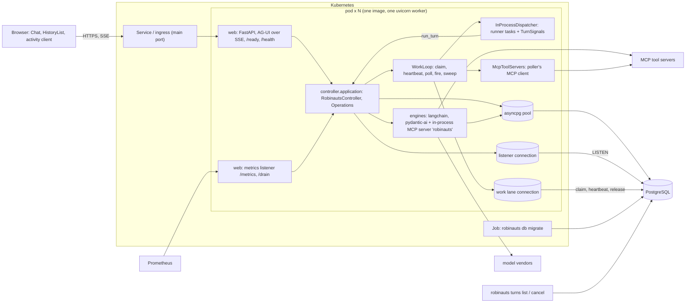
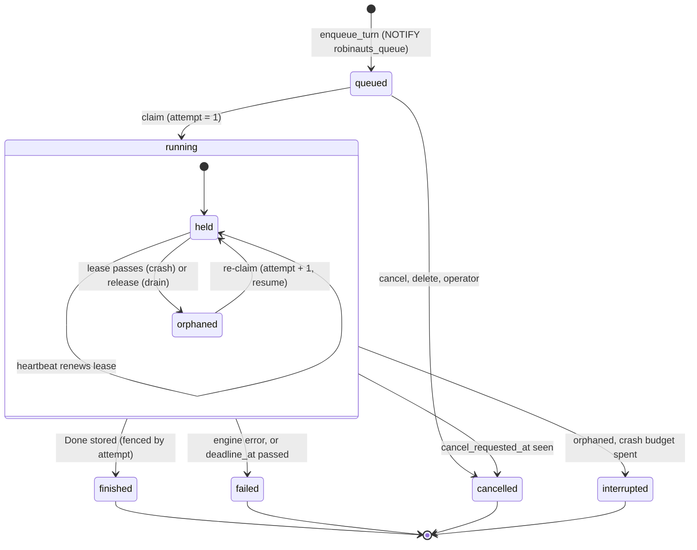
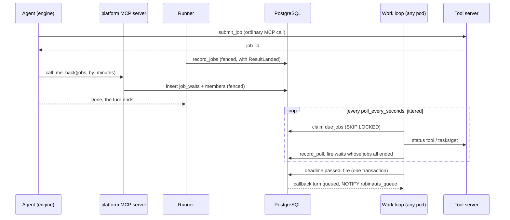

# Tech design 3 — long-running turns, queueing and external jobs (final state)

- Status: description of the target state; companion to long-running-turns.md.

## 1. The system in one paragraph

Robinauts runs agent turns of one to three hours on Kubernetes as **N identical
pods** of one image against **one PostgreSQL**. Every pod serves the web shell and
runs work; there is no role split. A turn is a row of `turns`. It waits in the
database as `queued`, is claimed by whichever pod has room, holds a short heartbeat
lease while it runs, and is resumed from its last committed step by any pod when
its runner dies or releases it. Each conversation belongs to one of two groups,
fixed when it is created: **live** work is capped at 10 running turns per user and
served first; **background** work is unlimited, queues, and keeps a guaranteed
share of capacity. A message sent while a turn runs queues behind it. Long external
jobs are rows that the same pods poll, and the agent is called back with a new
turn. The only database driver is asyncpg (no psycopg); nothing else is deployed.

| Term | Meaning |
|---|---|
| turn | One question and the work that answers it. Its id is the AG-UI run id |
| attempt | One claim of a turn by one runner. `turns.attempt` counts claims and fences every write |
| held / orphaned | A `running` turn whose lease is live / whose lease has passed or was released |
| work loop | The per-process loop that claims turns, renews leases, polls jobs, fires waits and sweeps |
| step boundary | The moment an engine has stored the checkpoint of a graph step, reported as `StepCommitted` |
| wait | A `job_waits` row: call the agent back when these jobs have ended, or by this time |
| callback turn | The queued turn a fired wait creates, opened by a platform message |

## 2. Components

### 2.1 Processes and connections



### 2.2 Where each piece lives

| Layer | Modules | Responsibility |
|---|---|---|
| web | `web/app.py`, `web/agui.py`, `web/metrics.py`, `web/cli.py` | Routes, AG-UI mapping, keep-alives, stream close on drain; a second uvicorn server for `/metrics` and `/drain`; the CLI (`start`, `db migrate`, `db status`, `turns list`, `turns cancel`) |
| application | `controller.py`, `operations.py`, `work.py`, `turns.py`, `platform_tools.py`, `jobs.py`, `sweep.py` | The `Controller` and `Operations` contracts; the work loop; the runner of one attempt; `call_me_back` and `job_status`; polling and firing; housekeeping |
| core | `admission.py`, `placement.py`, `callbacks.py`, `budgets.py`, `fingerprint.py`, `transcript.py`, `failures.py` | Pure policy: slots and waiting reasons, branch tip, callback notice, budget checks, fingerprints, rewind, failure notes |
| adapters | `postgres/store.py`, `postgres/lanes.py`, `postgres/migrations/`, `dispatch.py`, `host.py`, `mcp_client.py`, `memory/` | SQL, fencing and `NOTIFY`; the listener and the work lane; numbered migrations; runner tasks and drain; cgroup memory and loop lag; the poller's MCP client; the same ports in one process for `--dev-no-sign-in` and tests |
| engines | `langchain_engine/`, `pydantic_ai_engine/`, each with `platform.py` | Middleware, run-indexed saver, drain and resume; per-node snapshots, call ledger, cancel capture and resume; the in-memory MCP server `robinauts` built from `PlatformTools` |

### 2.3 Layer rules

The rules of `docs/architecture/rules.md` hold as written: web imports
`controller.contract` and `controller.composition`; the engines import nothing of
the controller; `application` imports the contract, the ports, `core` and
`agent_engines.contract`; adapters import the contract and the ports; `core` does no
I/O. The third-party rule for `mcp` reads `mcp -> langchain_engine,
pydantic_ai_engine, controller.adapters.mcp_client`, and import-linter enforces it.
The engines reach the controller only through ABCs of `agent_engines.contract`
that the controller implements: `ProviderKeyLookup`, `ToolSecretLookup`,
`PlatformTools` and `TurnSignals`.

### 2.4 Inside one pod

| Task | Cadence | Connection | Work |
|---|---|---|---|
| listener | persistent | listener | `LISTEN robinauts_turns, robinauts_queue, robinauts_cancel, robinauts_activity`; wakes waiters |
| claim tick | on `robinauts_queue`, else every `turns.claim_poll_seconds` | work lane | Claims turns (§6.7) |
| heartbeat tick | every `turns.heartbeat_seconds` | work lane | One batched lease renewal for every held turn |
| admission sampler | every second | — | Memory ratio, loop lag, pool wait |
| poll and fire tick | every 5 s | pool | Due jobs, due waits |
| sweep tick | every `housekeeping.sweep_seconds` | pool | Housekeeping under advisory locks |
| runner tasks | one per held turn | pool | Engine stream, event batches |

A pod runs one uvicorn worker, and capacity scales with pods. `worker_id` is
`ROBINAUTS_WORKER_ID`, else `$HOSTNAME/<8 random hex>`, minted at process start.

## 3. The turn's lifecycle



| Transition | Made by | Write |
|---|---|---|
| — → `queued` | `start_session`, `send_message`, `edit_message`, `regenerate_answer`, `retry_answer`, a fired wait | `INSERT`, `NOTIFY robinauts_queue` in the same transaction |
| `queued` → `running` | claim tick | `attempt = 1`, `worker_id`, `started_at`, `claimed_at`, `lease_until` |
| `queued` → `cancelled` | cancel, delete, operator | `UPDATE … WHERE state = 'queued'` |
| held → orphaned | the lease passing; `release` on drain | Release: `lease_until = now`, `worker_id = NULL` |
| orphaned → held | claim tick | `attempt + 1`; `crashes + 1` only when `worker_id` was set (a crash, not a release) |
| orphaned → `interrupted` / `failed` / `cancelled` | claim tick, sweep | `crashes >= max_crashes` / `deadline_at < now` / `cancel_requested_at` set |
| held → `finished` / `failed` / `cancelled` | the runner's `finish_turn` | Fenced by `attempt` and `worker_id`: answer, last events, `TurnEnded` |

`turns_one_running_per_session` keeps one running turn per conversation; any
number of turns of a conversation wait as `queued`, in `queued_at` order.

## 4. Data model

The schema is the result of the numbered migrations (§4.4). The application mints
every id and sets every time, constraint names are interface (the store translates
violations by name), and every column a sweep deletes by is indexed.

### 4.1 The controller's tables

**`sessions`**: `id`, `owner_id`, `agent`, `engine`, `title`, `mode text NOT NULL
CONSTRAINT sessions_mode_is_a_mode CHECK (mode IN ('live','background'))`,
`created_at`, `updated_at`, `seen_at timestamptz` (the owner last saw the
conversation), `deleted_at` (soft delete; the purge follows after 30 days).
Indexes: `sessions_listing_idx`, `sessions_deleted_at_idx`.

**`messages`**: the conversation tree, with `role IN ('user','assistant','tool','platform')`. A
`platform` message is a callback notice. A turn's `follows` is a `user` or a
`platform` message, a rule the store keeps.

**`turns`**:

```sql
CREATE TABLE turns (
  id uuid CONSTRAINT turns_pkey PRIMARY KEY,
  session_id uuid NOT NULL CONSTRAINT turns_session_id_fkey
      REFERENCES sessions (id) ON DELETE CASCADE,
  owner_id uuid NOT NULL,              -- the session's, copied: per-user counts
  mode text NOT NULL CONSTRAINT turns_mode_is_a_mode CHECK (mode IN ('live','background')),
  origin text NOT NULL CONSTRAINT turns_origin_is_an_origin CHECK (origin IN ('person','callback')),
  follows uuid,                        -- the question, once it is in the tree
  anchor uuid,                         -- placed at claim under the branch tip below it
  pending_question jsonb,              -- the question or notice awaiting placement
  model text NOT NULL,
  state text NOT NULL CONSTRAINT turns_state_is_a_state CHECK (state IN
      ('queued','running','finished','failed','cancelled','interrupted')),
  queued_at timestamptz NOT NULL,
  started_at timestamptz,              -- first claim
  claimed_at timestamptz,              -- latest claim
  ended_at timestamptz,
  error text,                          -- for the operator only
  worker_id text,                      -- the holder; NULL once released
  attempt integer NOT NULL DEFAULT 0,  -- +1 on every claim: fencing
  crashes integer NOT NULL DEFAULT 0,  -- +1 when an expired lease is re-claimed
  lease_until timestamptz,
  heartbeat_at timestamptz,
  deadline_at timestamptz,             -- started_at + max_seconds + wrap_up_seconds
  cancel_requested_at timestamptz,
  retries uuid,                        -- the failed answer a Retry answers again
  start_checkpoint text,               -- pinned at enqueue; NULL is the empty memory
  fingerprint text,                    -- written by the first attempt
  budget jsonb NOT NULL,               -- {max_seconds, max_model_calls, max_cost}
  progress jsonb NOT NULL DEFAULT '{}',
  committed_position integer NOT NULL DEFAULT 0,  -- last StepCommitted position
  snapshot jsonb,                      -- the partial answer's parts
  snapshot_position integer NOT NULL DEFAULT 0,
  wrapped_up text CONSTRAINT turns_wrapped_up_is_a_budget
      CHECK (wrapped_up IN ('time','model_calls','cost')),
  engine_settled_at timestamptz,
  CONSTRAINT turns_follows_fkey FOREIGN KEY (session_id, follows) REFERENCES messages (session_id, id),
  CONSTRAINT turns_anchor_fkey FOREIGN KEY (session_id, anchor) REFERENCES messages (session_id, id),
  CONSTRAINT turns_retries_fkey FOREIGN KEY (session_id, retries) REFERENCES messages (session_id, id),
  CONSTRAINT turns_placed_or_pending CHECK ((follows IS NULL) = (pending_question IS NOT NULL)),
  CONSTRAINT turns_finished_is_placed CHECK (state <> 'finished' OR follows IS NOT NULL),
  CONSTRAINT turns_ended_when_done CHECK ((state IN ('queued','running')) = (ended_at IS NULL)),
  CONSTRAINT turns_lease_when_running CHECK (state <> 'running' OR (lease_until IS NOT NULL AND attempt >= 1)),
  CONSTRAINT turns_error_only_when_failed CHECK (error IS NULL OR state IN ('failed','interrupted'))
);
```

| Index | Definition | Read by |
|---|---|---|
| `turns_one_running_per_session` | `UNIQUE (session_id) WHERE state = 'running'` | Exclusivity; translated to `TurnActiveError` |
| `turns_queue_idx` | `(mode, queued_at, id) WHERE state = 'queued'` | Claim |
| `turns_session_active_idx` | `(session_id, queued_at, id) WHERE state IN ('queued','running')` | Claim order within a conversation, queued questions |
| `turns_live_running_idx` | `(owner_id) WHERE state = 'running' AND mode = 'live'` | The per-user live count |
| `turns_lease_until_idx` | `(lease_until) WHERE state = 'running'` | Orphan detection |
| `turns_worker_idx` | `(worker_id) WHERE state = 'running'` | Release, `turns list` |
| `turns_session_id_queued_at_idx` | `(session_id, queued_at DESC, id DESC)` | Latest turn, `ended_badly`, cascade |
| `turns_unsettled_idx` | `(ended_at) WHERE ended_at IS NOT NULL AND engine_settled_at IS NULL` | Engine pruning sweep |

`progress` holds `steps`, `model_calls`, `tool_calls`, `input_tokens`,
`output_tokens`, `cache_read_tokens`, `cache_write_tokens`, `cost`,
`current_tool {name, since}` and `active_seconds`. It is written with event batches
and survives every resume: the controller's budgets read it.

**`turn_events`**: `(turn_id, position)` primary key, `document`, `expires_at`;
index `turn_events_expires_at_idx`. Positions continue across attempts: a resumed
attempt appends after the last stored position.

**`tool_jobs`**:

```sql
CREATE TABLE tool_jobs (
  id uuid CONSTRAINT tool_jobs_pkey PRIMARY KEY,
  session_id uuid NOT NULL REFERENCES sessions (id) ON DELETE CASCADE,
  owner_id uuid NOT NULL,
  origin_turn uuid NOT NULL REFERENCES turns (id) ON DELETE CASCADE,
  submit_call text NOT NULL,           -- the submit's tool_call_id
  server_id text NOT NULL,
  protocol text NOT NULL CONSTRAINT tool_jobs_protocol_is_a_protocol CHECK (protocol IN ('pair','mcp_task')),
  external_id text NOT NULL,           -- the vendor's job or task id
  state text NOT NULL CONSTRAINT tool_jobs_state_is_a_state CHECK (state IN
      ('running','succeeded','failed','unknown','cancelled')),
  last_status jsonb, result jsonb,     -- result bounded by jobs.max_result_bytes
  polls integer NOT NULL DEFAULT 0, poll_failures integer NOT NULL DEFAULT 0,
  last_polled_at timestamptz, next_poll_at timestamptz,
  lease_until timestamptz, worker_id text,
  cancel_requested_at timestamptz,
  created_at timestamptz NOT NULL, ended_at timestamptz,
  CONSTRAINT tool_jobs_submit_call_key UNIQUE (origin_turn, submit_call),
  CONSTRAINT tool_jobs_external_key UNIQUE (session_id, server_id, external_id),
  CONSTRAINT tool_jobs_ended_when_not_running CHECK ((state = 'running') = (ended_at IS NULL))
);
```

Indexes: `tool_jobs_due_idx (next_poll_at) WHERE state = 'running'`,
`tool_jobs_open_idx (owner_id) WHERE state = 'running'`,
`tool_jobs_session_idx (session_id, created_at)`,
`tool_jobs_ended_at_idx (ended_at) WHERE ended_at IS NOT NULL`.

**`job_waits`** and **`job_wait_members`**:

```sql
CREATE TABLE job_waits (
  id uuid CONSTRAINT job_waits_pkey PRIMARY KEY,
  session_id uuid NOT NULL REFERENCES sessions (id) ON DELETE CASCADE,
  origin_turn uuid NOT NULL REFERENCES turns (id) ON DELETE CASCADE,
  call_id text NOT NULL,               -- the call_me_back tool_call_id
  chain integer NOT NULL,              -- callbacks in a row before this wait
  state text NOT NULL CONSTRAINT job_waits_state_is_a_state CHECK (state IN ('waiting','fired','cancelled')),
  created_at timestamptz NOT NULL,
  deadline_at timestamptz NOT NULL,    -- created_at + by_minutes
  fired_at timestamptz,
  fired_on text CONSTRAINT job_waits_fired_on_is_a_reason CHECK (fired_on IN ('all_ended','deadline')),
  callback_turn uuid REFERENCES turns (id),
  CONSTRAINT job_waits_call_key UNIQUE (origin_turn, call_id),
  CONSTRAINT job_waits_fired_has_turn CHECK ((state = 'fired') = (callback_turn IS NOT NULL))
);
CREATE TABLE job_wait_members (
  wait_id uuid REFERENCES job_waits (id) ON DELETE CASCADE,
  job_id uuid REFERENCES tool_jobs (id) ON DELETE CASCADE,
  CONSTRAINT job_wait_members_pkey PRIMARY KEY (wait_id, job_id)
);
```

Indexes: `job_waits_deadline_idx (deadline_at) WHERE state = 'waiting'`,
`job_waits_session_idx (session_id) WHERE state = 'waiting'`,
`job_wait_members_job_id_idx (job_id)`.

**`audit_events`**: append-only, metadata only, never content. `id`, `at`, `actor
CHECK (actor IN ('user','platform','operator'))`, `actor_id text` (user id, worker
id or operator name), `action text`, `owner_id uuid` (no foreign key; it outlives
the user), `session_id`, `turn_id`, `job_id`, `detail jsonb NOT NULL DEFAULT '{}'`.
Indexes: `audit_events_at_idx (at)`, `audit_events_owner_idx (owner_id, at)`.

**`schema_migrations`**: `version integer PRIMARY KEY`, `name`, `sha256`, `kind
CHECK (kind IN ('expand','contract'))`, `applied_at`.

`users`, `user_sessions`, `pending_logins` and `api_tokens` are as the first
migration makes them; the sweep deletes their expired rows.

### 4.2 The engines' tables

Each engine owns its tables and their migrations; nothing references the
controller's tables. `run_id` is the turn id, carried as data.

| Table | Key columns | Constraints and indexes |
|---|---|---|
| `langgraph_sessions` | `session_id uuid` | primary key |
| `langgraph_checkpoints` | `thread_id`, `checkpoint_ns`, `checkpoint_id`, `parent_checkpoint_id`, `run_id uuid`, `step integer`, `checkpoint bytea`, `metadata bytea` | PK `(thread_id, checkpoint_ns, checkpoint_id)`; `langgraph_checkpoints_run_idx (thread_id, run_id, checkpoint_id DESC)` |
| `langgraph_writes` | `thread_id`, `checkpoint_ns`, `checkpoint_id`, `task_id`, `idx`, `channel`, `value bytea` | PK `(thread_id, checkpoint_ns, checkpoint_id, task_id, idx)`; `aput_writes` writes a task's writes in one transaction |
| `pydantic_ai_sessions` | `session_id uuid` | primary key |
| `pydantic_ai_checkpoints` | `session_id`, `checkpoint_id`, `history json`, `created_at` | PK `(session_id, checkpoint_id)` |
| `pydantic_ai_progress` | `session_id`, `run_id`, `step`, `history json`, `pending_request json`, `updated_at` | PK `(session_id, run_id)`; one row per unfinished run |
| `pydantic_ai_tool_calls` | `session_id`, `run_id`, `call_id`, `step`, `tool_name`, `state ('started','finished')`, `result json`, `is_error`, `started_at`, `ended_at` | PK `(session_id, run_id, call_id)` |
| `langgraph_migrations`, `pydantic_ai_migrations` | `version`, `name`, `applied_at` | primary key `version` |

`run_id` on a LangGraph checkpoint is read from `metadata['robinauts_turn']`,
which the engine puts in `RunnableConfig["metadata"]`; "latest checkpoint of this
run" is one indexed query.

### 4.3 Documents

Additive kinds, in the versioned documents of `docs/architecture/data-model.md`:

| Document | Kind | Fields |
|---|---|---|
| event | `question_placed` | `message` (the question or notice, with its `parent_id`) |
| event | `step_committed` | `step` |
| event | `turn_resumed` | `attempt`, `rewind_to`, `restarted` |
| event | `progress_noted` | `progress` |
| event | `budget_reached` | `budget` (`time`, `model_calls`, `cost`) |
| event | `result_landed` | `outcome_unknown: true` on a settled call |
| part | `notice` | `code` (`resumed`, `restarted`, `budget_reached`), `attempt` |
| part | `callback` | `wait_id`, `fired_on`, `jobs[]` of `{job_id, server_id, external_id, state, result}` |
| part | `tool_result` | `outcome_unknown: true` on a settled call |

### 4.4 Migrations

`robinauts db migrate` applies `controller/adapters/postgres/migrations/NNNN_name.sql`
in order, each in its own transaction under `pg_advisory_xact_lock`, records it in
`schema_migrations`, then runs each installed engine's `setup()`, which applies
that engine's numbered migrations under the engine's own advisory lock. It runs
once per release as a Kubernetes Job before the rollout. A release's migrations
are `expand` (additive, readable by the previous build); a `contract` migration
removes only what a build two releases back used. Each build declares
`SCHEMA_REQUIRES` and `SCHEMA_LATEST`; `robinauts start` and `/ready` refuse a
database below `SCHEMA_REQUIRES`, and `robinauts db status` prints both and the
applied list. Rollouts are `RollingUpdate` with `maxUnavailable: 0`.

## 5. Ports and contracts

| Seam | Members that serve this design |
|---|---|
| `Controller` (`controller/contract/ports.py`) | `start_session(…, mode)`; `send_message` queues behind an active turn; `edit_message`, `regenerate_answer`, `retry_answer` raise `TurnActiveError` while a turn is queued or running; `cancel_turn`; `delete_session`; `watch_turn`; `turn_status → TurnStatus(state, reason, attempt, progress)`; `watch_activity(user)`; `mark_seen`; `list_jobs`; `cancel_jobs`; `sweep` |
| `Operations` (contract) | `list_turns(states, limit) → TurnOverview[]`, `cancel_any_turn(turn_id, operator)`, `metrics() → MetricsSnapshot`, `readiness() → Readiness`, `drain(seconds)` |
| `Store` (port) | `enqueue_turn`, `claim_turns`, `heartbeat`, `release`, `begin_attempt`, `append_events` (a batch), `finish_turn`, `request_cancel`, `hide_session`, `record_jobs`, `add_wait`, `claim_due_jobs`, `record_poll`, `fire_due_waits`, `wait_for_events`, `wait_for_work`, `sweep_*`, `pool_pressure` |
| `TurnDispatcher` (port) | `run(claimed)`, `cancel(turn) → bool` (local), `drain()`, `held() → [(turn, attempt)]`, `close(timeout)` |
| `HostSignals` (port) | `memory_ratio()`, `loop_lag()` |
| `ToolServers` (port) | `call_tool(server, name, arguments)`, `task_status`, `task_result`, `cancel_task` → structured content kept |
| `AgentEngine` (engines' contract) | `stream(session_id, agent, prompt, *, run_id, model, checkpoint_id, resume, signals)`; `settle(session_id, run_id, *, keep)`; `supports_resume`, `supports_mcp_tasks` |
| Engine events | `TextDelta`, `ReasoningDelta`, `ToolCall`, `ToolResult(server_id, structured, outcome_unknown)`, `Usage(input, output, cache_read, cache_write)`, `StepCommitted(step)`, `Done` |
| Engine inputs | `Prompt = UserPrompt(text) \| PlatformNotice(kind, text)`; `AgentDefinition.limits`, `.context`; `EngineSettings.platform_tools`; `TurnSignals.draining`, `.wrap_up`; error `RunDrained`; constant `OUTCOME_UNKNOWN` |

`checkpoint_id=None` means the empty memory, never "the thread's latest". The
contract suite runs the resume cases for every engine with `supports_resume`.

## 6. Operations, layer by layer

### 6.1 Starting a live turn

| Layer | Behaviour |
|---|---|
| Frontend | The new-conversation composer has a "Run in background" switch, off by default. `startNewConversation` posts `{agent_id, model_id, text, mode: "live"}` to `POST /api/turns`; the run id from `X-Robinauts-Run-Id` enables Stop at once |
| Web | Validates `NewChatRequest` (`mode` defaults to `live`), calls `start_session`, and answers at once: headers, `RUN_STARTED`, `robinauts.turn_state`, then the watched events with `: keep-alive` every 15 s |
| Controller | Mints the session with `mode`, calls `engine.create`, and calls `enqueue_turn` with the placed question and a turn: `queued`, `origin='person'`, `owner_id`, `mode`, `start_checkpoint=NULL`, `budget` copied from the agent |
| Store / PostgreSQL | One transaction: session row `FOR SHARE`, insert question and turn, `pg_notify('robinauts_queue','')`, `pg_notify('robinauts_activity', owner_id)` |
| Work loop, any pod | Woken on its listener; runs a claim tick (§6.7); passes the claimed turn to `InProcessDispatcher.run`, which starts `run_turn(owner, session, turn, attempt)` with its own `TurnSignals` |
| Runner | `begin_attempt` (fenced): places a pending question, sets `started_at`, `deadline_at`, `fingerprint`. Builds the prompt with `prompt_after_failures`, calls `engine.stream(…, run_id, checkpoint_id=start_checkpoint, resume=False)` and writes events in batches |
| Engine | LangGraph: `astream({"messages": [HumanMessage]}, config, durability="sync", control=RunControl())` from the pinned checkpoint. Pydantic AI: `agent.iter(prompt, message_history=…)` with a snapshot after each node |
| MCP / vendor | Vendor SDKs with the model's `max_retries` and per-call `timeout_seconds`; MCP servers over streamable HTTP with the server's credential |

### 6.2 Starting a background conversation

The same path with `mode: "background"` (the switch, or the API parameter). The
session's turns, callbacks included, carry `mode='background'`; no per-user cap
applies; the claim serves them after live work, from the free slots and the
reserved share (§6.6). The history list marks the conversation "background". The
mode is fixed: no endpoint changes it, and a fork copies it.

### 6.3 A message while a turn runs

| Layer | Behaviour |
|---|---|
| Frontend | The composer is enabled while a turn runs. A sent message appears greyed below the stream as "queued", from `ChatState.queued` |
| Web | `POST /api/conversations/{id}/turns` with `{text, parent_id}` answers the stream of the queued turn at once, with `robinauts.turn_state {state: "queued", reason: "behind"}` |
| Controller | With a queued or running turn in the conversation, enqueues an at-claim turn: `follows=NULL`, `anchor=parent_id`, `pending_question` holding the question document with its minted id. With none, the question is placed at once, as in §6.1 |
| Store | Insert the turn, `NOTIFY robinauts_queue` |
| Claim | Takes a conversation's oldest queued turn only when none of its turns is held |
| Runner | `begin_attempt` computes `core.placement.branch_tip(messages, anchor)` — the newest descendant of `anchor`, following the newest child at each level, usually the answer that just finished — and inserts the question under it, fenced; then appends `QuestionPlaced` |
| Frontend | `robinauts.question_placed` moves the greyed message into the thread |

### 6.4 Streaming, re-attach and keep-alives

- **Runner → store.** `_Writer` coalesces deltas for `turns.coalesce_ms` (150 ms)
  and writes each batch with `append_events` in one transaction, fenced by
  `state='running' AND attempt=$attempt AND worker_id=$me AND lease_until > $now`,
  with one `NOTIFY robinauts_turns '<turn> <position>'`. Every
  `turns.snapshot_seconds` (10 s) the batch also writes `snapshot` (the answer's
  parts, each with the position it started at), `snapshot_position` and
  `progress`.
- **Watchers, any pod.** The listener wakes the turn's waiters; each re-reads
  `events_after`; `web/agui.py` maps the events; `: keep-alive` goes out after 15 s
  without one (`WAIT_SECONDS`). A listener that reconnects wakes every waiter.
- **Re-attach.** `GET /api/conversations/{id}` returns the snapshot as `partial`
  and `resume.after = snapshot_position`; the client attaches with `?after=`.
  `open_session` counts with `max(position)`.
- **Frontend.** `agui/client.ts` reconnects until the run is known to have ended:
  backoff from 0.5 s to 30 s with ±30 % jitter, an idle watchdog at 45 s, retries on
  `online` and `visibilitychange`, a manual "Reconnect". A POST failing with a
  network error or a 5xx is unknown, not refused: the client re-reads the
  conversation before taking the question off the screen.

### 6.5 "…waiting…"

A queued turn has no runner and no numbered events. Web opens its stream with an
unnumbered `robinauts.turn_state`, reads `turn_status` at every 15 s wake, and sends
the event again when the state or reason differs. `core.admission.waiting_reason`
derives the reason from the rows:

| `reason` | Condition | UI text |
|---|---|---|
| `behind` | An earlier turn of the conversation is queued or running | "…waiting… (after the current answer)" |
| `live_cap` | Live, and the owner has `live_turns_per_user` live turns running | "…waiting… (you have 10 tasks running)" |
| `background` | Background, waiting for free capacity | "…waiting… (queued in the background)" |
| `busy` | Otherwise: admission is closed or slots are full | "…waiting… (the system is busy)" |

No queue position is computed or shown. `MessageStarted` ends the wait in the UI,
and `robinauts.turn_state {state: "resuming", attempt}` marks an orphaned turn
waiting for re-claim.

### 6.6 Admission

Each pod decides how many turns it claims per tick; the fleet-wide per-user cap is
exact in the claim statement.

| Signal | Source (`controller/adapters/host.py`, store) | Closes at | Reopens at |
|---|---|---|---|
| Held turns | dispatcher count | `capacity.max_running_turns` (150) | below it |
| Memory | cgroup v2 `memory.current / memory.max`; else RSS from `/proc/self/statm` / `capacity.memory_budget_mib` | `memory_high` 0.80 | `memory_low` 0.70 |
| Event-loop lag | 1 s ticker measuring its own delay | `loop_lag_high_ms` 200 | `loop_lag_low_ms` 100 |
| Pool wait | p95 acquire time over 10 s (`Store.pool_pressure`) | `pool_wait_high_ms` 250 | half of it |

`core.admission.slots` turns the signals into `(live_slots, background_slots)`:
`free = max_running_turns - held` when admission is open, else 0;
`reserve = ceil(background_share × max_running_turns)` (share 0.2). When background
turns wait, live work takes at most `free - max(0, reserve - held_background)`, and
background takes what is left; otherwise live takes all `free`. Re-claims of
orphaned turns are limited to `turns.reclaims_per_tick` (5) per pod, and an orphan
becomes claimable `abs(hashtext(id)) % reclaim_jitter_seconds` seconds after its
lease passed, so a fleet restart does not resume every turn at once.

### 6.7 Claim, heartbeat and fencing

The claim tick runs on the work lane in one transaction:

```sql
SELECT pg_try_advisory_xact_lock(hashtext('robinauts:claim'));  -- false: skip this tick
-- end orphans that cannot continue: crash budget, deadline, cancel requested
WITH live AS (
  SELECT owner_id, count(*) AS n FROM turns
  WHERE state = 'running' AND mode = 'live' AND lease_until >= $now GROUP BY owner_id),
ready AS (
  SELECT DISTINCT ON (t.session_id) t.id, t.owner_id, t.mode, t.queued_at
  FROM turns t
  WHERE (t.state = 'queued'
         OR (t.state = 'running' AND t.lease_until
             + make_interval(secs => abs(hashtext(t.id::text)) % $jitter) < $now))
    AND NOT EXISTS (SELECT 1 FROM turns x WHERE x.session_id = t.session_id
                    AND x.state = 'running' AND x.lease_until >= $now)
  ORDER BY t.session_id, (t.state = 'running') DESC, t.queued_at, t.id),
ranked AS (
  SELECT r.*, row_number() OVER (PARTITION BY owner_id, mode ORDER BY queued_at, id) AS k
  FROM ready r)
(SELECT id FROM ranked LEFT JOIN live USING (owner_id)
 WHERE mode = 'live' AND k <= $live_cap - coalesce(live.n, 0)
 ORDER BY queued_at, id LIMIT $live_slots)
UNION ALL
(SELECT id FROM ranked WHERE mode = 'background' ORDER BY queued_at, id LIMIT $background_slots);
UPDATE turns SET state = 'running', worker_id = $me, attempt = attempt + 1,
       crashes = crashes + (state = 'running' AND worker_id IS NOT NULL)::int,
       started_at = coalesce(started_at, $now), claimed_at = $now,
       lease_until = $now + $lease, heartbeat_at = $now
WHERE id = ANY($claimed) RETURNING id, session_id, owner_id, attempt, crashes;
```

One claimer at a time fleet-wide keeps the live cap exact; a claim takes
milliseconds. The lock is transaction-level, so it works through PgBouncer.

**Heartbeat.** Every `heartbeat_seconds` (30) one statement renews every held
turn:

```sql
UPDATE turns SET lease_until = $now + $lease, heartbeat_at = $now
FROM unnest($ids::uuid[], $attempts::int[]) AS h(id, attempt)
WHERE turns.id = h.id AND turns.attempt = h.attempt
  AND turns.state = 'running' AND turns.worker_id = $me
RETURNING turns.id, turns.cancel_requested_at;
```

A turn missing from the result is lost: the dispatcher cancels its task and the
runner writes nothing more. A non-null `cancel_requested_at` cancels it. With
`lease_seconds` 90, a dead runner is noticed within 90 s plus the jitter.

**Fencing.** `begin_attempt`, `append_events`, `finish_turn`, `record_jobs` and the
platform tools' writes all carry `attempt = $attempt AND worker_id = $me AND
lease_until > $now`; a refusal is `TurnLostError`. A slow runner whose turn was
re-claimed cannot write.

### 6.8 Cancel and delete from any pod

| Layer | Cancel | Delete |
|---|---|---|
| Frontend | Stop, enabled while queued or running; "stopping…" until `RUN_FINISHED` (cancelled) | Delete, allowed while a turn runs |
| Web | `POST …/runs/{run_id}/cancel` → 204 | `DELETE /api/conversations/{id}` → 204 |
| Controller | `cancel_turn` → `request_cancel` | `delete_session` → `hide_session` |
| Store | A queued turn: `state='cancelled'`, `ended_at`. A running one: `cancel_requested_at = $now`. `NOTIFY robinauts_cancel '<turn>'`, `robinauts_activity` | One transaction: `deleted_at`, queued turns cancelled, `cancel_requested_at` on the running one, waiting waits `cancelled`, running jobs `cancel_requested_at` and `next_poll_at = $now`; audit `session.deleted`; the same notifications |
| Holder pod | Its listener calls `InProcessDispatcher.cancel(turn)`; at worst the next heartbeat returns `cancel_requested_at` | The same for the running turn; the poller sends `cancel_tool` or `tasks/cancel` for each job, best effort, and ends it `cancelled` |
| Engine | The stream is cancelled; the runner calls `finish_turn(cancelled)` and `settle(keep=None)` | — |

A hidden conversation is not found by any read, starts no turn and is purged by
the sweep after the 30-day trash; the purge removes its jobs, waits and results
with the rows. `robinauts turns cancel <turn>` runs the same cancel through
`Operations` and records an `operator` audit event.

### 6.9 Crash detection and resume

The lease passes; a claim tick on any live pod re-claims the orphan with
`attempt + 1` and, when `worker_id` was set, `crashes + 1`. The runner then:

1. compares `core.fingerprint.of(agent, model, tool servers, engine name and
   version)` with `turns.fingerprint`;
2. rebuilds the answer's parts from the events up to `committed_position`
   (`core.transcript.rewind`), adds a `notice {code: "resumed", attempt}` part,
   writes the snapshot at that point, and appends `TurnResumed{attempt,
   rewind_to=committed_position, restarted=false}`; watchers drop what came after
   `rewind_to`;
3. calls `engine.stream(…, resume=True)` with the same prompt, `run_id` and start
   checkpoint.

When the fingerprint differs, or the engine kept nothing, the turn restarts:
`TurnResumed{restarted=true}` rewinds to the answer's start, the part is `notice
{code: "restarted"}`, and the prompt carries `prompt_after_failures`' note of every
call the abandoned attempts made, with in-flight calls marked "outcome unknown".

| Engine | Resume |
|---|---|
| LangGraph | `saver.latest_for_run(thread_id, run_id)`. For each tool call of the last `AIMessage` without a stored result, write a `ToolMessage(OUTCOME_UNKNOWN, status="error")`; finished calls keep their results from the checkpoint's pending writes; one `aupdate_state(config, …, as_node="tools")` holds both. Then `astream(None, config, durability="sync", control=RunControl())`. No tool call runs again |
| Pydantic AI | Load `pydantic_ai_progress`. Every call of the last `ModelResponse` without a return gets its ledger result if `finished`, else a `ToolReturnPart(OUTCOME_UNKNOWN)`; they are appended as one `ModelRequest` after the pending request. Then `agent.iter(None, message_history=h)` sends it to the model. No tool call runs again |

Both engines yield `ToolResult(outcome_unknown=True)` for every settled call
before anything else; the runner writes `ResultLanded{outcome_unknown}`. In the
browser, `robinauts.turn_state {state: "resuming"}` shows while the orphan waits;
`robinauts.resumed` makes `state.ts` drop the parts that started after
`rewind_to` and render a "Resumed after a restart" divider; a settled call shows
"outcome unknown". Callback turns resume the same way.

**Step boundaries.** The LangGraph saver's `aput` reports each stored checkpoint of
the run, and the engine yields `StepCommitted(step)` after the step's events. The
Pydantic AI engine upserts `pydantic_ai_progress` after each `ModelRequestNode` and
`CallToolsNode` (after a tool step, with the next node's pending request holding
the returns), records each tool call's start and result in
`pydantic_ai_tool_calls`, and yields `StepCommitted`. The runner flushes, appends
`StepCommitted` and sets `committed_position`.

### 6.10 Deploy, scale-down: drain and release

1. Kubernetes calls the `preStop` hook, an `httpGet` of `/drain` on the metrics
   port; `SIGTERM` starts the same drain when no hook ran. `Operations.drain(drain_seconds)` runs.
2. `/ready` answers 503; the work loop stops claiming, polling and sweeping.
3. Every SSE stream on the pod, turn and activity streams alike, receives
   `robinauts.reconnect {after_ms}` (250–2000 ms, random) and closes; clients
   reconnect through the Service to another pod.
4. The dispatcher sets `TurnSignals.draining` on every held turn. LangGraph calls
   `RunControl.request_drain("shutdown")` and stops at the next step boundary with
   `GraphDrained`; Pydantic AI stops after the next node's snapshot. The engine
   raises `RunDrained`.
5. The runner flushes and calls `release`:
   `UPDATE turns SET lease_until = $now, worker_id = NULL WHERE id = $t AND attempt
   = $a AND worker_id = $me`, then `NOTIFY robinauts_queue`.
6. At `drain_seconds` (45), turns inside a tool call are cancelled and
   released. LangGraph keeps the finished calls' pending writes; Pydantic AI's
   cancel capture keeps finished returns, and the engine stores them in the ledger.
   The in-flight call becomes "outcome unknown" on resume.
7. `/drain` returns; uvicorn shuts down within `graceful_shutdown_seconds` (60);
   `terminationGracePeriodSeconds` is 90.

Released turns resume elsewhere within seconds and never consume `max_crashes`. A
deploy costs each running turn at most one repeated model call.

### 6.11 Context management and budgets

Context belongs to the frameworks (ADR 0005, amended: the current turn's question
is always kept verbatim). Per agent:

| Setting | LangGraph | Pydantic AI |
|---|---|---|
| `clear_tool_results_at` 0.6 of the window | `ContextEditingMiddleware(ClearToolUsesEdit)` | history processor clearing old tool returns |
| `summarise_at` 0.85 of the window | `SummarizationMiddleware`, question kept | history processor that summarises, question kept |
| `prompt_cache_ttl` `5m` or `1h` | Anthropic prompt-caching middleware | Anthropic cache settings |
| `models.<id>.max_retries` | SDK retries and `ModelRetryMiddleware` | SDK retries |
| `tool_retries` | `ToolRetryMiddleware` | `retries`, `tool_error_behavior` |

The window is `models.<id>.context_window`, else the framework's own figure. The
summary lives in checkpointed state, so a resume does not produce it again.

**Budgets** are the controller's, from `turns.budget` and `turns.progress`, so they
survive resumes. `core.budgets.check` runs after every `Usage` event and every
second: `active_seconds ≥ max_seconds`, `model_calls ≥ max_model_calls`, or `cost ≥
max_cost` (cost from the model's prices). At the first hit the runner sets
`TurnSignals.wrap_up`, writes `wrapped_up` and appends `BudgetReached`; the engine
makes its next model call with no tools and a fixed closing instruction, then ends
with `Done`. The answer carries `notice {code: "budget_reached"}` and the UI offers
**Continue**, which sends `{text: "Continue", parent_id: <answer>}` as a fresh turn
with fresh budgets. The frameworks' own caps (`UsageLimits.request_limit`,
`recursion_limit`) sit above `max_model_calls` and never decide first. Past
`deadline_at` the runner cancels the engine and ends the turn `failed`.

### 6.12 A turn's end, failure and Retry

- **Finished.** `finish_turn` stores the answer (with its `checkpoint_id`, notices
  and settled calls), the last events and `TurnEnded`, sets `sessions.updated_at`,
  and notifies `robinauts_turns`, `robinauts_queue` and `robinauts_activity`. The
  runner then calls `engine.settle(session, run_id, keep=checkpoint_id)` and sets
  `engine_settled_at`: LangGraph deletes the run's checkpoints and writes except
  the kept one; Pydantic AI deletes the run's progress row and ledger.
- **Failed for good.** A vendor error past retries, an engine error, or the
  deadline: the answer is stored marked `failed`, then `settle(keep=None)` deletes
  all of the run's intermediate state.
- **Interrupted.** An orphan out of crash budget, ended by the claim tick or the
  sweep with no event; watchers read the record.
- **Retry** (`{retry: <answer>}`) is a fresh turn on the failed answer's question,
  from the nearest finished checkpoint above it, with the failure note of
  `prompt_after_failures`. It starts over; no partial progress carries.

### 6.13 External jobs



- **Submit.** An ordinary MCP call. When a `ToolResult`'s `(server_id, name)`
  matches `[tool_servers.<id>.jobs] submit_tool`, the runner reads
  `structured[id_from]` and writes a `tool_jobs` row in the same fenced batch as
  `ResultLanded`; `tool_jobs_submit_call_key` makes it exactly-once. With
  `idempotency_argument`, the engine passes the call's `tool_call_id` there. With
  `protocol = "mcp_task"` the engine calls the tool in task mode and the task id is
  the job id; configuration refuses such a server for an engine without
  `supports_mcp_tasks`.
- **`call_me_back(jobs: [id], by_minutes: int)`** is served by the platform MCP
  server `robinauts`, which each engine builds from `EngineSettings.platform_tools`
  over the MCP SDK's in-memory transport; agents with a job-capable server list
  `robinauts` in `AgentDefinition.tools`. `PlatformToolHost.call` refuses ids not
  recorded in this conversation, more than `max_jobs_per_wait` jobs, more than
  `max_open_jobs_per_user`, and a `chain` at `max_callbacks_in_a_row`; clamps
  `by_minutes` to `[min_minutes, max_minutes]`; and inserts the wait, fenced by the
  turn's attempt. The turn ends normally and the conversation is free.
  **`job_status(jobs?)`** reads the rows, waits included, with no vendor call.
- **Polling.** The poll tick claims due jobs with `FOR UPDATE SKIP LOCKED` and a
  60 s row lease, and calls `ToolServers.call_tool(server, status_tool,
  {id_argument: external_id})` or `task_status`, at most `poll_concurrency` per
  server per pod. One transaction writes `last_status`, the state (`status_field`
  against `succeeded` and `failed`), `result`, `polls`, `next_poll_at` (jittered,
  doubled on errors up to an hour) and an audit `job.polled`. After
  `failed_polls_before_unknown` failures in a row the job ends `unknown`.
- **Fire.** The transaction that ends a job fires every waiting wait whose members
  have all ended; the poll tick also claims waits past `deadline_at`. Firing is
  `UPDATE job_waits SET state = 'fired' … WHERE state = 'waiting'`, the insert of
  the callback turn (`origin='callback'`, `queued`, the session's `mode`, the origin
  turn's model, `anchor` = the origin turn's answer, else its question,
  `pending_question` = `core.callbacks.notice`), audit `wait.fired`, and `NOTIFY
  robinauts_queue, robinauts_activity`: exactly once on any number of pods.
- **Callback turn.** Claimed like any turn of its group and behind any turn of its
  conversation; in a live conversation it counts toward the live cap. Its question
  is a `platform` message with a `callback` part under the branch tip below the
  anchor, so it continues the job's branch. The engine receives a `PlatformNotice`,
  rendered as one user-role message wrapped in `<platform_notice
  source="robinauts" kind="callback">…</platform_notice>` with results
  JSON-escaped, and the system prompt states that a platform notice is untrusted
  tool output: "Callback (all ended): job 1 succeeded: …; job 2 failed: …", or
  "Callback (60 min limit reached): job 2 running". It runs tools as any turn does.

### 6.14 Notifications

In-app only; never answer text.

- **Backend.** `watch_activity(user)` streams `ConversationActivity` for the user's
  conversations, woken by `robinauts_activity` with the owner's id: `active`
  (`queued`, `running`, `resuming` or none), the last turn's end state, `unseen`
  (ended after `seen_at`) and open jobs with the earliest deadline.
- **Web.** `GET /api/activity`, an SSE stream of `robinauts.conversation` events
  with keep-alives; `POST /api/conversations/{id}/seen` sets `seen_at`, sent while
  the conversation is visible and the tab focused.
- **Frontend.** `shell/activity.ts` holds the stream; `HistoryList.tsx` shows
  running, queued and unseen badges and "waiting on 2 jobs · by 14:32";
  `shell/notify.ts` puts the unseen count in the tab title and, when the tab is
  hidden and the person granted permission from a button, raises a browser
  Notification: "An answer is ready", "A task stopped" or "Jobs reported back",
  with the agent's title and nothing else.

### 6.15 Operator visibility

- **Metrics.** `/metrics`, Prometheus text written by `web/metrics.py`, on
  `ROBINAUTS_METRICS_PORT`, or on the main port behind `Authorization: Bearer
  $ROBINAUTS_METRICS_TOKEN`; never open on the public origin. Fleet gauges, read
  from the database at scrape time (aggregate with `max`):
  `robinauts_turns_queued{mode}`, `robinauts_queue_oldest_seconds{mode}`,
  `robinauts_turns_running{mode}`, `robinauts_turns_orphaned`,
  `robinauts_jobs_open`. Pod series: `robinauts_worker_held_turns{mode}`,
  `robinauts_admission_open`, `robinauts_admission_memory_ratio`,
  `robinauts_admission_loop_lag_seconds`, `robinauts_claims_total{kind}`,
  `robinauts_releases_total`, `robinauts_resumes_total{engine,restarted}`,
  `robinauts_lease_losses_total`, `robinauts_turn_duration_seconds{outcome}`,
  `robinauts_event_batch_seconds`, `robinauts_provider_errors_total{provider,status}`,
  `robinauts_budget_reached_total{budget}`, `robinauts_job_polls_total{outcome}`,
  `robinauts_pool_acquire_seconds`.
- **CLI.** `robinauts turns list [--state queued|running] [--owner <id>] [--json]`
  prints id, conversation, owner, mode, state, worker, attempt, crashes, heartbeat
  age and progress; `robinauts turns cancel <turn>` cancels from anywhere. Both
  compose the controller with the work loop off and call `Operations`.
- **Logs.** JSON lines (`ROBINAUTS_LOG_FORMAT=json`) with `worker_id`,
  `request_id`, `session_id`, `turn_id`, `attempt` and `job_id` from context
  variables; the access log drops query strings. Lifecycle lines: `turn.claimed`,
  `turn.resumed`, `turn.released`, `turn.lease_lost`, `turn.ended`,
  `admission.closed`, `admission.opened`, `drain.started`, `drain.finished`.
- **Readiness.** `/health` is liveness (the process answers). `/ready` is 200 when
  the pool answers `SELECT 1` within a second, the listener and the work lane are
  connected, the schema is at least `SCHEMA_REQUIRES`, and the pod is not draining.
- **Audit.** `audit_events` records the platform's own actions (`job.recorded`,
  `job.polled`, `job.ended`, `job.cancel_sent`, `wait.fired`, `callback.queued`,
  `turn.resumed`, `turn.interrupted`) and `session.deleted`, `session.purged`,
  `turn.cancelled` by user or operator.

### 6.16 Housekeeping

The sweep tick runs each task under its own `pg_try_advisory_xact_lock`, in
batches of 1 000 rows, so one pod does each task per tick; the deletes are
idempotent.

| Task | Rows |
|---|---|
| Event retention | `turn_events` past `expires_at` (written with `turns.event_retention_hours`, 24) |
| Sign-in | Expired `user_sessions`, `api_tokens`, `pending_logins` |
| Orphans | Running turns past their lease with a spent crash budget, a passed deadline or a cancel request, ended as in §3 |
| Engine pruning | Ended turns with `engine_settled_at IS NULL` older than 5 minutes: `engine.settle`, keeping the answer's checkpoint |
| Trash | Sessions with `deleted_at` older than 30 days: `engine.forget`, then the row and its cascade (turns, events, messages, jobs, waits); audit `session.purged` |
| Retention | With `housekeeping.conversation_retention_days`, conversations not updated for that long are hidden as a delete hides them |
| Jobs | Ended `tool_jobs` and their fired or cancelled waits older than `jobs.retention_days` |
| Audit | Kept, unless `housekeeping.audit_retention_days` is set |

### 6.17 Connection budget and database interaction

| Connection | Per pod | Used for |
|---|---|---|
| Pool (`ROBINAUTS_DATABASE_URL`) | `database.pool_min`–`pool_max` (2–10), `acquire_timeout_seconds` 5 | Requests, runners' batches, engines' savers, poller, sweep |
| Listener (`ROBINAUTS_DATABASE_DIRECT_URL`) | 1 | `LISTEN` on the four channels |
| Work lane (`ROBINAUTS_DATABASE_DIRECT_URL`) | 1 | Claim, heartbeat, release |

A pod holds at most `pool_max + 2` connections; the fleet needs `N × (pool_max + 2)`
plus one for the migrate Job and one per CLI run, within `max_connections` minus
the reserved ones (with defaults, N ≤ 8 on 100). Behind PgBouncer in transaction
mode the pool URL points at PgBouncer with `database.statement_cache = false`, and
the direct URL points at PostgreSQL; advisory locks are transaction-level
throughout.

| Channel | Payload | Sent by | Woken |
|---|---|---|---|
| `robinauts_turns` | `<turn> <position>` or `<turn> end` | event batches, finish | Turn watchers |
| `robinauts_queue` | empty | enqueue, finish, release, fire | Claim ticks |
| `robinauts_cancel` | `<turn>` | cancel, delete, operator | The holder's dispatcher |
| `robinauts_activity` | `<owner id>` | enqueue, claim, finish, fire, delete | Activity streams |

`NOTIFY` is a hint; the tables are the truth. Every waiter re-reads on each wake
and on a timeout (15 s for watchers, `claim_poll_seconds` for claims), and a
listener that reconnects re-reads everything. One `NOTIFY` per event batch, never
per token.

## 7. Configuration surface

TOML tables of the file `ROBINAUTS_CONFIG` names; the controller's tables are
`model_providers`, `models`, `tool_servers`, `agents`, `turns`, `capacity`, `jobs`,
`database`, `housekeeping` and `shutdown`. Unknown keys are refused at start-up.

| Key | Default | Meaning |
|---|---|---|
| `models.<id>.timeout_seconds` | 120 | One vendor HTTP call |
| `models.<id>.max_retries` | 4 | SDK retries with backoff on 429, 529, resets |
| `models.<id>.context_window` | — | Tokens, for the context policy |
| `models.<id>.price_input`, `price_output`, `price_cache_read`, `price_cache_write` | — | Per million tokens, for the cost budget |
| `agents.<id>.max_turn_seconds` | 10800 | Time budget |
| `agents.<id>.max_model_calls` | 200 | Model-call budget |
| `agents.<id>.max_turn_cost` | — | Cost budget |
| `agents.<id>.wrap_up_seconds` | 300 | Grace after the time budget, part of `deadline_at` |
| `agents.<id>.tool_retries` | 3 | Tool errors before the error goes to the model |
| `agents.<id>.clear_tool_results_at` / `summarise_at` | 0.6 / 0.85 | Context policy |
| `agents.<id>.prompt_cache_ttl` | `"5m"` | `"5m"` or `"1h"`; long agents set `"1h"` |
| `tool_servers.<id>.jobs.protocol` | `"pair"` | `"pair"` or `"mcp_task"` |
| `tool_servers.<id>.jobs.submit_tool`, `id_from`, `status_tool`, `id_argument`, `status_field`, `succeeded`, `failed` | — | The submit/status pair |
| `tool_servers.<id>.jobs.poll_every_seconds` | 300 | Jittered; doubled on errors |
| `tool_servers.<id>.jobs.poll_concurrency` | 4 | Per pod |
| `tool_servers.<id>.jobs.cancel_tool`, `idempotency_argument` | — | Optional |
| `turns.lease_seconds` / `heartbeat_seconds` | 90 / 30 | Lease and tick |
| `turns.max_crashes` | 3 | Expired-lease re-claims before `interrupted` |
| `turns.reclaim_jitter_seconds` / `reclaims_per_tick` | 20 / 5 | Spread of re-claims |
| `turns.claim_poll_seconds` | 3 | Claim tick without a notification |
| `turns.coalesce_ms` / `snapshot_seconds` | 150 / 10 | Event batches, snapshots |
| `turns.event_retention_hours` | 24 | `turn_events.expires_at` |
| `capacity.max_running_turns` | 150 | Per pod |
| `capacity.live_turns_per_user` | 10 | Fleet-wide, live group |
| `capacity.background_share` | 0.2 | Reserved for waiting background turns |
| `capacity.memory_high` / `memory_low` / `memory_budget_mib` | 0.80 / 0.70 / — | Memory watermarks; budget when no cgroup |
| `capacity.loop_lag_high_ms` / `loop_lag_low_ms` | 200 / 100 | Loop-lag watermarks |
| `capacity.pool_wait_high_ms` | 250 | Pool watermark |
| `jobs.min_minutes` / `max_minutes` | 1 / 1440 | `by_minutes` bounds |
| `jobs.max_jobs_per_wait` / `max_open_jobs_per_user` / `max_callbacks_in_a_row` | 10 / 50 / 5 | Limits |
| `jobs.failed_polls_before_unknown` | 5 | Then `unknown` |
| `jobs.max_result_bytes` / `retention_days` | 65536 / 7 | Result bound, retention |
| `database.pool_min` / `pool_max` / `acquire_timeout_seconds` | 2 / 10 / 5 | Pool |
| `database.statement_cache` | true | `false` behind PgBouncer |
| `housekeeping.sweep_seconds` | 300 | Sweep tick |
| `housekeeping.conversation_retention_days` / `audit_retention_days` | — | Unset: kept |
| `shutdown.drain_seconds` / `graceful_shutdown_seconds` | 45 / 60 | Drain window, uvicorn's limit |

| Environment variable | Meaning |
|---|---|
| `ROBINAUTS_CONFIG` | The configuration file |
| `ROBINAUTS_DATABASE_URL` | The pool's database (may be PgBouncer); required in sign-in mode, where `start` refuses to run without it |
| `ROBINAUTS_DATABASE_DIRECT_URL` | Listener and work lane; defaults to `ROBINAUTS_DATABASE_URL` |
| `ROBINAUTS_METRICS_PORT` | The metrics listener (`/metrics`, `/drain`); unset serves both on the main port behind the token |
| `ROBINAUTS_METRICS_TOKEN` | Bearer for `/metrics` and `/drain` on the main port |
| `ROBINAUTS_WORKER_ID` | Overrides `$HOSTNAME/<random>` |
| `ROBINAUTS_LOG_FORMAT` | `json` or `text` |
| `ROBINAUTS_UI_DIR` | The built interface |

Kubernetes settings: `terminationGracePeriodSeconds: 90`, `preStop` `httpGet
/drain` on the metrics port, `readinessProbe /ready`, `livenessProbe /health`,
`RollingUpdate` with `maxUnavailable: 0`, and the `robinauts db migrate` Job before
each rollout.

## 8. Wire additions

| Endpoint | Body or answer |
|---|---|
| `POST /api/turns` | `{agent_id, model_id, text, mode: "live" \| "background"}`; the stream starts at once |
| `POST /api/conversations/{id}/turns` | `{text, parent_id}` while a turn is active: the queued turn's stream; `edit`, `regenerate`, `retry` while active: 409 `TurnActiveError` |
| `POST /api/conversations/{id}/runs/{run_id}/cancel` | 204 from any pod, queued or running |
| `DELETE /api/conversations/{id}` | 204 from any pod, also while a turn runs |
| `GET /api/conversations` | each item carries `mode`, `active` (`queued`, `running`, `resuming`, null), `unseen`, `jobs {open, deadline}` |
| `GET /api/conversations/{id}` | carries `mode`, `turn_state {state, reason, attempt, progress}`, `queued[] {run_id, message_id, text, queued_at}`, `partial` (the snapshot message); `resume.after` is the snapshot's position |
| `GET /api/conversations/{id}/jobs` | `[{job_id, server_id, external_id, state, last_polled_at, next_poll_at, waits: [{deadline_at, state}]}]` |
| `POST /api/conversations/{id}/jobs/cancel` | 204: cancels waits and jobs, best effort at the server |
| `POST /api/conversations/{id}/seen` | 204: sets `seen_at` |
| `GET /api/activity` | SSE of `robinauts.conversation` events |
| `GET /ready`, `GET /health` | Readiness, liveness |
| `GET /drain`, `GET /metrics` | Metrics port, or main port with the token |

AG-UI events, in the profile of `docs/specs/wire.md`:

| Event | Numbered | From | Value |
|---|---|---|---|
| `CUSTOM robinauts.turn_state` | no | turn row | `{state, reason, attempt}` |
| `CUSTOM robinauts.question_placed` | yes | `QuestionPlaced` | `{message_id, parent_id, role}` |
| `STEP_FINISHED` | yes | `StepCommitted` | `step_name: "step-<n>"` |
| `CUSTOM robinauts.resumed` | yes | `TurnResumed` | `{attempt, rewind_to, restarted}` |
| `CUSTOM robinauts.progress` | yes | `ProgressNoted` | the `progress` object |
| `CUSTOM robinauts.budget_reached` | yes | `BudgetReached` | `{budget}` |
| `TOOL_CALL_RESULT` | yes | `ResultLanded` | `metadata: {"isError": true, "outcomeUnknown": true}` for a settled call |
| `CUSTOM robinauts.reconnect` | no | drain | `{after_ms}`, then the stream closes |
| `CUSTOM robinauts.conversation` | no | activity | `{conversation_id, active, ended, unseen, jobs}` |
| `: keep-alive` | — | watcher | after 15 s without an event |

The frontend decodes every `robinauts.*` event in `agui/events.ts`; `state.ts`
holds `turn`, `progress`, `queued` and `budget`; `Chat.tsx` renders the waiting
text, the resumed and budget notices, Continue and the jobs panel
(`JobsPanel.tsx`); a `platform` message renders as `CallbackCard.tsx`.
